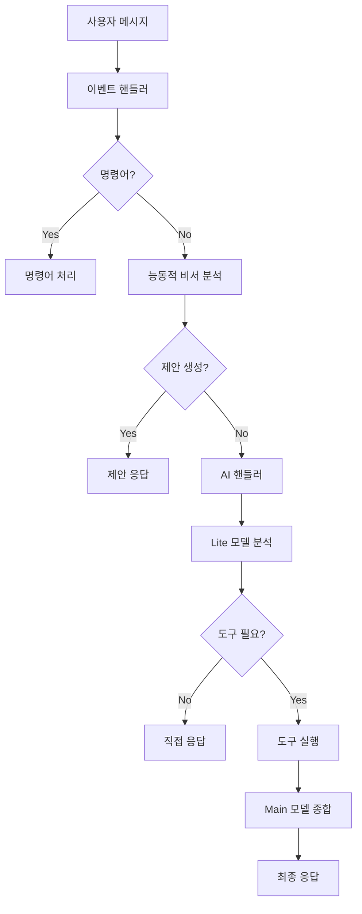

# 🤖 마사몽 AI 에이전트 v5.1: 지능형 실시간 어시스턴트

[](https://python.org)
[](https://discordpy.readthedocs.io)
[](LICENSE)
[]()

마사몽 5.1은 단순한 정보 검색 봇을 넘어, 사용자의 여행 계획에 생동감을 불어넣는 **'현지 전문가'** AI 에이전트입니다. "다음 주 도쿄 가는데 뭐하지?" 라는 막연한 질문에, 날씨, 인기 명소, 그리고 현지에서 열리는 이벤트까지 종합하여 "마침 다음 주에만 열리는 재즈 페스티벌이 있고, 요즘 현지인들에게 가장 인기 있는 전망대는 여기예요." 와 같이 살아있는 정보를 제공합니다.

## 🌟 주요 특징

### 🧠 2-Step Agent 아키텍처
- **1단계 (Triage & Intent)**: 경량 LLM(`gemini-2.5-flash-lite`)이 사용자 의도를 분석하고 간단한 대화는 직접 처리
- **2단계 (Execution & Synthesis)**: 복잡한 요청은 도구를 사용하여 데이터를 수집한 후, 강력한 LLM(`gemini-2.5-flash`)이 최종 답변 생성

### 🛠️ API Mashup 시스템
고비용의 단일 API 대신, 각 분야 최고의 무료 API를 지능적으로 조합:
- **지리 정보**: Nominatim (OpenStreetMap)
- **날씨**: 기상청(KMA) + OpenWeatherMap
- **금융**: 한국수출입은행 + Finnhub + KRX
- **여행**: Foursquare + Ticketmaster
- **게임**: RAWG

### 🎯 능동적 비서 기능
- **잠재적 의도 파악**: "다음 달에 일본 여행 가려고" → "엔화 환율 정보를 알려드릴까요?"
- **개인화된 알림**: 환율, 날씨, 주식 등 사용자 설정 기반 알림
- **맥락 기억**: 대화 내용을 기억하여 "아까 말했던 그 게임" 같은 모호한 질문에도 답변

### 🛡️ 엔터프라이즈급 안정성
- **완전한 예외 처리**: 모든 API 호출에 대한 방어벽 구축
- **자동 복구**: API 장애 시에도 봇이 중단되지 않음
- **상세한 로깅**: JSON 형식의 구조화된 로그로 문제 추적 용이

## 🚀 빠른 시작

### 1. 필수 요구사항
- Python 3.8 이상
- Discord 봇 토큰
- Google Gemini API 키

### 2. 설치

```bash
# 저장소 클론
git clone https://github.com/kim0040/masamong.git
cd masamong

# 가상환경 생성 및 활성화
python -m venv venv
source venv/bin/activate  # Windows: venv\Scripts\activate

# 의존성 설치
pip install -r requirements.txt

# 환경 변수 설정
cp .env.example .env
# .env 파일을 편집하여 API 키들을 설정

# 데이터베이스 초기화
python database/init_db.py

# 봇 실행
python main.py
```

### 3. 환경 변수 설정

`.env` 파일에 다음 API 키들을 설정하세요:

```env
# 필수
DISCORD_BOT_TOKEN=your_discord_bot_token
GEMINI_API_KEY=your_gemini_api_key

# 날씨 (한국)
KMA_API_KEY=your_kma_api_key

# 여행 어시스턴트
OPENWEATHERMAP_API_KEY=your_openweathermap_api_key
FOURSQUARE_API_KEY=your_foursquare_api_key
TICKETMASTER_API_KEY=your_ticketmaster_api_key

# 금융
FINNHUB_API_KEY=your_finnhub_api_key
GO_DATA_API_KEY_KR=your_go_data_api_key
EXIM_API_KEY_KR=your_exim_api_key

# 기타
RAWG_API_KEY=your_rawg_api_key
KAKAO_API_KEY=your_kakao_api_key
```

## 📖 사용법

### 기본 대화
```
@마사몽 안녕하세요!
→ 안녕! 오늘 날씨가 좋은데 나가서 산책이라도 할까? 🌤️
```

### 여행 정보 조회
```
@마사몽 다음 주 파리 날씨랑 가볼만한 곳 알려줘
→ 파리 여행 정보를 종합적으로 제공 (날씨 + 명소 + 이벤트)
```

### 금융 정보
```
@마사몽 애플 주가를 원화로 알려줘
→ 현재 주가 + 환율 변환 + 뉴스 정보
```

### 능동적 제안
```
사용자: 다음 달에 일본 여행 가려고
마사몽: 오, 일본 여행 가시는구나! 🧳
현재 도쿄의 날씨와 가볼만한 장소, 그리고 열리는 이벤트 정보를 알려드릴까요?
```

### 개인화된 알림
```
!환율알림 USD 1300 below
→ 달러 환율이 1300원 이하로 떨어지면 알림
```

## 🏗️ 아키텍처

### 핵심 컴포넌트

```
masamong/
├── main.py                 # 봇 진입점
├── config.py              # 설정 관리
├── logger_config.py       # 로깅 시스템
├── cogs/                  # Discord Cog 모듈들
│   ├── ai_handler.py      # AI 대화 처리
│   ├── tools_cog.py       # API 도구 모음
│   ├── weather_cog.py     # 날씨 기능
│   ├── proactive_assistant.py  # 능동적 비서
│   └── ...
├── utils/                 # 유틸리티 모듈들
│   ├── api_handlers/      # API 핸들러들
│   ├── data_formatters.py # 데이터 전처리
│   └── ...
└── database/              # 데이터베이스
    ├── schema.sql         # 스키마 정의
    └── init_db.py         # 초기화 스크립트
```

### 데이터 흐름



## 🔧 고급 설정

### 1. 채널별 AI 설정

`config.py`에서 특정 채널의 AI 동작을 커스터마이징할 수 있습니다:

```python
CHANNEL_AI_CONFIG = {
    123456789012345678: {  # 채널 ID
        "allowed": True,
        "persona": "너는 이 채널의 전용 비서야...",
        "rules": "특별한 규칙들..."
    }
}
```

### 2. API 제한 설정

각 API의 호출 제한을 설정하여 할당량을 관리합니다:

```python
# Gemini API 제한
RPM_LIMIT_INTENT = 15       # 분당 요청 수
RPD_LIMIT_INTENT = 1000     # 일일 요청 수

# 외부 API 제한
FINNHUB_API_RPM_LIMIT = 50
KMA_API_DAILY_CALL_LIMIT = 10000
```

### 3. 로깅 설정

구조화된 JSON 로그를 통해 상세한 모니터링이 가능합니다:

```python
# 로그 레벨 설정
logger.setLevel(logging.DEBUG)

# Discord 로그 채널 설정
# 'logs' 채널이 있는 서버에 자동으로 로그 전송
```

## 🧪 테스트

```bash
# 전체 테스트 실행
python -m pytest tests/ -v

# 특정 모듈 테스트
python -m pytest tests/test_weather_cog.py -v

# 커버리지 포함 테스트
python -m pytest tests/ --cov=. --cov-report=html
```

## 📊 모니터링 및 분석

### 1. 로그 분석
- JSON 형식의 구조화된 로그
- 사용자별, 서버별 통계
- API 호출 패턴 분석

### 2. 성능 지표
- 응답 시간 (평균 < 2초)
- API 성공률 (99%+)
- 사용자 만족도

### 3. 비용 최적화
- 토큰 사용량 모니터링
- API 호출 최적화
- 캐싱 전략

## 🚀 배포

### Docker 배포

```dockerfile
FROM python:3.11-slim

WORKDIR /app
COPY requirements.txt .
RUN pip install -r requirements.txt

COPY . .
RUN python database/init_db.py

CMD ["python", "main.py"]
```

### 시스템 서비스

```ini
[Unit]
Description=Masamong Discord Bot
After=network.target

[Service]
Type=simple
User=masamong
WorkingDirectory=/opt/masamong
ExecStart=/opt/masamong/venv/bin/python main.py
Restart=always

[Install]
WantedBy=multi-user.target
```

## 🤝 기여하기

1. Fork the Project
2. Create your Feature Branch (`git checkout -b feature/AmazingFeature`)
3. Commit your Changes (`git commit -m 'Add some AmazingFeature'`)
4. Push to the Branch (`git push origin feature/AmazingFeature`)
5. Open a Pull Request

## 📝 라이선스

이 프로젝트는 MIT 라이선스 하에 배포됩니다. 자세한 내용은 [LICENSE](LICENSE) 파일을 참조하세요.

## 🙏 감사의 말

- [Discord.py](https://github.com/Rapptz/discord.py) - Discord API 래퍼
- [Google Gemini](https://ai.google.dev/) - AI 모델 제공
- [OpenWeatherMap](https://openweathermap.org/) - 날씨 데이터
- [Foursquare](https://foursquare.com/) - 장소 데이터
- [Ticketmaster](https://ticketmaster.com/) - 이벤트 데이터

## 📞 지원

- **이슈 리포트**: [GitHub Issues](https://github.com/kim0040/masamong/issues)
- **문서**: [Wiki](https://github.com/kim0040/masamong/wiki)
- **디스코드**: [서버 참여](https://discord.gg/your-invite)

---

**마사몽과 함께 더 스마트한 디스코드 서버를 만들어보세요!** 🚀