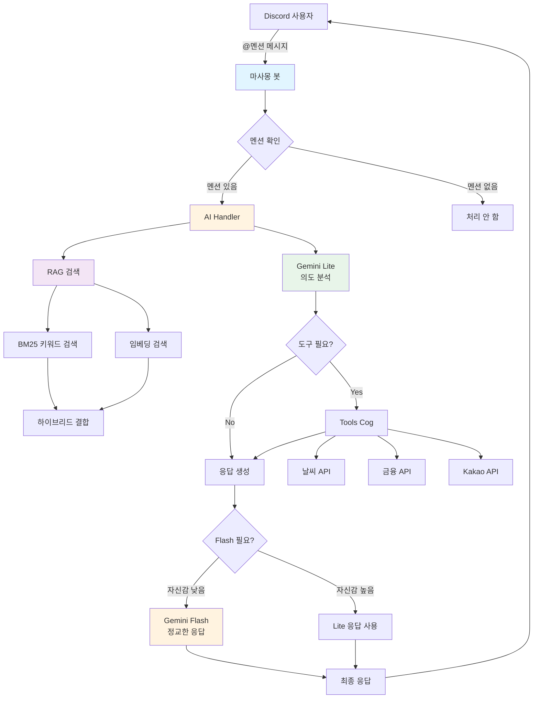
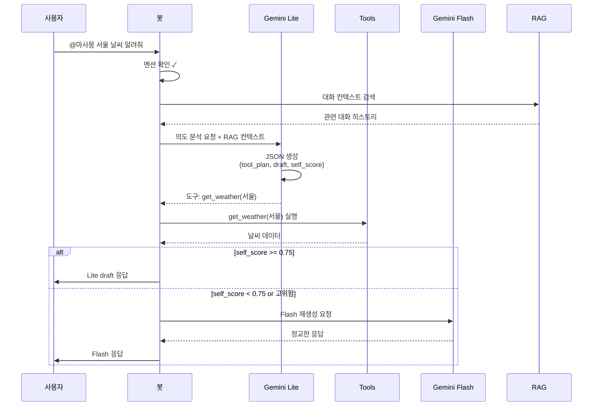
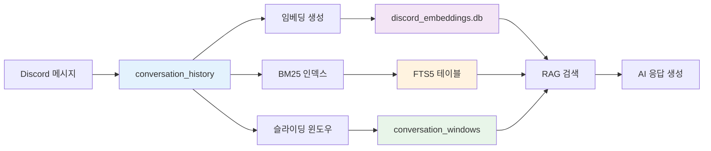

# 🤖 마사몽 Discord 에이전트

[](https://www.python.org/downloads/)
[](https://discordpy.readthedocs.io/)
[](https://opensource.org/licenses/MIT)

마사몽은 Discord 서버에서 실시간 날씨·금융 데이터와 Google Gemini 기반 AI 대화를 동시에 제공하는 복합형 봇입니다. `cogs` 구조로 기능을 모듈화했고, 주요 업무 흐름은 2-Step 에이전트(의도 분석 → 도구 실행 → 답변 생성)로 구성되어 있습니다.

## 📑 목차

- [프로젝트 개요](#프로젝트-개요)
- [빠른 시작](#빠른-시작)
- [시스템 아키텍처](#시스템-아키텍처)
- [주요 기능](#주요-기능)
- [Discord 사용 가이드](#discord-사용-가이드)
- [설치 및 설정](#설치-및-설정)
- [환경 변수](#환경-변수)
- [RAG 시스템](#rag-시스템)
- [실행 방법](#실행-방법)
- [테스트](#테스트)
- [문제 해결](#문제-해결)
- [프로젝트 구조](#프로젝트-구조)
- [문서](#문서)

## 빠른 시작

처음 사용하시나요? **[빠른 시작 가이드](docs/QUICKSTART.md)**를 확인하세요! ⚡

5분 안에 마사몽을 실행할 수 있습니다.
## 프로젝트 개요

### 핵심 특징

- 🤖 **2단계 AI 에이전트**: Google Gemini Lite/Flash 모델을 사용한 효율적인 의도 분석 및 응답 생성
- 🔍 **하이브리드 RAG**: BM25 키워드 검색 + SentenceTransformer 의미 검색의 결합
- 🛠️ **다양한 외부 API 연동**: 기상청, Finnhub, Kakao 등 실시간 데이터 제공
- 📊 **SQLite 기반 데이터 관리**: 대화 기록, 사용자 활동, API 호출 제한 관리
- ⚡ **비동기 처리**: Discord.py 2.x 기반 고성능 비동기 아키텍처
- 🧩 **모듈식 Cog 시스템**: 기능별로 독립적인 모듈 관리

### 기술 스택

| 카테고리 | 기술 |
|---------|------|
| **프레임워크** | Discord.py 2.4+ |
| **AI/ML** | Google Gemini 2.5 Flash/Lite, SentenceTransformers |
| **데이터베이스** | SQLite3 with aiosqlite |
| **임베딩** | `dragonkue/multilingual-e5-small-ko-v2` |
| **검색** | Cosine Similarity (오프라인 Numpy) |
| **HTTP** | aiohttp, requests |
| **환경 관리** | python-dotenv |

## 시스템 아키텍처

### 전체 구조



### 2-Step 에이전트 워크플로우



### 데이터 흐름



## 주요 기능

### AI Handler (`cogs/ai_handler.py`)

- ✅ **멘션 게이트**: 봇 멘션이 있는 메시지만 처리
- ✅ **Thinking 라우팅**: Lite 모델이 JSON으로 초안/도구 계획/자기 평가 작성
- ✅ **선택적 Flash 승급**: self_score < 0.75, 고위험 질의, 토큰 > 1200 시 Flash 호출
- ✅ **대화 윈도우 저장**: 최근 6개 메시지를 묶어 ±3 메시지 이웃까지 RAG 컨텍스트 제공
- ✅ **하이브리드 RAG**: BM25 + 임베딩 결합 (0.45/0.55 가중치)

### Tools Cog (`cogs/tools_cog.py`)

통합된 외부 API 인터페이스:

| 도구 | 설명 | API |
|-----|------|-----|
| `get_weather` | 날씨 조회 | 기상청 (KMA) |
| `get_exchange_rate` | 환율 조회 | 한국수출입은행 |
| `get_us_stock_info` | 미국 주식 | Finnhub |
| `get_kr_stock_info` | 한국 주식 | KRX |
| `search_for_place` | 장소 검색 | Kakao Local |
| `search_for_game` | 게임 검색 | Kakao |
| `web_search` | 웹 검색 | Google/SerpAPI/Kakao |

### Weather Cog (`cogs/weather_cog.py`)

- 🌤️ **위치 기반 날씨**: 격자 좌표 자동 변환
- ⏰ **정기 알림**: 아침 인사, 비/눈 예보 알림
- 📍 **지역 DB**: SQLite에 저장된 격자 좌표 관리

### Activity Cog (`cogs/activity_cog.py`)

- 📊 **사용자 활동 추적**: 메시지 카운트 누적
- 🏆 **랭킹 명령**: `!랭킹`, `!수다왕`으로 Top 5 확인
- 💬 **AI 멘트**: 1등에게는 특별한 축하 메시지

### 기타 Cogs

- **ProactiveAssistant**: 키워드 기반 능동 제안 (기본 비활성화)
- **FunCog**: `!운세` 등 재미 요소
- **PollCog**: `!투표` 즉석 투표 생성
- **SettingsCog**: 서버별 설정 관리
- **MaintenanceCog**: 로그 관리, 시스템 유지보수

## Discord 사용 가이드

### AI 호출 방법

> [!IMPORTANT]
> 반드시 `@마사몽` 멘션을 포함해야 합니다. 멘션이 없으면 봇이 반응하지 않습니다.

```
@마사몽 서울 날씨 알려줘
@마사몽 애플 주가 얼마야?
@마사몽 광양 맛집 추천해줘
```

### 바로 쓸 수 있는 질문 예시

#### 📈 주식
```
@마사몽 애플 주가 얼마야?
@마사몽 삼성전자 오늘 주가 알려줘
@마사몽 테슬라 최근 뉴스 찾아줘
```

#### 💱 환율
```
@마사몽 달러 환율 알려줘
@마사몽 엔화 환율은?
@마사몽 유로 환율 얼마야?
```

#### ☀️ 날씨
```
@마사몽 서울 오늘 날씨 어때?
@마사몽 부산 내일 날씨 알려줘
@마사몽 광양 주말 날씨는?
```
*지역을 지정하지 않으면 기본값은 광양입니다.*

#### 📍 장소 검색
```
@마사몽 광양 맛집 추천해줘
@마사몽 여수 가볼만한 곳 알려줘
@마사몽 강남역 근처 카페 찾아줘
```

#### 🎮 게임
```
@마사몽 평점 높은 RPG 게임 추천해줘
@마사몽 최신 게임 뭐 나왔어?
```

#### 🧠 기억 (RAG)
```
@마사몽 아까 내가 뭐랬더라?
@마사몽 우리 어제 무슨 얘기 했지?
```

### 간단 명령어

| 명령어 | 설명 |
|-------|------|
| `!랭킹` / `!수다왕` | 서버 활동량 Top 5 + AI 멘트 |
| `!투표 "질문" "항목1" "항목2"` | 즉석 투표 생성 |
| `!운세` | 오늘의 운세 (츤데레 버전) |
| `!요약` | 최근 대화 3줄 요약 |
| `!delete_log` | 로그 삭제 (관리자 전용) |

### 캐릭터 설정

마사몽의 기본 페르소나는 **츤데레**입니다. 가끔 투덜거려도 도움을 주려는 마음은 진심이에요! 😊

채널별로 다른 페르소나를 설정하려면 `prompts.json`의 `channels` 섹션을 편집하세요.

## 설치 및 설정

### 준비 사항

- ✅ Python 3.9 이상 (3.11 권장)
- ✅ Git
- ✅ Discord 봇 토큰
- ✅ Google Gemini API 키
- ✅ (선택) 기타 API 키들 (기상청, Finnhub, Kakao 등)

### 설치 절차

#### 1. 저장소 클론 및 가상환경 구성

```bash
git clone https://github.com/kim0040/masamong.git
cd masamong
python3 -m venv venv
source venv/bin/activate  # Windows: venv\Scripts\activate
```

#### 2. 의존성 설치

```bash
pip install --upgrade pip
pip install -r requirements.txt
```

**저사양 서버 (RAG 불필요):**
```bash
# numpy와 sentence-transformers 제외하고 설치
pip install discord.py aiosqlite aiohttp requests pytz python-dotenv google-generativeai
```

#### 3. 설정 파일 준비

```bash
cp .env.example .env
cp config.json.example config.json
cp emb_config.json.example emb_config.json
```

#### 4. API 키 설정

`.env` 파일을 편집하여 필수 키를 입력:

```env
DISCORD_BOT_TOKEN=your_discord_bot_token_here
GEMINI_API_KEY=your_gemini_api_key_here
KMA_API_KEY=your_kma_api_key_here  # 선택
FINNHUB_API_KEY=your_finnhub_key_here  # 선택
KAKAO_API_KEY=your_kakao_key_here  # 선택
```

#### 5. 프롬프트 설정 (중요!)

`prompts.json` 파일을 생성하고 기본 프롬프트를 작성:

```json
{
  "prompts": {
    "lite_system_prompt": "You are a helpful AI assistant...",
    "agent_system_prompt": "You are 마사몽, a tsundere Discord bot...",
    "web_fallback_prompt": "Use web search results to answer..."
  },
  "channels": {
    "YOUR_CHANNEL_ID": {
      "allowed": true,
      "persona": "츤데레 친구",
      "rules": "반말 사용, 이모지 적절히 사용"
    }
  }
}
```

> [!WARNING]
> `prompts.json`은 `.gitignore`에 포함되어 있으므로 Git에 커밋되지 않습니다. 운영 서버에만 배포하세요.

#### 6. 데이터베이스 초기화

```bash
python3 database/init_db.py
python3 database/init_bm25.py  # BM25 인덱스 생성 (선택)
```

#### 7. 설정 검증

```bash
python3 -c "import config; print('✅ 설정 로드 성공')"
```

### 빠른 시작 스크립트

자동화된 설치를 원하면:

```bash
python3 setup.py
```

## 환경 변수

### 필수 변수

| 변수명 | 설명 | 기본값 |
|-------|------|--------|
| `DISCORD_BOT_TOKEN` | Discord 봇 토큰 | **필수** |
| `GEMINI_API_KEY` | Google Gemini API 키 | **필수** |

### API 키 (선택)

| 변수명 | 설명 | 용도 |
|-------|------|------|
| `KMA_API_KEY` | 기상청 API 키 | 날씨 조회 |
| `FINNHUB_API_KEY` | Finnhub API 키 | 미국 주식 |
| `KAKAO_API_KEY` | Kakao REST API 키 | 장소/게임 검색 |
| `GOOGLE_API_KEY` | Google Custom Search 키 | 웹 검색 |
| `GOOGLE_CX` | Google Custom Search CX | 웹 검색 |
| `SERPAPI_KEY` | SerpAPI 키 | 웹 검색 (폴백) |

### AI 설정

| 변수명 | 설명 | 기본값 |
|-------|------|--------|
| `AI_MEMORY_ENABLED` | RAG 메모리 기능 활성화 | `true` |
| `query_rewrite_enabled` | 쿼리 재작성 (추가 모델 로드) | `false` |
| `RERANK_ENABLED` | Cross-Encoder 리랭킹 | `false` |
| `ENABLE_PROACTIVE_KEYWORD_HINTS` | 능동 응답 | `false` |

### RAG 파라미터

| 변수명 | 설명 | 기본값 |
|-------|------|--------|
| `CONVERSATION_WINDOW_SIZE` | 대화 윈도우 크기 | `12` |
| `CONVERSATION_WINDOW_STRIDE` | 슬라이딩 stride | `6` |
| `CONVERSATION_NEIGHBOR_RADIUS` | 인접 대화 반경 | `3` |
| `RAG_SIMILARITY_THRESHOLD` | 임베딩 유사도 임계값 | `0.6` |
| `RAG_HYBRID_TOP_K` | 하이브리드 결과 개수 | `4` |

### BM25 자동 재구축

| 변수명 | 설명 | 기본값 |
|-------|------|--------|
| `BM25_AUTO_REBUILD_ENABLED` | 자동 재구축 활성화 | `false` |
| `BM25_AUTO_REBUILD_IDLE_MINUTES` | 유휴 판단 기준 (분) | `180` |
| `BM25_AUTO_REBUILD_POLL_MINUTES` | 체크 주기 (분) | `15` |

### 디버그 설정

| 변수명 | 설명 | 기본값 |
|-------|------|--------|
| `AI_DEBUG_ENABLED` | AI 디버그 로그 | `false` |
| `RAG_DEBUG_ENABLED` | RAG 디버그 로그 | `false` |
| `DISABLE_VERBOSE_THINKING_OUTPUT` | Thinking JSON 로그 숨김 | `true` |

전체 환경 변수 목록은 `config.py`를 참고하세요.

### RAG 검색 파이프라인

현재 마사몽은 **임베딩 기반 유사도 검색**을 사용합니다. (BM25, Reranker는 기본 비활성화)


> [!NOTE]
> `similarity_threshold: 0.6` 미만의 결과는 자동으로 무시됩니다. 이로 인해 관련 없는 맥락이 응답에 영향을 주지 않습니다.

### 대화 윈도우 관리

마사몽은 대화의 맥락을 완벽하게 유지하기 위해 **화자 병합(Speaker Merging)** 및 **슬라이딩 윈도우** 방식을 사용합니다:

- **윈도우 크기**: 12개 메시지 (약 15개 기준 최적화)
- **Stride**: 6개씩 이동 (중복 최소화)
- **인접 반경**: ±3 메시지
- **화자 병합**: 연속된 동일 화자의 메시지는 하나의 블록으로 병합하여 문맥 파악 용이

```
메시지: [A] [A] [B] [A] [A] [A] ...
병합후: [A: ...] [B: ...] [A: ...] ...
윈도우: 병합된 블록 단위로 슬라이딩
```

검색 결과에서 메시지가 발견되면, 해당 윈도우 전체를 컨텍스트로 제공합니다.

### 임베딩 모델

**기본 모델**: `dragonkue/multilingual-e5-small-ko-v2`

한국어 성능이 검증된 E5 모델을 사용하며, `query:` 및 `passage:` prefix를 자동으로 적용합니다.
`emb_config.json`에서 변경 가능:

```json
{
  "embedding_model_name": "dragonkue/multilingual-e5-small-ko-v2",
  "embedding_device": "cpu",
  "normalize_embeddings": true
}
```

**다른 모델 옵션**:
- `upskyy/kf-deberta-multitask` (더 정확, 더 무거움)
- `jhgan/ko-sroberta-multitask` (균형잡힌 선택)

### BM25 인덱스

SQLite FTS5 (Full-Text Search)를 사용한 키워드 검색:

```bash
# BM25 인덱스 재구축
python3 database/init_bm25.py
```

인덱스는 다음 항목들을 포함합니다:
- 메시지 내용
- 사용자 이름
- 타임스탬프
- 대화 윈도우

### 오프라인 임베딩 (저사양 서버 지원)

서버 성능이 낮거나(GPU 없음), 대량의 과거 대화를 미리 처리하고 싶은 경우 **오프라인 생성**을 권장합니다.

1. **준비**: `data/kakao_raw/` 폴더에 카카오톡 대화 내용 CSV 파일을 넣습니다. (`date`, `user`, `message` 컬럼 포함)
2. **생성**:
   ```bash
   # 로컬(고성능 PC)에서 실행
   python scripts/generate_kakao_embeddings.py --input data/kakao_raw/chat.csv
   ```
3. **업로드**: 생성된 `data/kakao_store/` 폴더를 서버의 동일한 위치로 업로드합니다.
4. **설정**: `emb_config.json`의 `kakao_servers`에 해당 폴더 경로를 지정합니다.
   ```json
   {
     "server_id": "my_server",
     "db_path": "data/kakao_store",
     "label": "오프라인 대화"
   }
   ```
5. **실행**: 봇이 시작되면 `.npy` 파일을 메모리로 로드하여 즉시 검색에 사용합니다 (SQLite 불필요).

## 실행 방법

### 로컬 개발 환경

**macOS:**
```bash
cd /path/to/masamong
source venv/bin/activate
python3 main.py
```

**Ubuntu/Linux:**
```bash
cd /path/to/masamong
source venv/bin/activate
python3 main.py
```

> [!TIP]
> 우분투 서버에서 `mps` 관련 오류 발생 시 `emb_config.json`에서 `"embedding_device": "cpu"`로 설정하세요.

### Screen 세션 (운영 환경)

```bash
# 새 세션 생성
screen -S masamong-bot

# 봇 실행
cd /path/to/masamong
source venv/bin/activate
python3 main.py

# 세션 분리 (백그라운드 실행)
Ctrl+A, D

# 세션 목록 확인
screen -ls

# 다시 접속
screen -r masamong-bot

# 종료
Ctrl+C
exit
```

### Systemd 서비스 (권장)

`/etc/systemd/system/masamong.service` 생성:

```ini
[Unit]
Description=Masamong Discord Bot
After=network.target

[Service]
Type=simple
User=your_username
WorkingDirectory=/path/to/masamong
Environment="PATH=/path/to/masamong/venv/bin"
ExecStart=/path/to/masamong/venv/bin/python3 main.py
Restart=always
RestartSec=10

[Install]
WantedBy=multi-user.target
```

실행:
```bash
sudo systemctl daemon-reload
sudo systemctl enable masamong
sudo systemctl start masamong
sudo systemctl status masamong
```

로그 확인:
```bash
sudo journalctl -u masamong -f
```

## 테스트

### 전체 테스트 실행

```bash
pytest
```

### 특정 테스트만 실행

```bash
# 멘션 게이트 테스트
pytest tests/test_ai_handler_mentions.py -v

# 하이브리드 검색 테스트
pytest tests/test_hybrid_search.py -v

# RAG 테스트
pytest tests/test_ai_handler_rag.py -v
```

### 커버리지 확인

```bash
pytest --cov=. --cov-report=html
open htmlcov/index.html
```

## 문제 해결

### 일반적인 문제

#### ❌ `ModuleNotFoundError: No module named 'discord'`

**원인**: discord.py가 설치되지 않음

**해결**:
```bash
pip install -r requirements.txt
```

#### ❌ `AttributeError: 'NoneType' object has no attribute 'execute'`

**원인**: 데이터베이스가 초기화되지 않음

**해결**:
```bash
python3 database/init_db.py
```

#### ❌ 봇이 멘션에 반응하지 않음

**원인**: 
1. `prompts.json`에 채널이 `allowed: true`로 설정되지 않음
2. Gemini API 키 누락

**해결**:
1. `prompts.json` 확인:
```json
{
  "channels": {
    "YOUR_CHANNEL_ID": {
      "allowed": true
    }
  }
}
```
2. `.env`에서 `GEMINI_API_KEY` 확인

#### ❌ `sentence-transformers` 설치 실패

**원인**: 의존성 충돌 또는 메모리 부족

**해결** (저사양 서버):
```bash
# AI 메모리 기능 비활성화
echo "AI_MEMORY_ENABLED=false" >> .env
```

#### ❌ SQLite 잠금 오류 (`database is locked`)

**원인**: 여러 프로세스가 동시에 DB 접근

**해결**:
```bash
# WAL 모드 활성화 (자동)
# 또는 봇을 하나만 실행
```

#### ❌ Gemini API 할당량 초과

**원인**: API 호출 제한 도달

**해결**:
- `config.py`에서 `RPM_LIMIT_*` 값 조정
- Gemini API 콘솔에서 할당량 확인

### 디버그 모드

더 자세한 로그가 필요하면:

```bash
# .env에 추가
AI_DEBUG_ENABLED=true
RAG_DEBUG_ENABLED=true
DISABLE_VERBOSE_THINKING_OUTPUT=false
```

로그 위치:
- 일반 로그: `discord_logs.txt`
- 에러 로그: `error_logs.txt`
- Discord 임베드: `#logs` 채널 (설정된 경우)

### 성능 최적화

#### 저사양 서버

```bash
# .env 설정
AI_MEMORY_ENABLED=false           # RAG 비활성화
RERANK_ENABLED=false              # 리랭킹 비활성화
SEARCH_CHUNKING_ENABLED=false     # 청킹 비활성화
SEARCH_QUERY_EXPANSION_ENABLED=false  # 쿼리 확장 비활성화
```

#### 고성능 서버

```bash
# .env 설정
RERANK_ENABLED=true
SEARCH_CHUNKING_ENABLED=true
BM25_AUTO_REBUILD_ENABLED=true
```

#### 데이터베이스 최적화

```bash
# 주기적으로 VACUUM 실행
sqlite3 database/remasamong.db "VACUUM;"
sqlite3 database/discord_embeddings.db "VACUUM;"
```

## 프로젝트 구조

```
masamong/
│   ├── commands.py           # 유틸 명령 (62줄)
│   └── maintenance_cog.py    # 유지보수 (136줄)
│
├── utils/                     # 유틸리티 모듈
│   ├── embeddings.py         # 임베딩 스토어 (563줄) ⭐
│   ├── hybrid_search.py      # 하이브리드 검색 (651줄) ⭐
│   ├── query_rewriter.py     # 쿼리 확장 (185줄)
│   ├── reranker.py           # Cross-Encoder 리랭킹 (137줄)
│   ├── chunker.py            # 시맨틱 청킹 (145줄)
│   ├── db.py                 # DB 헬퍼 (144줄)
│   ├── http.py               # HTTP 클라이언트 (66줄)
│   ├── weather.py            # 날씨 유틸 (246줄)
│   ├── coords.py             # 좌표 변환 (84줄)
│   ├── data_formatters.py    # 데이터 포매터 (297줄)
│   ├── initial_data.py       # 초기 데이터 (164줄)
│   └── api_handlers/         # API 래퍼들
│       ├── finnhub.py        # Finnhub (229줄)
│       ├── krx.py            # KRX (176줄)
│       ├── kakao.py          # Kakao (122줄)
│       └── exchange_rate.py  # 환율 (96줄)
│
├── database/                  # 데이터베이스 관리
│   ├── schema.sql            # DB 스키마
│   ├── init_db.py            # DB 초기화 스크립트
│   ├── init_bm25.py          # BM25 인덱스 구축
│   └── bm25_index.py         # BM25 인덱스 관리 (430줄)
│
├── tests/                     # 테스트 (8개)
│   ├── conftest.py           # pytest 설정
│   ├── test_ai_handler_mentions.py
│   ├── test_ai_handler_rag.py
│   ├── test_hybrid_search.py
│   ├── test_reranker.py
│   ├── test_chunker.py
│   ├── test_coords.py
│   └── test_exchange_rate_handler.py
│
├── .env.example               # 환경 변수 템플릿
├── config.json.example        # 설정 템플릿
├── emb_config.json.example    # 임베딩 설정 템플릿
├── requirements.txt           # 의존성 목록
└── .gitignore                 # Git 제외 파일

총 파일: 43개 Python 파일 (8,029줄)
핵심 모듈: ai_handler.py, hybrid_search.py, embeddings.py
```

## 기여하기

기여를 환영합니다! 다음 절차를 따라주세요:

1. Fork the repository
2. Create your feature branch (`git checkout -b feature/AmazingFeature`)
3. Commit your changes (`git commit -m 'Add some AmazingFeature'`)
4. Push to the branch (`git push origin feature/AmazingFeature`)
5. Open a Pull Request

### 코드 스타일

- Python 3.9+ 표준 사용
- Docstring은 Google 스타일
- Type hints 적극 활용
- Async/await 패턴 준수

## 라이선스

MIT License. 세부 내용은 [LICENSE](LICENSE) 파일을 참조하세요.

## 📚 문서

프로젝트의 모든 문서는 [`docs/`](docs/) 폴더에 정리되어 있습니다:

- 📖 **[빠른 시작 가이드](docs/QUICKSTART.md)** - 5분 안에 시작하기
- 🏗️ **[아키텍처 문서](docs/ARCHITECTURE.md)** - 시스템 설계 및 기술 상세
- 🤝 **[기여 가이드](docs/CONTRIBUTING.md)** - 개발 참여 방법
- 📋 **[변경 이력](docs/CHANGELOG.md)** - 버전별 변경사항

### 설정 예시 파일

[`examples/`](examples/) 폴더에서 설정 예시를 확인하세요:

- `.env.example` - 환경 변수 템플릿
- `config.json.example` - 봇 설정 템플릿
- `emb_config.json.example` - 임베딩 설정 템플릿
- `prompts.json.example` - 프롬프트 템플릿

## 지원

- 📧 이메일: [프로젝트 이메일]
- 🐛 버그 리포트: [GitHub Issues](https://github.com/kim0040/masamong/issues)
- 💬 Discord: [디스코드 서버 링크]

## 감사의 말

- [Discord.py](https://github.com/Rapptz/discord.py) - Discord API 래퍼
- [Google Gemini](https://ai.google.dev/) - AI 모델
- [SentenceTransformers](https://www.sbert.net/) - 임베딩 모델
- [기상청](https://www.data.go.kr/) - 날씨 API
- [Finnhub](https://finnhub.io/) - 주식 API

---

**마사몽과 함께 즐거운 Discord 생활 되세요! 🚀**

*마지막 업데이트: 2026-01-19*
