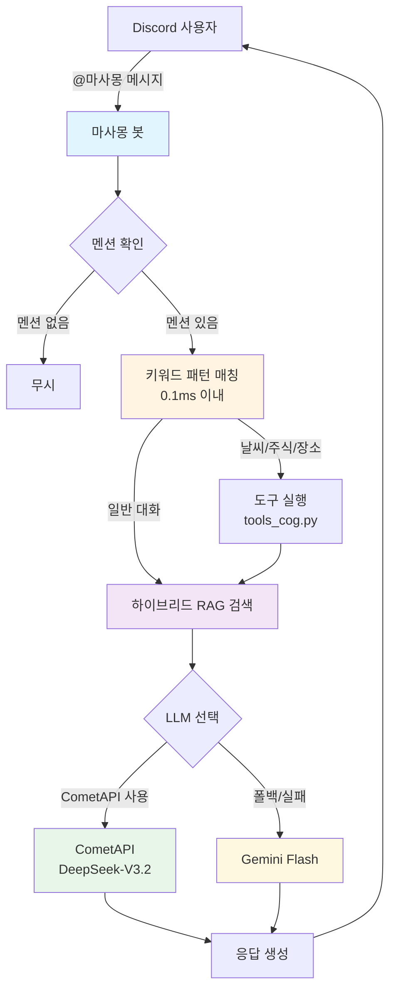
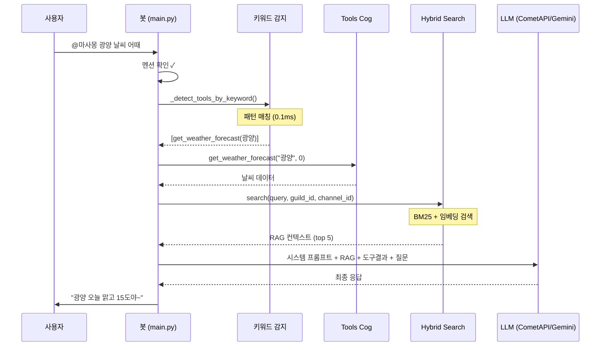
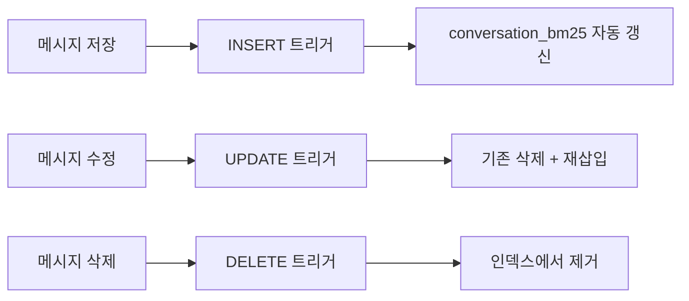
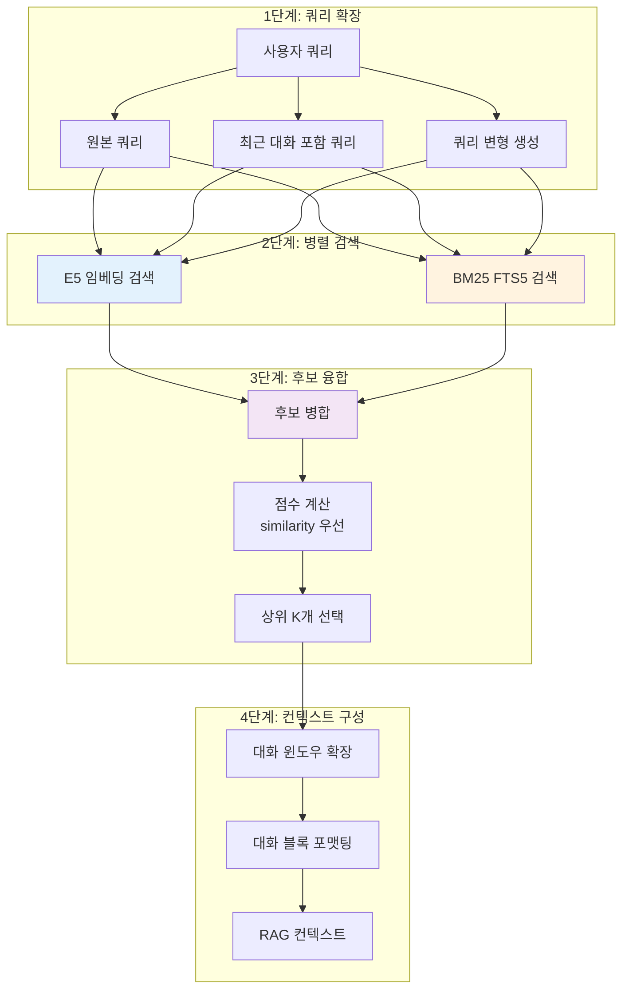
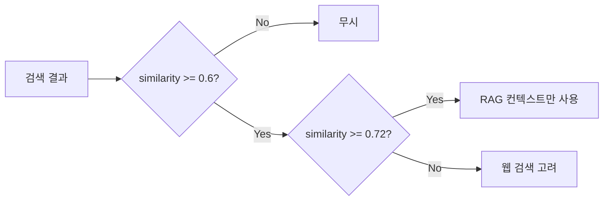

# 🤖 마사몽 Discord 에이전트

[](https://www.python.org/downloads/)
[](https://discordpy.readthedocs.io/)
[](https://opensource.org/licenses/MIT)

마사몽은 Discord 서버에서 실시간 날씨·금융 데이터와 AI 대화를 제공하는 **하이브리드 RAG 기반 챗봇**입니다. CometAPI(DeepSeek)를 기본 LLM으로 사용하며, 키워드 패턴 매칭으로 도구를 0.1ms 내에 감지하여 빠르고 효율적인 응답을 제공합니다.

---

## 📑 목차

- [핵심 특징](#핵심-특징)
- [시스템 아키텍처](#시스템-아키텍처)
- [RAG 시스템 상세](#rag-시스템-상세)
- [주요 기능](#주요-기능)
- [Discord 사용 가이드](#discord-사용-가이드)
- [설치 및 설정](#설치-및-설정)
- [환경 변수](#환경-변수)
- [실행 방법](#실행-방법)
- [문제 해결](#문제-해결)
- [프로젝트 구조](#프로젝트-구조)

---

## 핵심 특징

| 특징 | 설명 |
|------|------|
| 🚀 **CometAPI 기반 LLM** | DeepSeek-V3.2 모델을 기본으로 사용, Gemini Flash는 폴백 |
| ⚡ **키워드 기반 도구 감지** | Lite 모델 없이 0.1ms 내 패턴 매칭으로 의도 분석 |
| 🔍 **하이브리드 RAG** | BM25(FTS5) + E5 임베딩 결합 검색 |
| 💬 **슬라이딩 윈도우 대화 관리** | 12메시지 윈도우, stride 6으로 문맥 완전 유지 |
| 🛠️ **다양한 외부 API** | 기상청, Finnhub, KRX, Kakao 등 실시간 데이터 |
| 📊 **SQLite 기반 저장소** | 대화 기록, 임베딩, BM25 인덱스 통합 관리 |

### 기술 스택

| 카테고리 | 기술 |
|---------|------|
| **프레임워크** | Discord.py 2.4+ |
| **AI/ML** | CometAPI (DeepSeek-V3.2), Google Gemini 2.5 Flash |
| **임베딩** | `dragonkue/multilingual-e5-small-ko-v2` (SentenceTransformers) |
| **검색** | SQLite FTS5 (BM25) + Cosine Similarity |
| **데이터베이스** | SQLite3 with aiosqlite (WAL 모드) |
| **HTTP** | aiohttp, requests, openai (AsyncOpenAI) |

---

## 시스템 아키텍처

### 왜 키워드 기반으로 변경했나?

기존 2-Step 아키텍처(Lite → Main)의 문제점을 해결하기 위해 키워드 기반 감지로 전환했습니다:

| 기존 문제 | 해결책 |
|----------|--------|
| 메시지당 2회 API 호출 → 할당량 소진 | **1회 호출**로 50% 감소 |
| Lite 모델 JSON 파싱 오류 | **파싱 오류 완전 제거** |
| 2번 왕복으로 3-5초 응답 지연 | **~1초 단축** |
| Lite vs Main 디버깅 어려움 | **단일 경로로 추적 용이** |

### 전체 처리 흐름



### 상세 처리 시퀀스



---

## RAG 시스템 상세

마사몽의 RAG(Retrieval-Augmented Generation) 시스템은 **BM25 키워드 검색**과 **E5 임베딩 유사도 검색**을 결합한 하이브리드 방식입니다.

### 1. 임베딩 모델: E5

**모델**: `dragonkue/multilingual-e5-small-ko-v2`

#### 왜 E5를 선택했나?

| 특징 | 설명 |
|------|------|
| **한국어 최적화** | 한국어 데이터로 fine-tuning된 다국어 E5 모델 |
| **경량화** | small 버전으로 저사양 서버에서도 실행 가능 |
| **prefix 시스템** | `query:` / `passage:` prefix로 검색 정확도 향상 |

#### Prefix 적용 방식

```python
# 쿼리 임베딩 (검색 시)
query_vector = get_embedding(text, prefix="query: ")

# 문서 임베딩 (저장 시)
passage_vector = get_embedding(text, prefix="passage: ")
```

E5 모델은 쿼리와 문서에 서로 다른 prefix를 붙여 임베딩하면 검색 성능이 크게 향상됩니다. 이는 모델이 "검색하는 쿼리"와 "검색될 문서"를 구분할 수 있게 해줍니다.

### 2. BM25 검색 (FTS5)

**BM25**(Best Match 25)는 TF-IDF 기반의 확률적 검색 알고리즘으로, 키워드 일치에 강합니다.

#### SQLite FTS5 구조

```sql
-- FTS5 가상 테이블 생성
CREATE VIRTUAL TABLE conversation_bm25 USING fts5(
    content,
    guild_id UNINDEXED,
    channel_id UNINDEXED,
    user_id UNINDEXED,
    user_name,
    created_at,
    message_id UNINDEXED,
    tokenize='unicode61 remove_diacritics 2'
);
```

#### 자동 동기화 트리거

새 메시지가 `conversation_history`에 저장되면 트리거가 자동으로 BM25 인덱스를 갱신합니다:



#### BM25 점수 계산

SQLite FTS5의 `bm25()` 함수를 사용하며, 파라미터 `(k1=1.2, b=0.75)`를 적용합니다:

```sql
SELECT message_id, content, bm25(conversation_bm25, 1.2, 0.75) AS score
FROM conversation_bm25
WHERE conversation_bm25 MATCH '"검색어1" OR "검색어2"'
ORDER BY score ASC
LIMIT 20
```

> **참고**: BM25 점수는 낮을수록 관련성이 높습니다. 하이브리드 융합을 위해 `1/(1+score)`로 정규화합니다.

### 3. 하이브리드 검색 파이프라인



#### 후보 병합 로직

동일 메시지가 임베딩과 BM25 양쪽에서 검색되면 점수를 합산합니다:

```python
# 점수 계산 (hybrid_search.py)
similarity = candidate.get("similarity") or 0.0  # 임베딩 코사인 유사도
bm25_score = candidate.get("bm25_score") or 0.0  # 정규화된 BM25 점수

# 임베딩 유사도 우선 사용
combined = similarity if similarity > 0.0 else bm25_score
```

### 4. 대화 윈도우 시스템

메시지를 개별로 임베딩하지 않고, **슬라이딩 윈도우**로 묶어서 임베딩합니다:

#### 윈도우 파라미터

| 파라미터 | 값 | 설명 |
|---------|-----|------|
| `CONVERSATION_WINDOW_SIZE` | 12 | 한 윈도우에 포함되는 메시지 수 |
| `CONVERSATION_WINDOW_STRIDE` | 6 | 윈도우 이동 간격 |
| `CONVERSATION_NEIGHBOR_RADIUS` | 3 | 검색 결과 주변 확장 반경 |

#### 윈도우 슬라이딩 예시

```
메시지 스트림: [1] [2] [3] [4] [5] [6] [7] [8] [9] [10] [11] [12] [13] [14] ...
               └─────────── Window 1 ───────────┘
                              └─────────── Window 2 ───────────┘
                                             └─────────── Window 3 ───────────┘
               
stride=6: 6개 메시지마다 새 윈도우 생성 (중복 영역으로 연속성 유지)
```

#### 화자 병합 (Speaker Merging)

연속된 동일 화자의 메시지는 하나로 병합하여 문맥을 유지합니다:

```
원본:
  [User A] 안녕
  [User A] 오늘 뭐해?
  [User B] 밥 먹어
  [User A] 나도 배고파

병합 후:
  [User A] 안녕 오늘 뭐해?
  [User B] 밥 먹어
  [User A] 나도 배고파
```

### 5. RAG 임계값 및 필터링

| 파라미터 | 값 | 역할 |
|---------|-----|------|
| `RAG_SIMILARITY_THRESHOLD` | 0.6 | 이 미만인 결과는 무시 |
| `RAG_STRONG_SIMILARITY_THRESHOLD` | 0.72 | 이 이상이면 웹 검색 불필요 |
| `RAG_HYBRID_TOP_K` | 5 | 최종 반환 결과 수 |



---

## 주요 기능

### AI Handler (`cogs/ai_handler.py`)

| 기능 | 설명 |
|------|------|
| 멘션 게이트 | `@마사몽` 멘션이 있는 메시지만 처리 |
| 키워드 도구 감지 | 패턴 매칭으로 날씨/주식/장소 도구 자동 선택 |
| CometAPI 통합 | DeepSeek-V3.2 모델로 응답 생성 (Gemini 폴백) |
| 하이브리드 RAG | BM25 + 임베딩 결합 검색 |
| 대화 윈도우 관리 | 슬라이딩 윈도우 기반 청크 임베딩 |

### Tools Cog (`cogs/tools_cog.py`)

| 도구 | 설명 | API |
|-----|------|-----|
| `get_weather_forecast` | 날씨 조회 | 기상청 (KMA) |
| `get_stock_price` | 주식 시세 (국내/해외 자동 판별) | Finnhub / KRX |
| `get_krw_exchange_rate` | 환율 조회 | 한국수출입은행 |
| `search_for_place` | 장소 검색 | Kakao Local |
| `web_search` | 웹 검색 | Google CSE / Kakao |
| `search_images` | 이미지 검색 | Kakao |

### 키워드 기반 도구 감지

`_detect_tools_by_keyword()` 함수가 다음 패턴을 인식합니다:

| 카테고리 | 키워드 예시 | 도구 |
|---------|------------|------|
| 날씨 | 날씨, 기온, 비, 눈, 우산 | `get_weather_forecast` |
| 미국 주식 | 애플, 테슬라, AAPL, TSLA | `get_stock_price` |
| 한국 주식 | 삼성전자, 카카오, 네이버 | `get_stock_price` |
| 장소 | 맛집, 카페, 추천, 근처 | `search_for_place` |

**동적 주식 심볼 추출**: 하드코딩된 종목 외에도 "astx 주가", "P&G 주가"처럼 영문 심볼이 포함된 쿼리를 자동 감지합니다.

### 기타 Cogs

| Cog | 설명 |
|-----|------|
| `WeatherCog` | 정기 날씨 알림, 비/눈 예보 |
| `ActivityCog` | 사용자 활동 추적, `!랭킹` 명령 |
| `FunCog` | `!운세` 등 재미 요소 |
| `PollCog` | `!투표` 즉석 투표 |
| `SettingsCog` | 서버별 설정 관리 |
| `MaintenanceCog` | 로그 관리, 시스템 유지보수 |

---

## Discord 사용 가이드

### AI 호출 방법

> **중요**: 반드시 `@마사몽` 멘션을 포함해야 합니다!

```
@마사몽 서울 날씨 알려줘
@마사몽 테슬라 주가 얼마야?
@마사몽 광양 맛집 추천해줘
@마사몽 아까 우리 무슨 얘기 했지?
```

### 질문 예시

| 카테고리 | 예시 |
|---------|------|
| 📈 주식 | `@마사몽 애플 주가`, `@마사몽 삼성전자 시세` |
| 💱 환율 | `@마사몽 달러 환율`, `@마사몽 엔화 환율` |
| ☀️ 날씨 | `@마사몽 서울 날씨`, `@마사몽 내일 비 와?` |
| 📍 장소 | `@마사몽 강남 맛집`, `@마사몽 여수 카페 추천` |
| 🧠 기억 | `@마사몽 아까 뭐랬더라?`, `@마사몽 어제 무슨 얘기 했어?` |

### 명령어

| 명령어 | 설명 |
|-------|------|
| `!랭킹` / `!수다왕` | 서버 활동량 Top 5 |
| `!투표 "질문" "항목1" "항목2"` | 즉석 투표 생성 |
| `!운세` | 오늘의 운세 |
| `!delete_log` | 로그 삭제 (관리자 전용) |

---

## 설치 및 설정

### 요구사항

- Python 3.9+ (3.11 권장)
- Git
- Discord 봇 토큰
- CometAPI 키 또는 Gemini API 키

### 설치

```bash
# 1. 저장소 클론
git clone https://github.com/kim0040/masamong.git
cd masamong

# 2. 가상환경 생성
python3 -m venv venv
source venv/bin/activate  # Windows: venv\Scripts\activate

# 3. 의존성 설치
pip install --upgrade pip
pip install -r requirements.txt

# 4. 환경변수 설정
cp .env.example .env
# .env 파일 편집하여 API 키 입력

# 5. 데이터베이스 초기화
python3 database/init_db.py

# 6. 실행
python3 main.py
```

### 저사양 서버 설치

RAG 기능이 필요 없는 경우:

```bash
pip install discord.py aiosqlite aiohttp requests pytz python-dotenv google-generativeai openai
```

`.env`에 추가:
```env
AI_MEMORY_ENABLED=false
```

---

## 환경 변수

### 필수

| 변수명 | 설명 |
|-------|------|
| `DISCORD_BOT_TOKEN` | Discord 봇 토큰 |
| `COMETAPI_KEY` | CometAPI 키 (기본 LLM) |
| `GEMINI_API_KEY` | Google Gemini API 키 (폴백) |

### CometAPI 설정

| 변수명 | 기본값 | 설명 |
|-------|--------|------|
| `USE_COMETAPI` | `true` | CometAPI 우선 사용 여부 |
| `COMETAPI_BASE_URL` | `https://api.cometapi.com/v1` | API 엔드포인트 |
| `COMETAPI_MODEL` | `DeepSeek-V3.2-Exp-nothinking` | 사용할 모델 |

### API 키 (선택)

| 변수명 | 용도 |
|-------|------|
| `KMA_API_KEY` | 기상청 날씨 |
| `FINNHUB_API_KEY` | 미국 주식 |
| `KAKAO_API_KEY` | 장소/이미지 검색 |
| `GOOGLE_API_KEY` + `GOOGLE_CX` | 웹 검색 |

### RAG 파라미터

| 변수명 | 기본값 | 설명 |
|-------|--------|------|
| `AI_MEMORY_ENABLED` | `true` | RAG 기능 활성화 |
| `RAG_SIMILARITY_THRESHOLD` | `0.6` | 임베딩 유사도 임계값 |
| `RAG_HYBRID_TOP_K` | `5` | 하이브리드 결과 개수 |
| `CONVERSATION_WINDOW_SIZE` | `12` | 대화 윈도우 크기 |
| `CONVERSATION_WINDOW_STRIDE` | `6` | 윈도우 이동 간격 |

### 안전장치 설정

| 변수명 | 기본값 | 설명 |
|-------|--------|------|
| `USER_COOLDOWN_SECONDS` | `3` | 사용자별 쿨다운 |
| `USER_DAILY_LLM_LIMIT` | `200` | 사용자당 일일 LLM 호출 제한 |
| `GLOBAL_DAILY_LLM_LIMIT` | `5000` | 전역 일일 LLM 호출 제한 |
| `GOOGLE_CUSTOM_SEARCH_DAILY_LIMIT` | `100` | 웹 검색 일일 제한 |

---

## 실행 방법

### 로컬 개발

```bash
cd /path/to/masamong
source venv/bin/activate
python3 main.py
```

### Screen 세션 (운영 환경)

```bash
screen -S masamong-bot
cd /path/to/masamong
source venv/bin/activate
python3 main.py
# Ctrl+A, D 로 분리
```

### Systemd 서비스

`/etc/systemd/system/masamong.service`:

```ini
[Unit]
Description=Masamong Discord Bot
After=network.target

[Service]
Type=simple
User=your_username
WorkingDirectory=/path/to/masamong
Environment="PATH=/path/to/masamong/venv/bin"
ExecStart=/path/to/masamong/venv/bin/python3 main.py
Restart=always
RestartSec=10

[Install]
WantedBy=multi-user.target
```

```bash
sudo systemctl daemon-reload
sudo systemctl enable masamong
sudo systemctl start masamong
```

---

## 문제 해결

### 봇이 멘션에 반응하지 않음

1. `prompts.json`에 채널이 `"allowed": true`로 설정되어 있는지 확인
2. API 키(COMETAPI_KEY 또는 GEMINI_API_KEY) 확인
3. 로그 확인: `discord_logs.txt`

### API 할당량 초과

- `config.py`의 `RPM_LIMIT_*`, `USER_DAILY_LLM_LIMIT` 조정
- CometAPI/Gemini 콘솔에서 할당량 확인

### 임베딩 오류

- `sentence-transformers` 설치 확인
- 저사양 서버: `AI_MEMORY_ENABLED=false` 설정

### 디버그 모드

```env
AI_DEBUG_ENABLED=true
RAG_DEBUG_ENABLED=true
```

---

## 프로젝트 구조

```
masamong/
├── main.py                    # 봇 진입점, DB 초기화
├── config.py                  # 전역 설정 및 환경변수 로드
├── logger_config.py           # 로깅 설정
├── prompts.json               # 채널별 페르소나 설정
│
├── cogs/                      # Discord Cog 모듈
│   ├── ai_handler.py          # AI 처리 핵심 (1,700+ 줄) ⭐
│   ├── tools_cog.py           # 외부 API 도구들
│   ├── weather_cog.py         # 날씨 기능
│   ├── activity_cog.py        # 사용자 활동 추적
│   ├── fun_cog.py             # 재미 요소
│   ├── poll_cog.py            # 투표 기능
│   ├── settings_cog.py        # 서버 설정
│   └── maintenance_cog.py     # 유지보수
│
├── utils/                     # 유틸리티 모듈
│   ├── embeddings.py          # E5 임베딩 & 벡터 저장소 ⭐
│   ├── hybrid_search.py       # 하이브리드 검색 엔진 ⭐
│   ├── query_rewriter.py      # 쿼리 확장
│   ├── reranker.py            # Cross-Encoder 리랭킹
│   ├── chunker.py             # 시맨틱 청킹
│   ├── db.py                  # DB 헬퍼
│   ├── weather.py             # 날씨 유틸
│   └── api_handlers/          # API 래퍼들
│       ├── finnhub.py
│       ├── krx.py
│       ├── kakao.py
│       └── exchange_rate.py
│
├── database/                  # 데이터베이스 관리
│   ├── schema.sql             # DB 스키마
│   ├── init_db.py             # DB 초기화
│   ├── init_bm25.py           # BM25 인덱스 구축
│   └── bm25_index.py          # BM25 인덱스 관리 ⭐
│
└── scripts/                   # 유틸리티 스크립트
    └── reindex_discord_rag.py # RAG 재인덱싱
```

---

## 라이선스

MIT License - [LICENSE](LICENSE) 파일 참조

---

## 기여하기

1. Fork the repository
2. Create feature branch (`git checkout -b feature/AmazingFeature`)
3. Commit changes (`git commit -m 'Add AmazingFeature'`)
4. Push to branch (`git push origin feature/AmazingFeature`)
5. Open Pull Request
