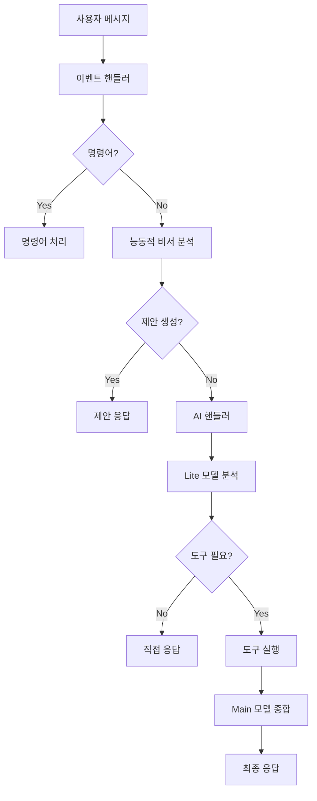

# 🤖 마사몽 AI 에이전트 v5.1: 지능형 실시간 어시스턴트

[](https://python.org)
[](https://discordpy.readthedocs.io)
[](LICENSE)
[]()

마사몽 5.1은 단순한 정보 검색 봇을 넘어, 사용자의 여행 계획에 생동감을 불어넣는 **'현지 전문가'** AI 에이전트입니다. "다음 주 도쿄 가는데 뭐하지?" 라는 막연한 질문에, 날씨, 인기 명소, 그리고 현지에서 열리는 이벤트까지 종합하여 "마침 다음 주에만 열리는 재즈 페스티벌이 있고, 요즘 현지인들에게 가장 인기 있는 전망대는 여기예요." 와 같이 살아있는 정보를 제공합니다.

## 🌟 주요 특징

### 🧠 2-Step Agent 아키텍처
- **1단계 (Triage & Intent)**: 경량 LLM(`gemini-2.5-flash-lite`)이 사용자 의도를 분석하고 간단한 대화는 직접 처리
- **2단계 (Execution & Synthesis)**: 복잡한 요청은 도구를 사용하여 데이터를 수집한 후, 강력한 LLM(`gemini-2.5-flash`)이 최종 답변 생성

### 🛠️ API Mashup 시스템
고비용의 단일 API 대신, 각 분야 최고의 무료 API를 지능적으로 조합:
- **지리 정보**: Nominatim (OpenStreetMap)
- **날씨**: 기상청(KMA) + OpenWeatherMap
- **금융**: 한국수출입은행 + Finnhub + KRX
- **여행**: Foursquare + Ticketmaster
- **게임**: RAWG

### 🎯 능동적 비서 기능
- **잠재적 의도 파악**: "다음 달에 일본 여행 가려고" → "엔화 환율 정보를 알려드릴까요?"
- **개인화된 알림**: 환율, 날씨, 주식 등 사용자 설정 기반 알림
- **맥락 기억**: 대화 내용을 기억하여 "아까 말했던 그 게임" 같은 모호한 질문에도 답변

### 🛡️ 엔터프라이즈급 안정성
- **완전한 예외 처리**: 모든 API 호출에 대한 방어벽 구축
- **자동 복구**: API 장애 시에도 봇이 중단되지 않음
- **상세한 로깅**: JSON 형식의 구조화된 로그로 문제 추적 용이

## 🚀 빠른 시작

### 1. 필수 요구사항
- Python 3.8 이상
- Discord 봇 토큰
- Google Gemini API 키

### 2. 설치 (Ubuntu 20.04+ 기준)

**1. 시스템 준비**

```bash
# 시스템 패키지 목록을 최신 상태로 업데이트합니다.
sudo apt update && sudo apt upgrade -y

# Python 3.11, 가상 환경 도구, pip, git을 설치합니다.
# (Python 3.8 이상이면 되지만, 3.11을 권장합니다.)
sudo apt install python3.11 python3.11-venv python3-pip git -y
```

**2. 프로젝트 클론 및 설정**

```bash
# 원하는 위치에 프로젝트 소스 코드를 클론합니다.
git clone https://github.com/kim0040/masamong.git
cd masamong

# 'venv'라는 이름의 가상 환경을 생성합니다.
python3.11 -m venv venv

# 가상 환경을 활성화합니다. (터미널 프롬프트 앞에 (venv)가 표시됩니다.)
source venv/bin/activate

# pip를 최신 버전으로 업그레이드합니다.
pip install --upgrade pip

# requirements.txt 파일에 명시된 모든 파이썬 라이브러리를 설치합니다.
pip install -r requirements.txt
```

**3. 환경 변수 및 API 키 설정**

```bash
# .env.example 파일을 복사하여 .env 파일을 생성합니다.
cp .env.example .env

# nano 또는 vim과 같은 텍스트 편집기로 .env 파일을 엽니다.
nano .env
```

`.env` 파일 내부에 각 API 서비스에서 발급받은 키를 입력하고 저장합니다. `DISCORD_BOT_TOKEN`과 `GEMINI_API_KEY`는 봇의 핵심 기능을 위해 **반드시** 필요합니다.

**4. 데이터베이스 초기화**

```bash
# database/schema.sql 파일의 내용에 따라 SQLite 데이터베이스 파일을 생성합니다.
# 이 명령어는 봇을 처음 설정할 때 한 번만 실행하면 됩니다.
python database/init_db.py
```

**5. 봇 실행**

```bash
# 모든 설정이 완료되었습니다! 봇을 실행합니다.
python main.py
```

#### 백그라운드 실행 (Ubuntu 서버용)

```bash
# systemd 서비스 파일 생성
sudo nano /etc/systemd/system/masamong.service

# 서비스 내용:
[Unit]
Description=Masamong Discord Bot
After=network.target

[Service]
Type=simple
User=your_username
WorkingDirectory=/path/to/masamong
Environment=PATH=/path/to/masamong/venv/bin
ExecStart=/path/to/masamong/venv/bin/python main.py
Restart=always
RestartSec=10

[Install]
WantedBy=multi-user.target

# 서비스 활성화 및 시작
sudo systemctl daemon-reload
sudo systemctl enable masamong
sudo systemctl start masamong

# 상태 확인
sudo systemctl status masamong
```

### 3. 환경 변수 설정

`.env` 파일에 다음 API 키들을 설정하세요:

```env
# 필수 (무료)
DISCORD_BOT_TOKEN=your_discord_bot_token        # Discord Developer Portal
GEMINI_API_KEY=your_gemini_api_key              # Google AI Studio

# 날씨 (한국)
KMA_API_KEY=your_kma_api_key                   # 기상청 API 허브

# 여행 어시스턴트
OPENWEATHERMAP_API_KEY=your_openweathermap_api_key  # OpenWeatherMap
FOURSQUARE_API_KEY=your_foursquare_api_key      # Foursquare Developers
TICKETMASTER_API_KEY=your_ticketmaster_api_key  # Ticketmaster Developer

# 금융
FINNHUB_API_KEY=your_finnhub_api_key           # Finnhub Stock API
GO_DATA_API_KEY_KR=your_go_data_api_key        # 공공데이터포털
EXIM_API_KEY_KR=your_exim_api_key              # 한국수출입은행

# 기타
RAWG_API_KEY=your_rawg_api_key                 # RAWG Video Games Database
KAKAO_API_KEY=your_kakao_api_key               # Kakao Developers
```

#### API 키 발급 가이드

| 서비스 | 발급처 | 무료 할당량 | 필수도 |
|--------|--------|-------------|---------|
| **Discord Bot** | [Discord Developer Portal](https://discord.com/developers/applications) | 무제한 | 필수 |
| **Google Gemini** | [Google AI Studio](https://aistudio.google.com/app/apikey) | 15 RPM, 1M RPD | 필수 |
| **기상청 API** | [API 허브](https://apihub.kma.go.kr/) | 10,000/일 | 권장 |
| **OpenWeatherMap** | [OpenWeatherMap](https://openweathermap.org/api) | 1,000/일 | 권장 |
| **Foursquare** | [Developers](https://developer.foursquare.com/) | 950/일 | 선택 |
| **Ticketmaster** | [Developer](https://developer.ticketmaster.com/) | 5,000/일 | 선택 |
| **Finnhub** | [Stock API](https://finnhub.io/) | 60/분 | 선택 |
| **공공데이터** | [공공데이터포털](https://data.go.kr/) | 다양 | 선택 |
| **수출입은행** | [환율 API](https://www.koreaexim.go.kr/ir/HPHKIR020M01) | 무제한 | 선택 |
| **RAWG** | [RAWG](https://rawg.io/apidocs) | 20,000/월 | 선택 |
| **Kakao** | [Kakao Developers](https://developers.kakao.com/) | 100,000/일 | 선택 |

## 📖 사용법

### 기본 대화
```
@마사몽 안녕하세요!
→ 안녕! 오늘 날씨가 좋은데 나가서 산책이라도 할까? 🌤️
```

### 여행 정보 조회
```
@마사몽 다음 주 파리 날씨랑 가볼만한 곳 알려줘
→ 파리 여행 정보를 종합적으로 제공 (날씨 + 명소 + 이벤트)
```

### 금융 정보
```
@마사몽 애플 주가를 원화로 알려줘
→ 현재 주가 + 환율 변환 + 뉴스 정보
```

### 능동적 제안
```
사용자: 다음 달에 일본 여행 가려고
마사몽: 오, 일본 여행 가시는구나! 🧳
현재 도쿄의 날씨와 가볼만한 장소, 그리고 열리는 이벤트 정보를 알려드릴까요?
```

### 개인화된 알림
```
!환율알림 USD 1300 below
→ 달러 환율이 1300원 이하로 떨어지면 알림
```

### 명령어 목록

`!` 접두사를 사용하여 다음 명령어들을 사용할 수 있습니다.

| 명령어 (Alias) | 설명 | 사용법 |
| --- | --- | --- |
| `!날씨` (`!weather`, `!현재날씨`, `!오늘날씨`) | 지정된 지역의 날씨 정보를 알려줍니다. | `!날씨 서울` |
| `!운세` (`!fortune`) | 오늘의 운세를 알려줍니다. | `!운세` |
| `!요약` (`!summarize`, `!summary`) | 현재 채널의 최근 대화를 요약합니다. | `!요약` |
| `!랭킹` (`!수다왕`, `!ranking`) | 서버 내 메시지 활동량 순위를 보여줍니다. | `!랭킹` |
| `!투표` (`!poll`) | 간단한 투표를 생성합니다. | `!투표 "저녁 메뉴" "치킨" "피자"` |
| `!환율알림` (`!환율알림설정`, `!exchange_alert`) | 지정한 환율에 도달하면 DM으로 알림을 보냅니다. | `!환율알림 USD 1300 below` |
| `!알림해제` (`!알림삭제`, `!remove_alert`) | 설정된 알림을 해제합니다. | `!알림해제 exchange_rate_alert` |
| `!로그삭제` (`!delete_log`) | (관리자 전용) 봇의 로그 파일을 삭제합니다. | `!로그삭제` |


## 🏗️ 아키텍처

### 핵심 컴포넌트

```
masamong/
├── main.py                 # 봇 진입점
├── config.py              # 설정 관리
├── logger_config.py       # 로깅 시스템
├── cogs/                  # Discord Cog 모듈들
│   ├── ai_handler.py      # AI 대화 처리
│   ├── tools_cog.py       # API 도구 모음
│   ├── weather_cog.py     # 날씨 기능
│   ├── proactive_assistant.py  # 능동적 비서
│   └── ...
├── utils/                 # 유틸리티 모듈들
│   ├── api_handlers/      # API 핸들러들
│   ├── data_formatters.py # 데이터 전처리
│   └── ...
└── database/              # 데이터베이스
    ├── schema.sql         # 스키마 정의
    └── init_db.py         # 초기화 스크립트
```

### 데이터 흐름



## 🔧 고급 설정

### 1. 채널별 AI 설정

`config.py`에서 특정 채널의 AI 동작을 커스터마이징할 수 있습니다:

```python
CHANNEL_AI_CONFIG = {
    123456789012345678: {  # 채널 ID
        "allowed": True,
        "persona": "너는 이 채널의 전용 비서야...",
        "rules": "특별한 규칙들..."
    }
}
```

### 2. API 제한 설정

각 API의 호출 제한을 설정하여 할당량을 관리합니다:

```python
# Gemini API 제한
RPM_LIMIT_INTENT = 15       # 분당 요청 수
RPD_LIMIT_INTENT = 1000     # 일일 요청 수

# 외부 API 제한
FINNHUB_API_RPM_LIMIT = 50
KMA_API_DAILY_CALL_LIMIT = 10000
```

### 3. 로깅 설정

구조화된 JSON 로그를 통해 상세한 모니터링이 가능합니다:

```python
# 로그 레벨 설정
logger.setLevel(logging.DEBUG)

# Discord 로그 채널 설정
# 'logs' 채널이 있는 서버에 자동으로 로그 전송
```

## 🧪 테스트

```bash
# 전체 테스트 실행
python -m pytest tests/ -v

# 특정 모듈 테스트
python -m pytest tests/test_weather_cog.py -v

# 커버리지 포함 테스트
python -m pytest tests/ --cov=. --cov-report=html
```

## 📊 모니터링 및 분석

### 1. 로그 분석
- JSON 형식의 구조화된 로그
- 사용자별, 서버별 통계
- API 호출 패턴 분석

### 2. 성능 지표
- 응답 시간 (평균 < 2초)
- API 성공률 (99%+)
- 사용자 만족도

### 3. 비용 최적화
- 토큰 사용량 모니터링
- API 호출 최적화
- 캐싱 전략

## 🚀 배포

### Docker 배포

```dockerfile
FROM python:3.11-slim

WORKDIR /app
COPY requirements.txt .
RUN pip install -r requirements.txt

COPY . .
RUN python database/init_db.py

CMD ["python", "main.py"]
```

### 시스템 서비스

```ini
[Unit]
Description=Masamong Discord Bot
After=network.target

[Service]
Type=simple
User=masamong
WorkingDirectory=/opt/masamong
ExecStart=/opt/masamong/venv/bin/python main.py
Restart=always

[Install]
WantedBy=multi-user.target
```


---

**마사몽과 함께 더 스마트한 디스코드 서버를 만들어보세요!** 🚀