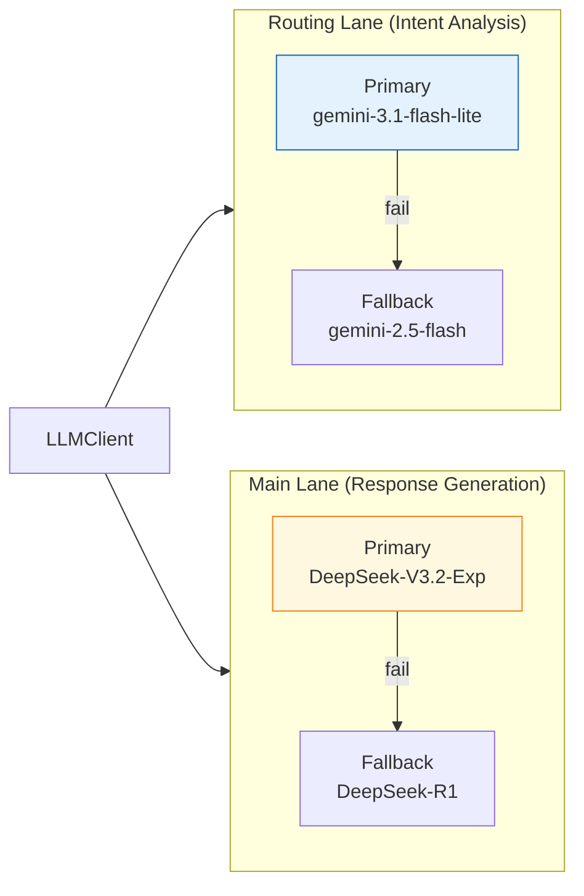

# 🤖 Masamong — Discord AI Chatbot

<p align="center">
  <strong>Korean-language AI chatbot for Discord</strong><br/>
  Dual-lane LLM · Structured Memory (RAG) · Weather · Finance · Web Search · Fortune · Image Generation
</p>

<p align="center">
  <a href="docs/README.ko.md">한국어</a> &nbsp;|&nbsp;
  <a href="docs/README.ja.md">日本語</a>
</p>

---

## Overview

Masamong is a modular Discord bot that integrates AI conversation, structured memory (RAG), KakaoTalk chat vector search, and external tools (weather, finance, web search, image generation) into a single runtime.

- **Language**: Python 3.9+
- **Framework**: `discord.py` >=2.7.1
- **LLM**: CometAPI (OpenAI-compatible) + optional Gemini fallback
- **DB Backend**: TiDB (production) / SQLite (development)
- **License**: MIT

---

## Quick Start

### Prerequisites
- Python 3.9+
- Discord Bot Token ([Developer Portal](https://discord.com/developers/applications))
- CometAPI Key (or Gemini API Key)

### Install

```bash
git clone https://github.com/kim0040/masamong.git
cd masamong

python3 -m venv venv
source venv/bin/activate

pip install -r requirements.txt
pip install -r requirements-cpu.txt   # CPU server extras
```

### Configure

```bash
cp .env.example .env
# Edit .env with your API keys
```

**Minimum `.env`:**
```env
DISCORD_BOT_TOKEN=your_token_here
COMETAPI_KEY=your_cometapi_key
COMETAPI_BASE_URL=https://api.cometapi.com/v1
USE_COMETAPI=true
```

### Run

```bash
PYTHONPATH=. python main.py
```

---

## Features

| Feature | Description |
|---------|-------------|
| **AI Chat** | `@Masamong` mention triggers LLM response with channel persona |
| **DM Chat** | 1:1 conversation without mention (30 per 5h rate limit) |
| **Memory / RAG** | Hybrid search (embedding + BM25 + RRF) across conversation history |
| **Weather** | KMA real-time/forecast/earthquake alerts + `!weather` command |
| **Finance** | Stocks (US/KR), exchange rates via Finnhub, yfinance, KRX, EximBank |
| **Web Search** | Real-time web/news via Linkup API (primary) / DuckDuckGo (fallback) |
| **Image Gen** | `!image <prompt>` via CometAPI Gemini Image |
| **Fortune** | Daily/monthly/yearly fortune + zodiac + subscription |
| **Activity** | Server ranking charts (`!ranking`) |
| **Summary** | Channel conversation summary (`!summary`) |
| **Polls** | `!poll "topic" "opt1" "opt2"` |

### Commands

| Command | Description |
|---------|-------------|
| `@Masamong <msg>` | AI conversation (guild, mention required) |
| `!weather [location] [date]` | Weather forecast |
| `!fortune` / `!zodiac` | Fortune & zodiac reading |
| `!ranking` | Server activity ranking |
| `!summary` | Channel conversation summary |
| `!poll "topic" "opt1" "opt2"` | Create a poll |
| `!image <prompt>` | AI image generation |
| `!help` | Show help |
| `/config` | Slash command — configure AI settings |
| `/persona` | Slash command — set channel persona |

---

## Architecture

Masamong uses a **3-stage dual-lane agent pipeline**:

```
Message → Intent Analysis (Routing Lane) → Tool Execution → RAG Search → Response (Main Lane)
```

[📘 Full Architecture (English)](docs/ARCHITECTURE.en.md) &nbsp;|&nbsp; [📗 Full Architecture (한국어)](docs/ARCHITECTURE.ko.md)

[📐 UML Specification (English)](docs/UML_SPEC.en.md) &nbsp;|&nbsp; [📐 UML 명세 (한국어)](docs/UML_SPEC.ko.md) — C4, component, class, sequence, activity, state, and ER diagrams (15 total)

---

## Project Structure

```
masamong/
├── main.py              # Bot entry point, Cog loader, DB migration
├── config.py            # Configuration from .env / config.json / defaults
├── prompts.json          # Channel personas & system prompts
├── emb_config.json       # Embedding / RAG settings
│
├── cogs/                 # Discord Cog modules
│   ├── ai_handler.py     # Core AI pipeline
│   ├── tools_cog.py      # External tool integration
│   ├── weather_cog.py    # Weather commands + rain/greeting alerts
│   ├── fortune_cog.py    # Fortune / zodiac / subscription
│   ├── activity_cog.py   # Activity tracking + ranking
│   └── ...
│
├── utils/                # Utility modules
│   ├── llm_client.py     # LLM lane routing (Primary/Fallback)
│   ├── intent_analyzer.py # Intent analysis + tool detection
│   ├── rag_manager.py    # RAG / embedding / memory management
│   ├── hybrid_search.py  # Embedding + BM25 + RRF search
│   └── api_handlers/     # Finnhub, yfinance, KRX, Kakao, EximBank
│
├── database/             # TiDB/SQLite schemas + compat adapter
├── scripts/              # Operational scripts (smoke test, migration, etc.)
├── docs/                 # Documentation
│   ├── ARCHITECTURE.ko.md # Korean architecture doc
│   ├── ARCHITECTURE.en.md # English architecture doc
│   ├── UML_SPEC.ko.md     # UML diagrams & technical analysis (Korean)
│   ├── README.ko.md       # Korean README
│   └── README.ja.md      # Japanese README
└── requirements.txt
```

---

## Dual-Lane LLM System


```mermaid
flowchart LR
    subgraph Routing["Routing Lane (Intent Analysis)"]
        RP["Primary<br/>gemini-3.1-flash-lite"]
        RF["Fallback<br/>gemini-2.5-flash"]
        RP -->|"fail"| RF
    end

    subgraph Main["Main Lane (Response Generation)"]
        MP["Primary<br/>DeepSeek-V3.2-Exp"]
        MF["Fallback<br/>DeepSeek-R1"]
        MP -->|"fail"| MF
    end

    Caller["LLMClient"] --> Routing
    Caller --> Main

    style RP fill:#e3f2fd,stroke:#1565c0
    style MP fill:#fff8e1,stroke:#f57f17
```

Each lane has **Primary + Fallback** targets with automatic failover.  
See [ARCHITECTURE.en.md](docs/ARCHITECTURE.en.md) for the full diagram.

---

## Configuration Priority

```
1. Environment variables (.env)    ← highest
2. config.json                     ← supplementary
3. Code defaults (config.py)       ← lowest
```

**Key env vars:**
| Variable | Purpose |
|----------|---------|
| `DISCORD_BOT_TOKEN` | Discord bot token (required) |
| `COMETAPI_KEY` | CometAPI key (primary LLM) |
| `GEMINI_API_KEY` | Gemini key (optional fallback) |
| `KMA_API_KEY` | Weather API key |
| `LINKUP_API_KEY` | Web search API key |
| `MASAMONG_DB_BACKEND` | `tidb` or `sqlite` |

See `.env.example` for the complete reference.

---

## Tech Stack

| Layer | Technology |
|-------|-----------|
| Bot Framework | discord.py >=2.7.1 |
| LLM Provider | CometAPI (OpenAI-compatible), Google Gemini |
| LLM Architecture | Dual Lane (Routing + Main) with Primary/Fallback |
| Database | TiDB (production), SQLite (development) |
| Vector Search | SentenceTransformers + TiDB VECTOR(384) / cosine similarity |
| Web Search | Linkup API, DuckDuckGo |
| Finance | Finnhub, yfinance, KRX API, EximBank |
| Weather | KMA (Korea Meteorological Administration) |
| Charting | matplotlib, seaborn |
| Testing | pytest |

### Embedding Models

| Model | Purpose |
|-------|---------|
| `dragonkue/multilingual-e5-small-ko-v2` | Korean-optimized embeddings |
| `upskyy/e5-small-korean` | Query rewriting |
| `BAAI/bge-reranker-v2-m3` | Cross-encoder re-ranking |

---

## License

MIT License

Copyright (c) 2025-2026 kim0040

Permission is hereby granted, free of charge, to any person obtaining a copy
of this software and associated documentation files, to deal in the Software
without restriction, including without limitation the rights to use, copy,
modify, merge, publish, distribute, sublicense, and/or sell copies of the
Software, and to permit persons to whom the Software is furnished to do so.

THE SOFTWARE IS PROVIDED "AS IS", WITHOUT WARRANTY OF ANY KIND.

---

## Documentation

| Document | Language | Content |
|----------|----------|---------|
| [ARCHITECTURE.en.md](docs/ARCHITECTURE.en.md) | English | System architecture in detail (15 diagrams) |
| [ARCHITECTURE.md](docs/ARCHITECTURE.ko.md) | 한국어 | 시스템 아키텍처 상세 (15개 다이어그램) |
| [UML_SPEC.md](docs/UML_SPEC.ko.md) | 한국어 | UML analysis — C4, class, sequence, ER (17 diagrams) |
| [README.ko.md](docs/README.ko.md) | 한국어 | Korean README |
| [README.ja.md](docs/README.ja.md) | 日本語 | Japanese README |

---

<p align="center">
  Made with 🐍 by <a href="https://github.com/kim0040">kim0040</a>
</p>
