# Masamong Architecture Document

> **See also**: [UML_SPEC.md](UML_SPEC.md) for detailed UML diagrams and technical analysis.

## System Overview

Masamong is a modular Discord bot combining an AI agent, RAG system, and external API integrations.

---

## System Context Diagram

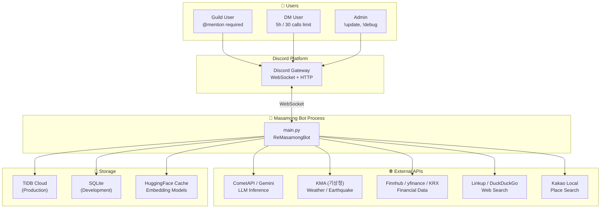

---

## Core Design Principles

### 1. 3-Stage AI Pipeline

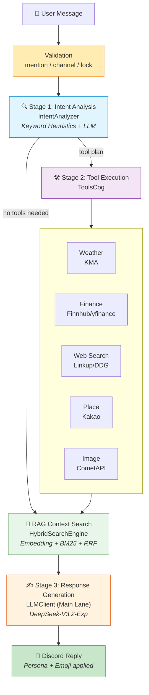

### 2. Dual-Lane LLM Routing

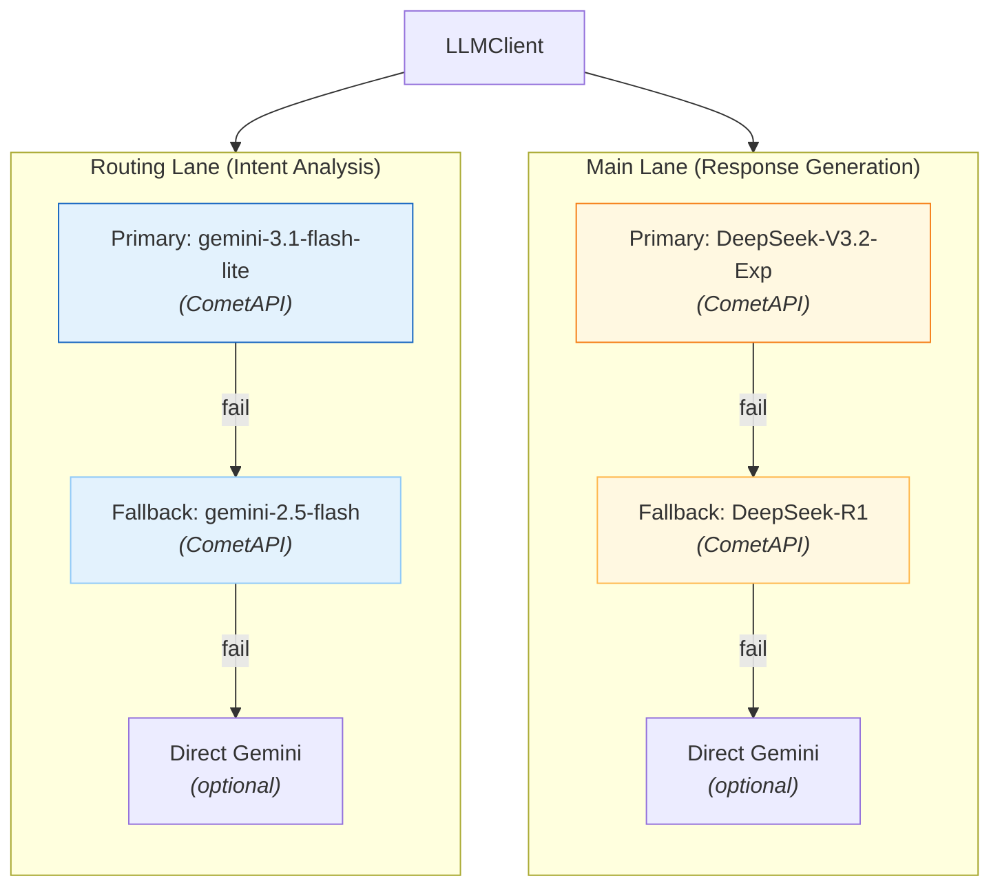

**LLM Call Sequence**:

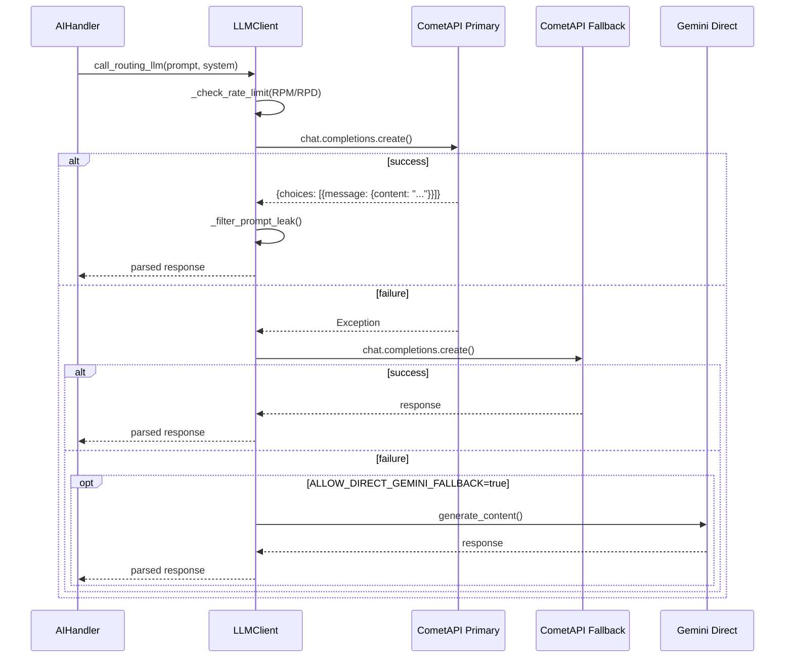

### 3. Hybrid RAG

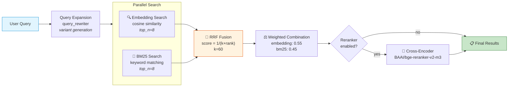

### 4. Mention Gate Pattern

**Goal**: Prevent resource waste and protect privacy.

Processing all messages would mean:
- ❌ Unnecessary API calls
- ❌ Risk of exposing private conversations
- ❌ High costs

Processing mentions only ensures:
- ✅ Respond only to explicit requests
- ✅ Reduced API costs
- ✅ Privacy protection

---

## Module Structure

### Cog Architecture

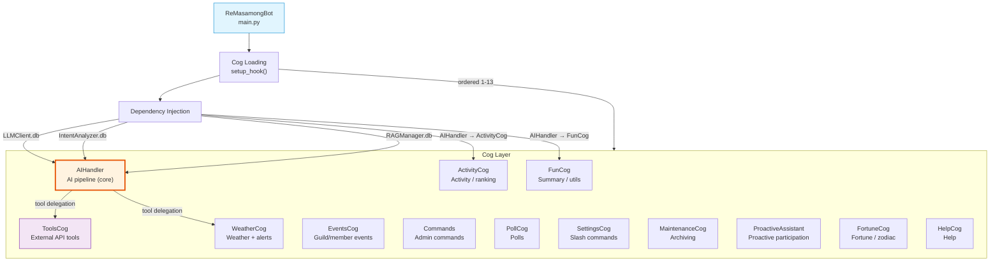

### Component Dependency

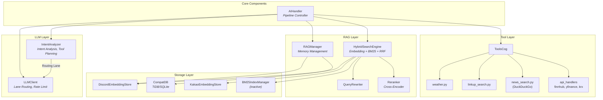

---

## Message Processing Sequence

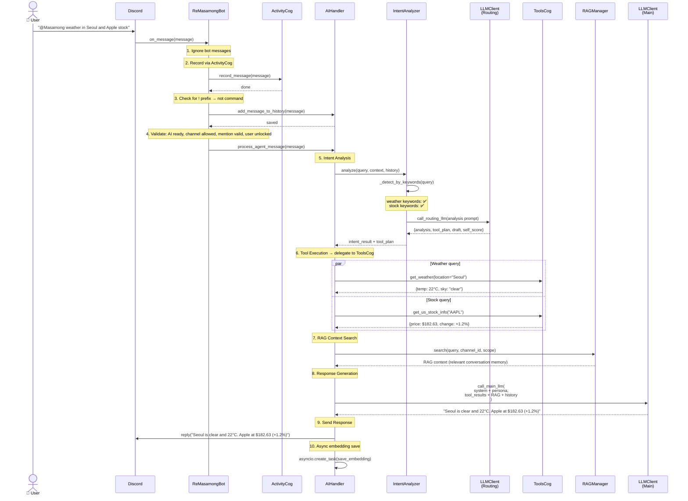

---

## Data Layer

### Database Structure

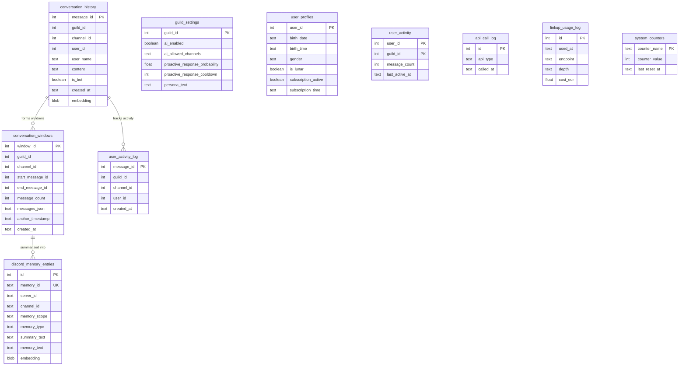

### Conversation Window Caching

**Goal**: Optimize RAG performance

Naive approach:
```sql
-- Query ±3 messages every time (slow)
SELECT * FROM conversation_history 
WHERE message_id BETWEEN (target_id - 3) AND (target_id + 3)
```

Masamong approach:
```sql
-- Query pre-computed windows (fast)
SELECT messages_json FROM conversation_windows 
WHERE start_message_id <= target_id 
  AND end_message_id >= target_id
```

**Performance improvement**: 3~5x

---

## RAG Pipeline Details

### 1. Query Preprocessing

```python
# Input: "weather Seoul"
query = "weather Seoul"
recent_messages = ["it rained yesterday", "what about today"]

# Step 1: Context combination
seed_query = "weather Seoul it rained yesterday what about today"

# Step 2: Query expansion
variants = [
    "weather Seoul",
    "weather Seoul it rained yesterday what about today",
    "current weather information for Seoul",  # generated variant
]
```

### 2. Parallel Search

```python
# Run BM25 + embedding simultaneously for each variant
for variant in variants:
    embedding_results = await embedding_search(variant, top_n=8)
    bm25_results = await bm25_search(variant, top_n=8)
```

### 3. RRF (Reciprocal Rank Fusion)

```python
def calculate_rrf_score(rank: int, k: int = 60) -> float:
    return 1.0 / (k + rank)

# Example
# embedding rank 1 → rrf_score = 1/(60+1) = 0.0164
# BM25 rank 3 → rrf_score = 1/(60+3) = 0.0159
```

### 4. Weighted Combination

```python
# When a candidate appears in both searches
combined_score = (
    similarity * 0.55 +        # semantic similarity
    bm25_normalized * 0.45     # keyword matching
)
```

### 5. Re-ranking (Optional)

```python
if RERANK_ENABLED:
    # Cross-Encoder for precision
    reranked = cross_encoder.rank(query, candidates)
    return reranked[:top_k]
```

---

## Background Tasks

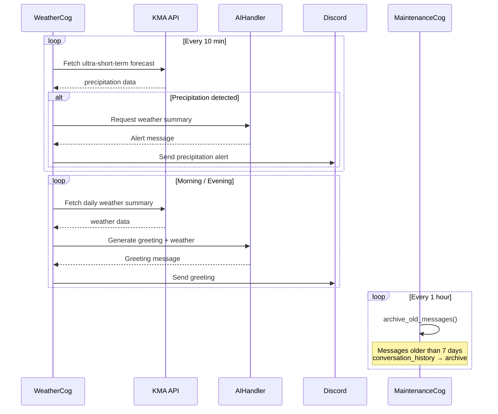

---

## Performance Optimization

### 1. Caching Layers

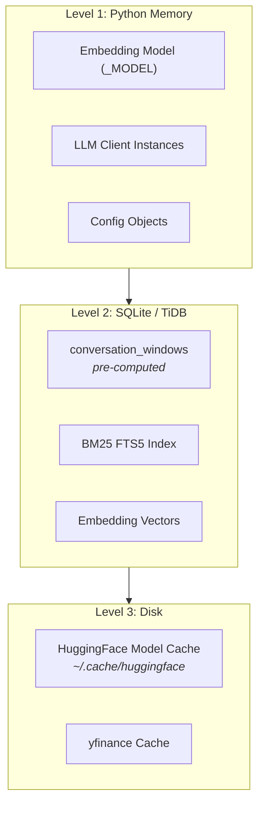

### 2. Async Processing

**Message embedding**:
```python
# Prevent main thread blocking
asyncio.create_task(
    self._create_and_save_embedding(message)
)
```

**Parallel API calls**:
```python
# Concurrent API calls
results = await asyncio.gather(
    get_weather(),
    get_stock_info(),
    web_search(),
    return_exceptions=True
)
```

### 3. Index Optimization

```sql
-- conversation_windows composite index
CREATE INDEX idx_conversation_windows_channel 
ON conversation_windows (channel_id, anchor_timestamp DESC);

-- Unique constraint prevents duplicates
CREATE UNIQUE INDEX idx_conversation_windows_span 
ON conversation_windows (channel_id, start_message_id, end_message_id);
```

---

## Error Handling Patterns

### Layered Fallback

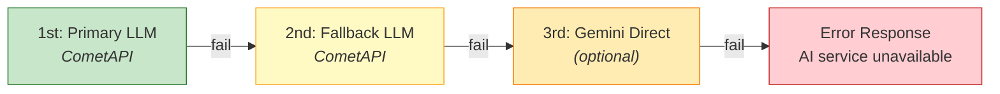

### Web Search Fallback Chain

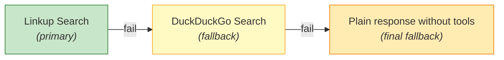

### Tool Execution Failure

```python
# Auto-add web search on tool failure
if tool_execution_failed:
    tool_plan.append({
        "tool_name": "web_search",
        "parameters": {"query": original_query}
    })
```

---

## Extensibility

### Adding a New Cog

```python
# cogs/my_new_cog.py
class MyNewCog(commands.Cog):
    def __init__(self, bot):
        self.bot = bot
    
    @commands.command()
    async def my_command(self, ctx):
        await ctx.send("Hello!")

# main.py → add to cog_list
await bot.load_extension("cogs.my_new_cog")
```

### Adding a New Tool

```python
# cogs/tools_cog.py
async def my_new_tool(self, param1: str) -> dict:
    """New tool description"""
    result = await some_api_call(param1)
    return {"result": result}

# IntentAnalyzer → add keywords to keyword sets
# AIHandler auto-discovers and uses the tool
```

### Adding a New Embedding Source

```python
# emb_config.json
{
  "kakao_servers": [
    {
      "server_id": "new_source_123",
      "db_path": "database/new_source_embeddings.db",
      "label": "New Data Source"
    }
  ]
}
```

---

## Deployment Architecture

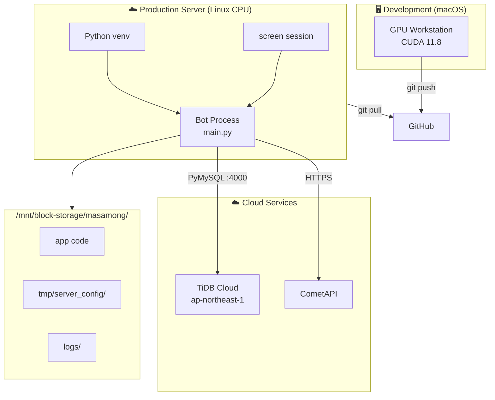

---

## Security Considerations

### 1. Mention Gate

- Auto-injected mention policy in all prompts
- Double-checked at code level

### 2. API Key Management

```python
# ❌ No hardcoding
GEMINI_API_KEY = "AIza..."

# ✅ Environment variables
GEMINI_API_KEY = os.environ.get("GEMINI_API_KEY")
```

### 3. Rate Limiting

```python
# DB-based API call limit
async def check_rate_limit(api_type: str) -> bool:
    recent_calls = await db.count_recent_calls(
        api_type, 
        window_minutes=60
    )
    return recent_calls < config.RPM_LIMIT
```

### 4. Input Validation

```python
# User input sanitization
cleaned_query = re.sub(r'[<>\"\'`]', '', user_query)
```

---

## Monitoring & Observability

### Logging Layers

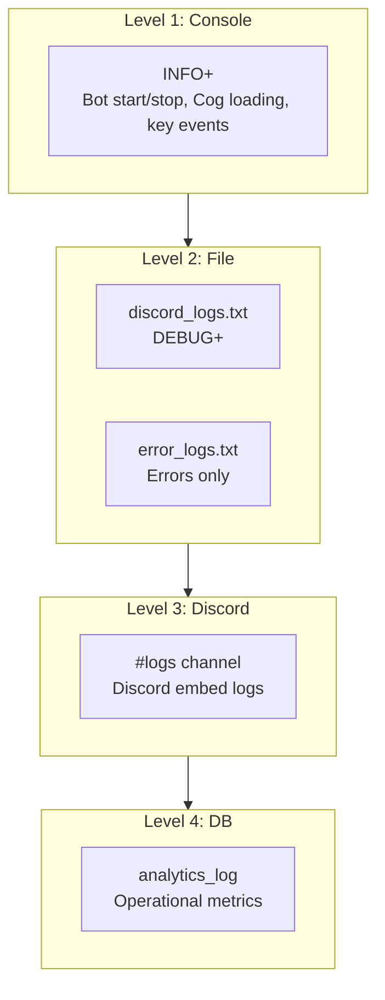

### Metrics Collection

```python
# analytics_log table
{
  "event_type": "AI_INTERACTION",
  "details": {
    "model_used": "DeepSeek-V3.2-Exp",
    "rag_hits": 3,
    "latency_ms": 1250,
    "tools_used": ["get_weather"],
    "self_score": 0.92
  }
}
```

---

## Deployment Considerations

### Low-end Server

**Recommended specs**:
- CPU: 2 Core
- RAM: 2 GB
- Disk: 5 GB

**Optimization**:
```env
AI_MEMORY_ENABLED=false
RERANK_ENABLED=false
SEARCH_CHUNKING_ENABLED=false
CONVERSATION_WINDOW_SIZE=3
```

### High-performance Server

**Recommended specs**:
- CPU: 4+ Core
- RAM: 8 GB+
- Disk: 20 GB+
- GPU: Optional (CUDA 11.8+)

**Optimization**:
```env
AI_MEMORY_ENABLED=true
RERANK_ENABLED=true
SEARCH_CHUNKING_ENABLED=true
LOCAL_EMBEDDING_DEVICE=cuda
BM25_AUTO_REBUILD_ENABLED=true
```

---

## References

| Document | Content |
|----------|---------|
| [UML_SPEC.md](UML_SPEC.md) | Detailed UML diagrams & technical analysis |
| [README.en.md](README.en.md) | English project overview |
| [QUICKSTART.md](QUICKSTART.md) | 5-minute quick start guide |
| [Discord.py](https://discordpy.readthedocs.io/) | Discord.py official docs |
| [Google Gemini API](https://ai.google.dev/) | Gemini API |
| [SentenceTransformers](https://www.sbert.net/) | Embedding models |
| [SQLite FTS5](https://www.sqlite.org/fts5.html) | Full-text search |

---

*Last updated: 2026-04-30*
