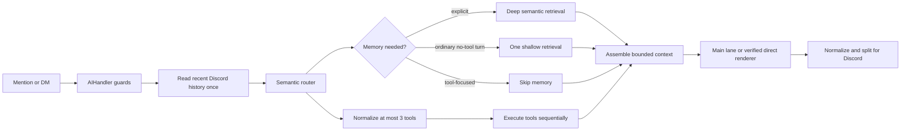
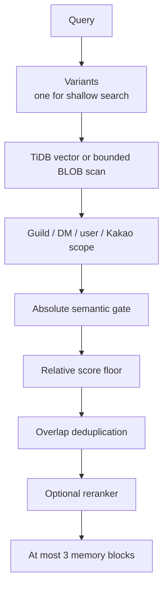

# Masamong Architecture

This document describes the code as of 2026-07-29. See
[README.ko.md](README.ko.md) for the user guide,
[DEPLOYMENT.md](DEPLOYMENT.md) for operations, and
[UML_SPEC.en.md](UML_SPEC.en.md) for diagrams.

## Core invariants

1. Masamo and General share a release, never an identity or mutable boundary.
2. A deployment does not delete or silently rewrite existing production rows.
3. Externally verifiable facts require a successful evidence-bearing tool result.
4. LLM, web, image, and batch work all have finite concurrency, time, size, and
   retry budgets.
5. Reusable personal profiles require current, feature-scoped consent.
6. Production low-spec hosts never build, query, or rebuild a BM25/FTS5 index.

## Instance boundary

| Boundary | Masamo | General |
|---|---|---|
| Profile | `masamo` | `general` |
| Discord app | existing bot | separate bot |
| TiDB database | `masamong` | `masamong_general` |
| Memory | Discord + mapped Kakao | Discord only |
| Notice batches | owner | disabled by default |
| Admins, logs, mutable files | Masamo-only | General-only |

An explicit profile reads its selected `MASAMONG_ENV_FILE` as the boundary
source of truth. Startup fails before Discord login if the declared profile,
bot ID, database, TLS identity, required Cogs, paths, or resource limits do not
match. See [INSTANCE_SEPARATION.ko.md](INSTANCE_SEPARATION.ko.md).

## Repository map

```text
main.py                 startup, schema verification, Cog lifecycle
config.py               profile resolution, feature and resource limits
cogs/                   Discord commands, views, events, schedulers
utils/llm_client.py      routing/main lanes and physical provider boundary
utils/intent_analyzer.py semantic routing and context digest
utils/rag_manager.py     history, windows, bounded embedding tasks
utils/hybrid_search.py   semantic retrieval, scope alignment, relevance gate
utils/db.py              atomic usage reservations and shared DB operations
database/compat_db.py    SQLite/TiDB adapter and transaction ownership
school_notice/           list/detail collection, analysis, digest generation
transfer_notice/         transfer-admission snapshots
profiles/                instance examples and school catalog
scripts/                 audits, validators, one-shot jobs, migrations
tests/                   offline regression and contract tests
```

## Conversation pipeline


```mermaid
flowchart LR
    U["Mention or DM"] --> A["AIHandler guards"]
    A --> H["Read recent Discord history once"]
    H --> R["Semantic router"]
    R --> M{"Memory needed?"}
    M -->|explicit| D["Deep semantic retrieval"]
    M -->|ordinary no-tool turn| P["One shallow retrieval"]
    M -->|tool-focused| N["Skip memory"]
    R --> T["Normalize at most 3 tools"]
    T --> X["Execute tools sequentially"]
    D --> C["Assemble bounded context"]
    P --> C
    N --> C
    X --> C
    C --> L["Main lane or verified direct renderer"]
    L --> O["Normalize and split for Discord"]
```

Recent history is reused by routing, follow-up query contextualization, and the
final prompt. A broken router falls back to a narrow keyword detector, but the
same tool allowlist and cardinality limits still apply.

The routing lane uses `openai/gpt-5.6-luna` through OpenRouter with low
reasoning. Its existing JSON assigns the official `deepseek-v4-flash` final
lane `none`, `low`, or `high`; no lower-effort failure is regenerated at a
higher effort. Flash explicitly disables thinking for `none/low` and enables
high thinking only for `high`. OpenRouter routing allows only the OpenAI
provider, disables provider fallbacks, and requires support for all sent
parameters. Image generation remains on its separate CometAPI key and endpoint.

A provider-neutral style-fidelity contract is placed at the end of the final
system prompt. It makes the selected channel `persona/rules` authoritative over
the model's default help-desk or textbook voice without copying a persona
between guilds. Recent bot turns from the same channel may guide cadence only;
facts, numeric claims, laughter spam, repeated sentences, malformed endings,
and typos are not style examples. Before Discord delivery, deterministic
normalization preserves code blocks while bounding excessive `ㅋㅋ/ㅎㅎ`
markers. This adds no LLM call or billing.

## Context harness

The bot does not append the entire chat log:

- the current question and successful tool evidence receive space first;
- recent verbatim turns are capped at 4,000 characters;
- older selected turns are compacted only when needed, with a 768-token output
  ceiling and a 1,200-character final insertion;
- long-term memory is inserted only when relevant, up to three blocks and 5,000
  characters;
- fortune context is DM-only, router-requested, and consent-gated;
- overlapping original messages, windows, and structured memories are removed.

The final prompt guard preserves both ends so neither global rules nor the
latest request disappears during truncation.

## Memory and retrieval

Memory is scoped by stable identity:

- guild-public facts stay within the same guild;
- guild-user memories also require the matching Discord user;
- DM memories use the DM/user scope (`guild_id=0`);
- Kakao memories are reachable only through the Masamo server map.

Display names are not identities. Discord IDs take precedence, and colliding
display names are labelled distinctly.

Production retrieval is semantic:


```mermaid
flowchart TD
    Q["Query"] --> V["Variants<br/>one for shallow search"]
    V --> S["TiDB vector or bounded BLOB scan"]
    S --> B["Guild / DM / user / Kakao scope"]
    B --> G["Absolute semantic gate"]
    G --> F["Relative score floor"]
    F --> D["Overlap deduplication"]
    D --> R["Optional reranker"]
    R --> K["At most 3 memory blocks"]
```

The passive gate defaults to `0.61`, the explicit-memory gate to `0.58`, and
the relative floor to `0.94` of the best result. Personal or lexical bonuses
may reorder candidates but cannot bypass the semantic gate. TiDB vector search
is used only when the column exists, the backfill is complete, and the feature
flag is on; otherwise a bounded compatibility scan reads existing embeddings.

The code can defensively consume an optional local lexical candidate source,
but `config.py` sets `BM25_DATABASE_PATH=None`, and explicit production profiles
must set `BM25_AUTO_REBUILD_ENABLED=false`. BM25 is therefore unreachable in
the remote runtime.

## Evidence-bearing tools

Weather, market, place, web, and image tools return structured contracts.
Timeout text, missing credentials, empty payloads, or status-less market data
are normalized as errors, not evidence. Current, numeric, news, schedule, or
local-facility questions fail closed when no successful source exists.

Market answers combine an actual KOSPI/KOSDAQ or US-index snapshot with sourced
news. Material numbers absent from the evidence are removed before sending.

Each external provider has a circuit breaker. Consecutive failures enter a
cooldown; one user request becomes the half-open probe. Cancellation abandons
the probe so the provider cannot remain permanently locked. An invalid or
ambiguous stock symbol is classified as an input failure and does not open the
provider circuit. A failed quote lookup may fall back to one bounded public-web
lookup inside the existing per-message tool limit; it never recursively retries
the same provider.

The stock tool handles one current Yahoo Finance quote for a known ticker.
Historical charts, ADR/OTC listing checks, private service APIs, and currency
conversion are redirected to public evidence. A currency-conversion number is
accepted only when it can be recomputed from the user-supplied amount and a
verified rate.

## LLM and cost boundary

`LLMClient` provides routing and main lanes, each with a primary and optional
fallback. SDK retries are disabled.

- Discord AI requests first enter a bounded global FIFO. Worker count is
  `AI_MAX_CONCURRENT_PROCESSING` and waiting capacity is `AI_QUEUE_MAX_SIZE`.
  Enqueueing and progress messages make no LLM, search, or image call. Each
  accepted item is consumed once; a full queue rejects new work instead of
  accumulating unbounded tasks.
- bounded provider semaphore;
- bounded admission and call timeouts;
- atomic logical-request reservation across global, feature, guild/DM, and user
  dimensions;
- a separate `llm_attempt` record for every physical attempt;
- no overlapping fallback after an ambiguous timeout;
- at most three tool calls, with stricter per-tool cardinality.

The existing semantic routing call also selects Linkup depth: `fast` for one
focused fact, `standard` for ordinary multi-source retrieval, and `deep` only
for sequential or multi-page investigation. A low-quality `fast` result can
advance once to `standard`; a low-quality `standard` result can advance once to
`deep`. No extra routing model call is introduced.

Linkup accounting uses USD reservation states. A call is committed as
`reserved` before provider I/O, then finalized as `billed`, `not_billed`, or
`billed_assumed`. A failed finalization remains reserved and counted, so an
accounting fault cannot understate spend.

The school-notice LLM has independent concurrency, response-size, total-time,
and at-most-two-retry limits. No path uses recursive or infinite LLM retry.

## Image generation

Image generation calls CometAPI's Gemini-native `generateContent` endpoint with
`gemini-3.1-flash-lite-image`. Relevant memory is included only when the user
asks for a context-dependent image. User, guild, and global usage rows are
reserved before the provider call. The response is capped at 18 MB and only one
final `inlineData` image is attached. Concurrent requests wait on one bounded
process lock without reserving usage or calling the provider. A 200 response
without an image is not retried automatically; logs retain only candidate,
finish-reason, safety-category, and part-count metadata, never generated text
or prompt content.

## Notice pipelines

The Discord process does not crawl school sites. A Masamo-only one-shot job at
05:00 KST collects only schools that have active profiles, reads list pages,
fetches candidate detail pages, evaluates them with rules plus a bounded LLM,
and writes user digests. The bot performs a one-school initial collection after
new registration and later delivers only non-empty, version-matching digests at
each user's configured time.

No Discord ID, department, year, or interest is sent to a school website.

Transfer notices use a separate 05:35 KST one-shot over 20 official admissions
sites. The first snapshot is a silent baseline. New or materially renamed
notices are delivered only to subscribers. Chungnam and Pukyong explicitly
block automation through `robots.txt`, so the product exposes official links
instead of pretending to monitor them.

## Earthquake path

KMA earthquakes are polled every 60 seconds. The occurrence watermark is saved
before notification and each channel's original Discord message ID is persisted.
Events in the same time/distance incident are edited into that message. A new
message is sent only if the original is confirmed missing; timeout or permission
errors never trigger a duplicate fallback. Disaster text bypasses guild persona.

## Privacy

Consent is keyed by feature scope, policy version, and notice hash. Button
interactions are deferred before DB work to satisfy Discord's acknowledgement
deadline. Fortune, school notices, and transfer notices use independent scopes.
Provider use and final writes re-check consent to cover mid-session withdrawal.
Consent storage failures fail closed for personal data use.

## Transactions and TiDB

Production uses one PyMySQL connection with `autocommit=False`. In addition to
packet serialization, the adapter assigns transaction ownership from the first
write through commit or rollback. Other tasks cannot interleave. If the owner is
cancelled or exits without committing, the adapter rolls back automatically.

The Starter-plan strategy uses bounded time-window queries, grouped quota reads,
multi-row reservations, local per-profile notice stores, and stale-read
read-only audits. Vector migrations are explicit operations, never part of an
ordinary release.

## Verification

```bash
venv/bin/python -m pytest -q
venv/bin/python -m compileall -q .
venv/bin/python scripts/verify_bang_commands.py
venv/bin/python scripts/audit_tracked_secrets.py --secret-env .env
venv/bin/python scripts/validate_profile_separation.py \
  /etc/masamong/masamo.env \
  /etc/masamong/general.env
```

A production verification also checks the selected env, release SHA, database
name, required Cogs, LLM lanes, BM25-disabled setting, scheduler ownership,
service state, and recent error logs.
