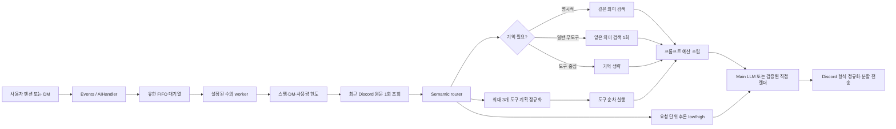
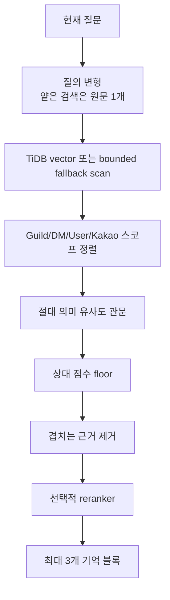
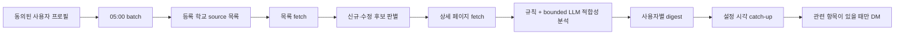

# 마사몽 아키텍처

이 문서는 현재 코드의 실행 구조와 경계를 설명합니다. 기능을 사용하려면
[사용자 가이드](README.ko.md)를, 운영 절차를 준비하려면
[운영·배포 가이드](DEPLOYMENT.md)를, 클래스·시퀀스 그림을 확인하려면
[UML 명세](UML_SPEC.ko.md)를 참고할 수 있습니다. 과거 측정값과 이행 판단은
사용자 안내와 분리해 [내부 유지보수 기록](internal/README.md)에 보관합니다.

## 설계 원칙

1. Masamo와 General은 같은 릴리스만 공유하고 토큰·DB·프롬프트·기억·쓰기 경로는
   공유하지 않는다.
2. 운영 DB의 기존 행은 배포 과정에서 삭제하거나 암묵적으로 재작성하지 않는다.
3. 외부 사실은 실제 도구 결과가 성공했을 때만 사실로 말한다.
4. LLM·웹·이미지 호출은 횟수, 동시성, 대기 시간, 실행 시간, 재시도 횟수가 모두
   유한하다.
5. 개인정보 프로필은 기능별 현재 정책에 명시적으로 동의한 사용자에게만 읽고 쓴다.
6. 원격 저사양 서버에서는 BM25/FTS5를 만들거나 재구축하지 않는다.

## 인스턴스 경계

| 경계 | Masamo | General |
|---|---|---|
| 프로필 | `masamo` | `general` |
| Discord 애플리케이션 | 기존 봇 | 별도 봇 |
| TiDB 데이터베이스 | `masamong` | `masamong_general` |
| 기억 | Discord + 허용된 Kakao 서버 | Discord만 |
| 공지 배치 | 소유 | 기본 비활성 |
| 관리자·로그·가변 파일 | Masamo 전용 | General 전용 |

`MASAMONG_ENV_FILE`로 선택한 파일만 경계 설정의 출처다. 명시적 프로필은 상속된
`MASAMONG_*` 값을 신뢰하지 않으며, 예상 프로필·봇 ID·DB 이름·TLS·필수 Cog·경로와
저사양 상한이 맞지 않으면 기동하지 않는다. 상세 계약은
[INSTANCE_SEPARATION.ko.md](INSTANCE_SEPARATION.ko.md)에 있다.

## 저장소 구조

```text
main.py                 기동, 스키마 검증, Cog 수명주기
config.py               프로필 해석, 기능 플래그, 자원·호출 상한
cogs/                   Discord 명령·메뉴·이벤트·스케줄러
utils/llm_client.py      routing/main LLM 레인과 물리 호출 경계
utils/intent_analyzer.py 의미 라우팅, 도구 계획, 컨텍스트 digest
utils/rag_manager.py     대화 저장, 윈도우, 임베딩 백그라운드 작업
utils/hybrid_search.py   의미 검색, 스코프 정렬, 관련도 관문
utils/db.py              사용량 예약과 공통 DB 작업
database/compat_db.py    SQLite/TiDB 호환과 TiDB 트랜잭션 소유권
school_notice/           학교 공지 수집·상세 분석·digest 생성
transfer_notice/         편입 공지 수집·snapshot 생성
profiles/                두 프로필 예제와 학교 카탈로그
scripts/                 감사, 검증, one-shot 배치·마이그레이션
deploy/systemd/          공지 배치 service/timer 예제
tests/                   네트워크 없는 회귀·계약 테스트
```

## Discord 대화 경로



한 메시지에서 Discord 최근 기록은 한 번만 읽어 라우터와 최종 프롬프트가 재사용한다.
도구는 동시에 폭주시키지 않고 정규화된 순서대로 실행한다. 라우터 결과가 고장 나면
제한된 키워드 fallback만 쓰며, fallback도 같은 도구 상한을 통과한다.

동시에 들어온 서버·DM 요청은 전역 bounded FIFO에 들어간다. worker 수는
`AI_MAX_CONCURRENT_PROCESSING`, 기다릴 수 있는 항목 수는 `AI_QUEUE_MAX_SIZE`다.
저사양 Masamo 권장값은 worker 1개와 대기 8개이므로 한 번에 한 요청만 실행하고 나머지는
접수 순서대로 기다린다. 사양이 늘면 worker 수를 올려 여러 요청을 처리할 수 있지만
provider의 `LLM_MAX_CONCURRENT_CALLS` 상한은 별도로 유지된다. 대기열 등록과 진행 표시는
Discord API만 사용하며 LLM·웹·이미지 호출을 만들지 않는다. 각 항목은 재등록이나 자동
재시도 없이 한 worker가 한 번만 소비한다. 대기열이 가득 차면 무제한 task 누적 대신
즉시 다시 시도해 달라고 안내한다.

대기 중 뒤에 올라온 Discord 메시지는 먼저 접수된 질문의 과거 문맥에 섞지 않는다.
worker가 최근 대화를 읽을 때 원래 질문 메시지 이전까지만 조회한다. 재시작 시 아직
시작하지 않은 항목은 중복 실행하지 않고 다시 질문해 달라고 표시한다.

라우터는 같은 JSON 안에서 최종 답변 추론 수준도 `low/high`로 고른다. 단순 정리에는
`low`, 여러 제약·충돌·모호성·긴 근거 종합에는 `high`를 사용한다. 난이도 판정을 위한
별도 LLM 호출이나 low 결과를 high로 다시 생성하는 경로는 없다. 값이 없거나 잘못되면
`low`로 내려가며, 수준은 공유 target을 수정하지 않고 해당 메시지의 호출 인자로만
전달되어 동시 요청과 서버 경계 사이에 전파되지 않는다. 이름 단독 신원 질문,
오래된 대화 압축, 복수 도구 결과 종합처럼 코드가 이미 아는 구조적 복잡성에는
`high` 후조건을 적용하되 특정 이름·주제 키워드 목록은 사용하지 않는다. Discord
진행 메시지는 `high`일 때만 더 오래 고민 중이라는 문구로 바뀌며 API 호출을
추가하지 않는다.

`references_shared_history`는 기억 필요 여부와 외부 검증 필요 여부를 분리한다. 사용자가
과거에 함께 나눈 사실·결정·사건을 전제로 이어 말하면 장기 기억을 검색하고, 그 전제가
현재 공개 기업·서비스·사건에 관한 내용이면 같은 요청에서 기존 웹 검색도 한 번만
계획할 수 있다. 기억은 “당시 서버에서 무엇을 말했는지”를 복원하는 자료이며 외부 사실의
증명으로 취급하지 않는다. 최종 프롬프트도 과거 대화와 이번 공개 자료를 별도 구획으로
표시한다. 라우팅 모델이 한국어의 과거 공동 담화 표지를 놓친 경우에는 회사명이나 인물명
목록이 아닌 담화 구조만 후조건으로 보정한다. 이 보정은 라우팅 또는 답변 LLM을
재호출하지 않는다.

긴 일반 메시지 작업은 `DiscordProgress`가 담당한다. 단계 문구는 최소 갱신 간격
안의 변경을 합쳐 Discord message edit 폭주를 막고, 별도의 Discord 기본 입력 중
표시는 작업 수명 동안만 유지한다. heartbeat는 장시간 정체 때만 경과 시간을
표시한다. 메뉴·버튼처럼 Discord interaction인 경로는 `thinking=True`로 3초 응답
기한 전에 승인하고, 첫 명령 결과로 deferred original response를 교체한다. 이
표시들은 Discord API만 사용하며 LLM·검색·이미지 API 호출 횟수를 늘리지 않는다.
native typing keepalive는 기본 5분, 최대 15분으로 코드 수준의 상한을 두며 이후에도
본 작업과 낮은 빈도의 상태 문구는 계속 진행된다.

## 컨텍스트 관리

컨텍스트는 “전체 로그를 계속 붙이는 방식”이 아니다.

1. 현재 질문과 성공한 도구 결과가 먼저 자리를 확보한다.
2. 최근 원문은 기본 8턴 범위에서 최대 4,000자로 제한한다.
3. 앞 구간은 필요할 때만 routing 레인으로 짧은 digest를 만든다. digest 출력 상한은
   768 토큰, 최종 주입은 최대 1,200자다.
4. 장기 기억은 질문과 관련된 경우에만 최대 3개 블록, 5,000자 안에서 넣는다.
5. 운세 프로필은 DM이고 라우터가 운세 맥락을 요구하며 현재 동의가 있을 때만 넣는다.
6. 겹치는 원문·윈도우·구조화 기억은 원문 ID와 내용 중복으로 제거한다.

프롬프트 최종 상한에서도 머리와 꼬리를 함께 보존해 시스템 규칙과 최신 질문 중 하나가
통째로 사라지지 않게 한다.

## 기억 저장과 격리

대화 원문은 `conversation_history`, 슬라이딩 윈도우는
`conversation_windows`, 검색용 구조화 기억은 `discord_memory_entries`와 기존
임베딩 테이블에 보존한다. Kakao 기억은 허용된 Masamo 서버 매핑으로만 접근한다.

검색 스코프는 다음과 같다.

- Guild 공용 기억: 같은 `guild_id` 안에서만 검색
- Guild 사용자 기억: 같은 `guild_id`와 해당 사용자 정체성에만 결합
- DM 기억: `guild_id=0`인 해당 DM/사용자 범위
- Kakao 기억: 프로필에 등록된 서버 매핑 안에서만 검색

표시명은 정체성이 아니다. Discord 사용자 ID가 있으면 ID를 우선하며, 같은 이름을
여러 사용자가 쓰면 출력 라벨도 구분한다. A 서버의 페르소나나 기억은 B 서버 프롬프트에
들어갈 수 없다.

## RAG 검색

운영 주 경로는 의미 임베딩 검색이다.



- 일반 얕은 검색 관문: `RAG_MEMORY_GATE_SCORE`, 기본 `0.61`
- 명시적 기억 질문 관문: `RAG_EXPLICIT_MEMORY_GATE_SCORE`, 기본 `0.58`
- 상대 floor: 최고 점수의 기본 `0.94`
- 개인·어휘 보너스는 순위만 조정하며 절대 의미 관문을 우회하지 못한다.
- DB에 `embedding_vec`가 있고 전체 백필 검증과 기능 플래그가 모두 참일 때만 TiDB
  vector 경로를 쓴다. 아니면 기존 BLOB 후보를 제한된 수만 읽는 호환 경로를 쓴다.

`utils/hybrid_search.py`에는 선택적 로컬 어휘 후보를 방어적으로 처리하는 코드가
남아 있지만, 현재 `config.py`는 `BM25_DATABASE_PATH=None`으로 관리자 자체를 만들지
않는다. 원격 프로필은 추가로 `BM25_AUTO_REBUILD_ENABLED=false`를 필수 검증한다.
따라서 운영 서버에서는 BM25 검색·인덱스 생성·자동 재구축이 실행되지 않는다.

## 사실 확인과 도구

라우터는 날씨, 시장, 장소, 웹 검색, 이미지 중 필요한 도구를 선택한다. 성공 문자열이
아닌 구조화된 증거 계약을 검사하며, 다음과 같은 결과는 증거로 인정하지 않는다.

- 오류·시간 초과·키 누락·제공자 비활성 문구
- 비어 있는 날씨/주가/장소 payload
- 성공 상태나 실제 시세 행이 없는 시장 snapshot
- URL·출처·요약이 모두 없는 웹 결과

현재 정보·수치·뉴스·일정·지역 시설처럼 외부 검증이 필요한 질문에서 증거를 못 얻으면
Main LLM이 추측하도록 넘기지 않고 확인 실패를 명시한다. 금융 답변은 KOSPI/KOSDAQ
또는 미국 지수의 실제 snapshot과 웹 소식을 함께 보고, 도구 원문에 없는 수치를
최종 전송 전에 제거한다.

각 제공자는 `ToolHealthRegistry` 회로 차단기를 거친다. 연속 실패 후 cooldown에
들어가고, 시간이 지난 뒤 사용자 요청 한 건만 half-open probe로 허용한다. probe가
취소되면 점유 상태를 즉시 버려 영구 잠금을 막는다.

## LLM 경계

`LLMClient`에는 routing과 main 두 레인이 있다. 각 레인은 primary와 선택적 fallback을
가질 수 있지만 SDK 자체 재시도는 끈다.

- provider 동시성: bounded semaphore
- 슬롯 대기: `LLM_ACQUIRE_TIMEOUT_SECONDS`
- 물리 호출: `LLM_CALL_TIMEOUT_SECONDS`
- 논리 요청 사용량: 전역·기능·Guild/DM·사용자 계층을 한 트랜잭션으로 예약
- 물리 시도: `llm_attempt`로 성공 여부와 무관하게 기록
- timeout 뒤에는 완료 여부가 불명확하므로 추가 fallback을 겹쳐 호출하지 않음
- 도구 계획: 최대 3개, 이미지 1개, 같은 유형별 별도 상한

학교 공지의 독립 LLM 클라이언트도 재시도 최대 2회, 동시성 2 이하, 응답 크기와 전체
시간 상한을 갖는다. 어떤 경로도 무한 retry나 재귀 LLM 호출을 사용하지 않는다.

## 이미지 생성

이미지는 CometAPI의 Gemini native `generateContent` 경로와
`gemini-3.1-flash-lite-image` 모델을 사용한다. 프롬프트에는 사용자가 요청한 경우에만
관련 기억을 넣고, 외모·민감 정보가 기억에 없으면 만들어내지 않도록 지시한다.

사용자·Guild·전역 한도를 확인한 뒤 세 범위 사용량을 한 commit으로 예약한다. 응답은
18MB 상한 안에서 읽고 `inlineData` 중 최종 이미지 한 장만 Discord에 첨부한다.
전용 키 또는 공용 CometAPI 키가 없으면 명시적 프로필은 기동하지 않는다.

## 학교 공지

Discord 봇 프로세스는 크롤링하지 않는다. 별도 systemd oneshot이 매일 05:00 KST에
프로필이 등록한 학교의 source만 순차 수집한다.



학교 사이트에는 Discord ID·학과·학년·관심사를 보내지 않는다. 공개 목록과 상세
페이지만 수집한 뒤 내부에서 프로필과 비교한다. 신규 등록은 해당 학교만 즉시 one-shot
수집하며 timeout·시도 횟수·프로세스 수가 제한된다. 전달은 revision·프로필
version/hash·완료 시각을 검증해 설정 변경 전 결과가 새 프로필에 섞이지 않게 한다.

## 편입 공지

독립 oneshot이 매일 05:35 KST에 20개 공식 입학처를 순차 확인한다. 첫 snapshot은
기준선만 만들고 전송하지 않으며, 이후 신규·실제 제목 수정만 구독자에게 전달한다.
자동 접근이 공식 `robots.txt`로 차단된 충남대·부경대는 지원하는 척하지 않고 공식
링크만 제공한다.

## 지진과 기상

지진은 60초마다 KMA를 확인한다. 새 발표를 보내기 전에 발생 시각 watermark를 DB에
기록하고, 채널별 원본 Discord 메시지 ID도 보존한다. 같은 시간·거리 범위의 지진군은
원본 메시지를 수정하고, 원본이 실제로 삭제된 경우에만 새 메시지를 보낸다. timeout이나
권한 오류에서 중복 메시지로 fallback하지 않는다. 재난 문구는 Guild 페르소나를 거치지
않는 공통 형식 문구다.

## 개인정보

동의는 기능 scope·정책 version·고지문 hash 단위다. 버튼은 먼저 interaction을
`defer`해 Discord의 3초 응답 제한을 지키고, 저장 성공 뒤 follow-up을 보낸다.

- 운세, 학교 공지, 편입 공지는 각각 별도 동의
- 동의 저장소 오류는 개인정보 사용에 대해 fail-closed
- 세션 중 철회될 수 있어 provider 호출과 최종 저장 직전에 다시 확인
- 철회는 사용 중단, 삭제 명령은 해당 기능 데이터 정리
- 동의·철회 이력은 처리 근거로 append-only 보존

일반 Discord 대화와 서버가 제공하는 공용 데이터는 기존 정책을 유지한다.

## DB 트랜잭션과 TiDB 무료 플랜

운영 TiDB 어댑터는 단일 PyMySQL 연결을 사용한다. 패킷 잠금 외에 논리 트랜잭션
소유권 gate를 두어 한 task의 첫 쓰기부터 commit/rollback까지 다른 task가 끼어들지
못한다. 소유 task가 취소되거나 commit 없이 끝나면 미확정 쓰기를 자동 rollback한다.
쓰기 예외를 처리하는 호출자도 명시적으로 rollback해 다음 작업의 commit에 섞이지
않게 한다.

TiDB Starter 보호 방식:

- 삭제 없이 최근 시간 범위와 복합 인덱스로 사용량 집계
- 여러 한도를 한 `GROUP BY` 조회와 multi-row INSERT로 예약
- 공지 원문·snapshot은 로컬 Masamo 전용 SQLite/파일 경로 소유
- 운영 감사 스크립트는 stale-read read-only transaction 사용
- vector 마이그레이션은 별도 명시적 단계이며 기본 배포에서 실행하지 않음

## 운영 로그와 요청 추적

- 일반 로그는 회전되는 JSON Lines 파일, 오류 로그는 `ERROR` 이상 전용 파일로 분리한다.
- AI 요청 하나는 임의의 `trace_id`로 라우팅, LLM 물리 호출, 도구 실행, Discord 전달,
  최종 종료 레코드를 연결한다.
- 종료 레코드에는 `outcome`, 마지막 `stage`, 전체 `duration_ms`, 실행한 도구 수를 남긴다.
  도구와 LLM 호출은 개별 소요 시간·대기 시간·실패 유형을 별도로 남긴다.
- 구조화 필드는 고정 allowlist와 길이 상한을 사용한다. 기본 설정에서는 질문, 프롬프트,
  검색 결과, 답변 본문과 도구 파라미터를 로그나 분석 table에 저장하지 않는다.
- 1분 지진 감시는 계속 수행하되 정상 성공 로그는 첫 실행·결과 개수 변화·시간별
  heartbeat만 `INFO`로 기록한다. 오류와 실제 신규 지진 처리는 즉시 기록한다.
- Discord 운영 로그에는 `WARNING` 이상만 보내며 bounded queue를 사용한다. `trace_id`가
  있으면 footer에 표시해 파일 로그와 연결할 수 있다.

## 수명주기와 실패 격리

- `tasks.loop` 본문은 한 tick 작업량과 timeout이 제한된다.
- 학교·편입 catch-up은 batch 크기와 재시도 횟수가 제한된다.
- RAG 임베딩 태스크는 set으로 추적하고 상한 초과 시 새 작업을 버린다.
- 종료 시 백그라운드 태스크·공유 HTTP 세션·DB 연결을 취소 후 회수한다.
- 도구 실패는 해당 도구 회로만 열고 대화 프로세스 전체를 멈추지 않는다.
- 시작 검증에서 필수 스키마·인덱스·경계를 만족하지 못하면 Discord 로그인 전에
  실패한다.

## 검증 기준

오프라인 기본 검증:

```bash
venv/bin/python -m pytest -q
venv/bin/python -m compileall -q .
venv/bin/python scripts/verify_bang_commands.py
venv/bin/python scripts/audit_tracked_secrets.py --secret-env .env
venv/bin/python scripts/validate_profile_separation.py \
  /etc/masamong/masamo.env \
  /etc/masamong/general.env
```

운영 배포 후에는 서비스가 active인지뿐 아니라 선택 env, release SHA, DB 이름,
필수 Cog, LLM 레인, BM25 비활성, scheduler 중복 여부, 최근 오류 로그를 확인한다.
