# 마사몽 아키텍처 문서

> **참고**: 더 자세한 UML 분석은 [UML_SPEC.md](UML_SPEC.ko.md)를 참조하세요.

## 시스템 개요

마사몽은 모듈식 아키텍처를 가진 Discord 봇으로, AI 에이전트, RAG 시스템, 외부 API 통합을 결합합니다.

---

## 시스템 컨텍스트 다이어그램

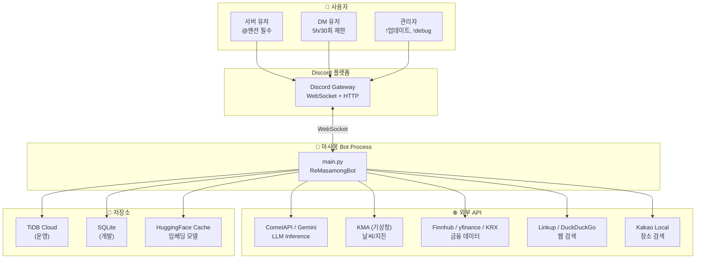

---

## 핵심 설계 원칙

### 1. 3단계 AI 파이프라인

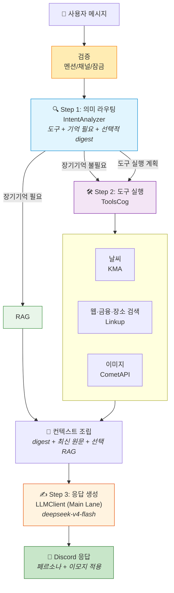

### 2. 듀얼 레인 LLM 라우팅

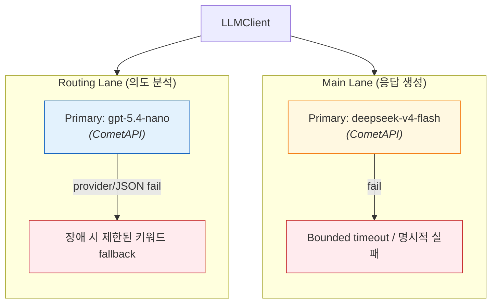

**LLM 호출 시퀀스**:

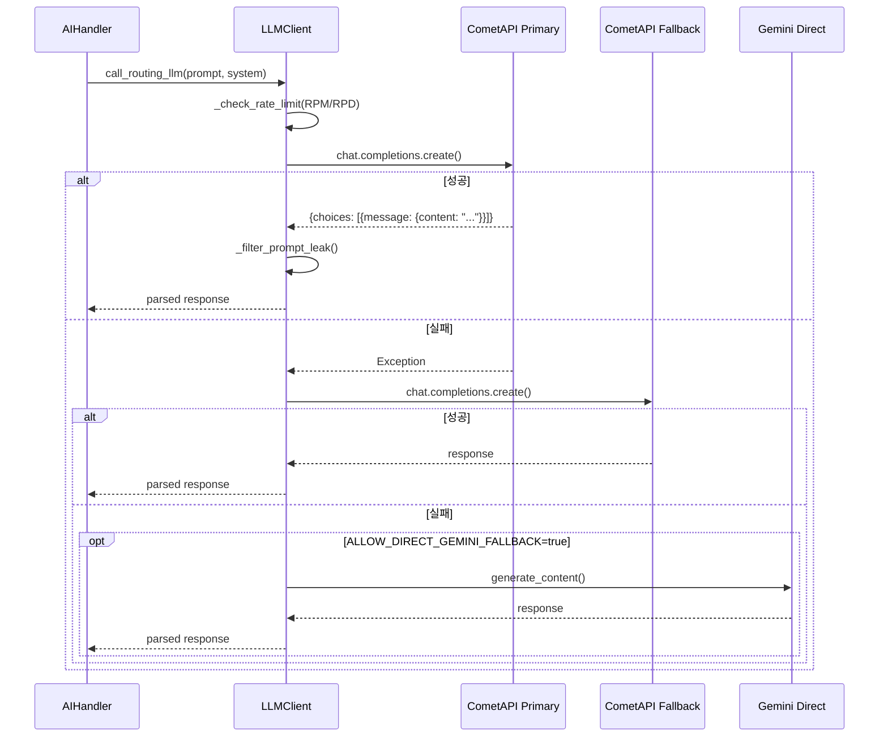

### 3. 하이브리드 RAG

**문제**: 단일 검색 방식의 한계
- 의미 검색만: 키워드 정확도 부족
- 키워드 검색만: 의미 파악 불가

**해결**: BM25 + Embedding 결합

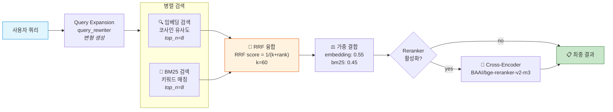

```python
# 가중치
embedding_weight = 0.55  # 의미 기반
bm25_weight = 0.45       # 키워드 기반

# 최종 점수
combined_score = (similarity * 0.55) + (bm25_score * 0.45)
```

### 4. 멘션 게이트 패턴

**목표**: 리소스 낭비 방지 및 개인정보 보호

모든 메시지를 처리하면:
- ❌ 불필요한 API 호출
- ❌ 개인 대화 노출 위험
- ❌ 높은 비용

멘션만 처리하면:
- ✅ 명시적 요청만 응답
- ✅ API 비용 절감
- ✅ 프라이버시 보호

---

## 모듈 구조

### Cog 아키텍처

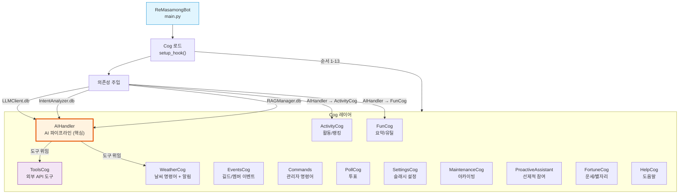

### 컴포넌트 의존성 관계

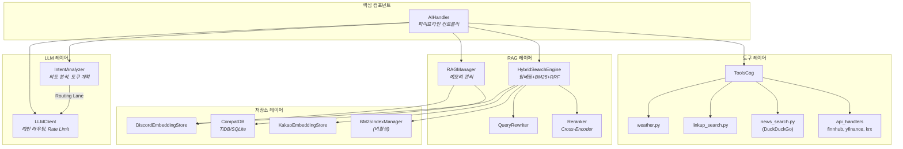

---

## 메시지 처리 상세 시퀀스

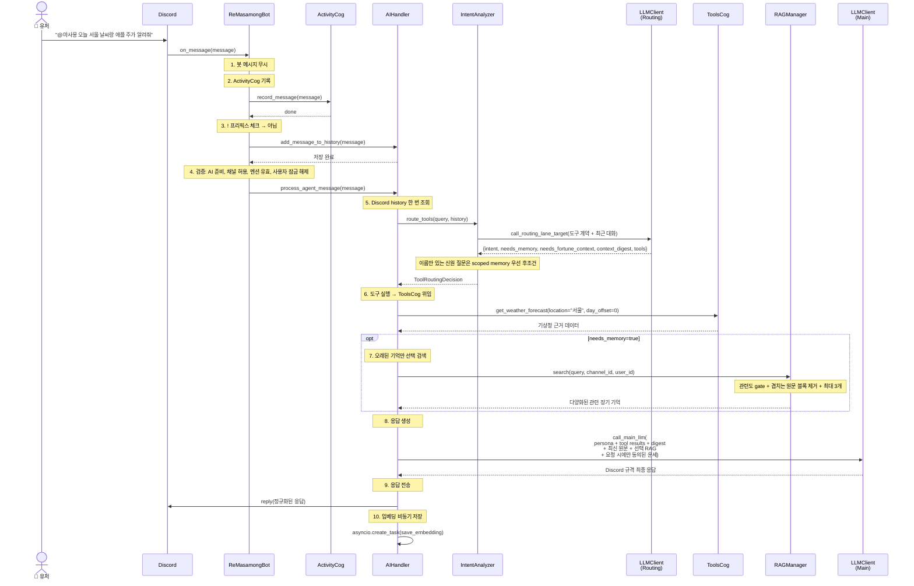

---

## 데이터 레이어

### 데이터베이스 구조

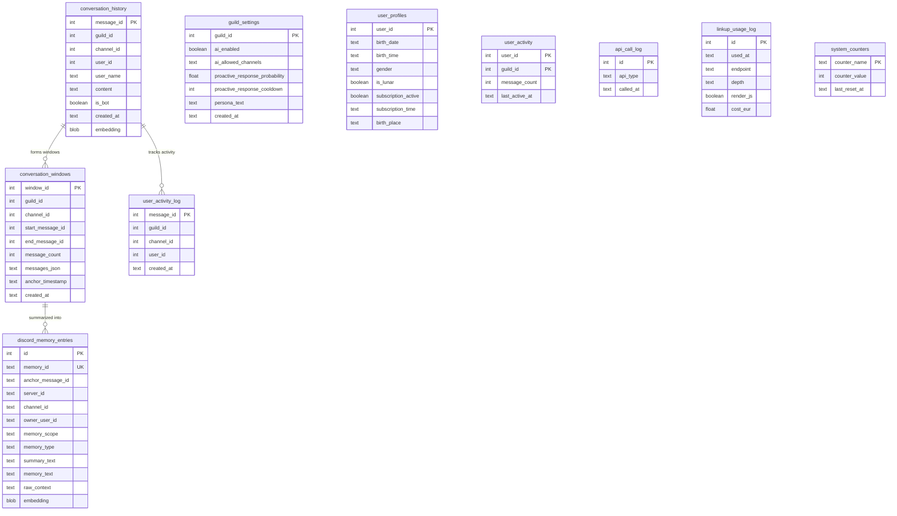

### 대화 윈도우 캐싱

**목적**: RAG 성능 최적화

일반적인 방식:
```sql
-- 매번 ±3 메시지 조회 (느림)
SELECT * FROM conversation_history 
WHERE message_id BETWEEN (target_id - 3) AND (target_id + 3)
```

마사몽 방식:
```sql
-- 미리 계산된 윈도우 조회 (빠름)
SELECT messages_json FROM conversation_windows 
WHERE start_message_id <= target_id 
  AND end_message_id >= target_id
```

**성능 향상**: 3~5배

---

## RAG 파이프라인 상세

### 1. 쿼리 전처리

```python
# 입력: "서울 날씨"
query = "서울 날씨"
recent_messages = ["어제 비 왔어", "오늘은 어떨까"]

# 1단계: 컨텍스트 결합
seed_query = "서울 날씨 어제 비 왔어 오늘은 어떨까"

# 2단계: 쿼리 확장
variants = [
    "서울 날씨",
    "서울 날씨 어제 비 왔어 오늘은 어떨까",
    "서울의 현재 기상 정보",  # 생성된 변형
]
```

### 2. 병렬 검색

```python
# 각 변형마다 BM25 + 임베딩 동시 실행
for variant in variants:
    # 병렬로
    embedding_results = await embedding_search(variant, top_n=8)
    bm25_results = await bm25_search(variant, top_n=8)
```

### 3. RRF (Reciprocal Rank Fusion)

```python
def calculate_rrf_score(rank: int, k: int = 60) -> float:
    return 1.0 / (k + rank)

# 예시
# 임베딩 rank 1 → rrf_score = 1/(60+1) = 0.0164
# BM25 rank 3 → rrf_score = 1/(60+3) = 0.0159
```

### 4. 가중 결합

```python
# 후보가 두 검색에서 모두 나타난 경우
combined_score = (
    similarity * 0.55 +        # 의미 유사도
    bm25_normalized * 0.45     # 키워드 매칭
)
```

### 5. 리랭킹 (선택)

```python
if RERANK_ENABLED:
    # Cross-Encoder로 정밀 평가
    reranked = cross_encoder.rank(query, candidates)
    return reranked[:top_k]
```

---

## 백그라운드 태스크 아키텍처

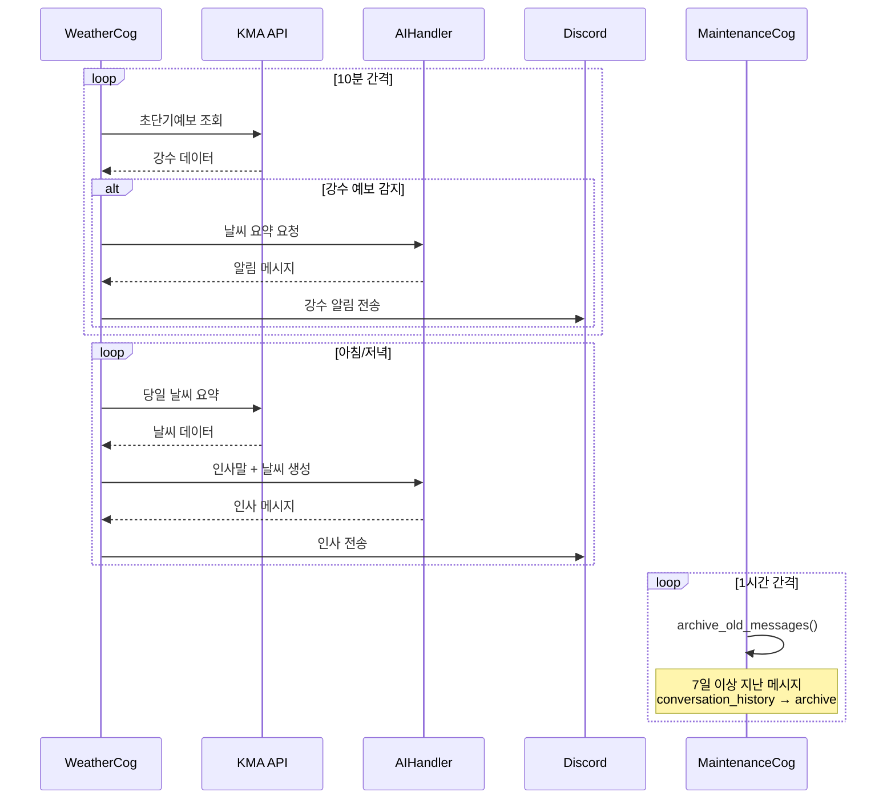

---

## 의미 라우터 통신 계약

### 의도 분석 프롬프트 구조

**입력 프롬프트 구조**:
```json
도구 계약, KST 시각, 화자가 표시된 최근 대화, 현재 요청을 전달한다. 대화가 설정된
문자 임계치를 넘은 경우에만 최신 원문보다 앞선 구간을 `압축할 오래된 대화`로 함께
전달한다. RAG와 서버 페르소나는 도구 선택 입력에 넣지 않는다.
```

**출력 JSON 구조**:
```json
{
  "intent": "서울 날씨 확인",
  "needs_memory": false,
  "requires_external_evidence": true,
  "context_digest": "",
  "tools": [
    {
      "tool": "get_weather_forecast",
      "params": {"location": "서울", "day_offset": 0}
    }
  ]
}
```

`requires_external_evidence=true`이면 실행 가능한 외부 자료가 하나도 없을 때 최종
모델을 호출하지 않고 명시적 확인 실패로 종료한다. 라우터가 시장 브리핑의 도구를
누락해도 `get_market_snapshot`과 `web_search`를 최대 한 번씩 보정하며, 최신 외부
사실은 장기기억의 과거 답변과 섞지 않는다. 이는 일반 키워드 라우팅이 아니라 라우터
오판 시 허위 사실 생성을 막는 실행 후조건이다.

---

## 성능 최적화 전략

### 1. 캐싱 계층

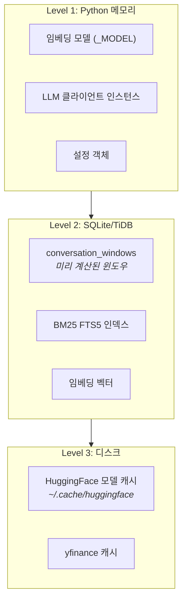

### 2. 비동기 처리

**메시지 임베딩**:
```python
# 메인 스레드 블로킹 방지
asyncio.create_task(
    self._create_and_save_embedding(message)
)
```

**병렬 API 호출**:
```python
# 여러 API 동시 호출
results = await asyncio.gather(
    get_weather(),
    get_stock_info(),
    web_search(),
    return_exceptions=True
)
```

### 3. 인덱싱 최적화

```sql
-- conversation_windows 복합 인덱스
CREATE INDEX idx_conversation_windows_channel 
ON conversation_windows (channel_id, anchor_timestamp DESC);

-- 유니크 제약으로 중복 방지
CREATE UNIQUE INDEX idx_conversation_windows_span 
ON conversation_windows (channel_id, start_message_id, end_message_id);
```

---

## 에러 처리 패턴

### 제한된 공급자 실패 처리

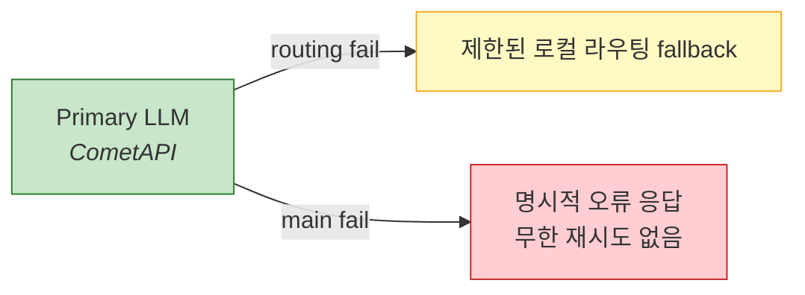

### 웹 검색 폴백 체인

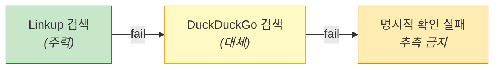

### 도구 실행 실패 처리

```python
# 도구 실패는 결과에 명시한다.
# 외부 근거가 필수인 요청은 성공 자료가 없으면 main 모델을 호출하지 않는다.
# 시장 수치는 구조화된 지수 스냅샷과 최종 문장의 숫자를 다시 대조한다.
tool_results.append({"tool": tool_name, "error": public_error})
```

---

## 확장 가능성

### 새 Cog 추가

```python
# cogs/my_new_cog.py
class MyNewCog(commands.Cog):
    def __init__(self, bot):
        self.bot = bot
    
    @commands.command()
    async def my_command(self, ctx):
        await ctx.send("Hello!")

# main.py → cog_list에 추가
await bot.load_extension("cogs.my_new_cog")
```

### 새 도구 추가

```python
# cogs/tools_cog.py
async def my_new_tool(self, param1: str) -> dict:
    """새로운 도구 설명"""
    result = await some_api_call(param1)
    return {"result": result}

# IntentAnalyzer의 routing tool contract와 allowlist에 이름/파라미터를 추가
# 정상 선택은 routing LLM이 의미적으로 수행하고 keyword는 장애 fallback만 수정
```

### 새 임베딩 소스 추가

```python
# emb_config.json
{
  "kakao_servers": [
    {
      "server_id": "new_source_123",
      "db_path": "database/new_source_embeddings.db",
      "label": "새 데이터 소스"
    }
  ]
}
```

---

## 배포 아키텍처

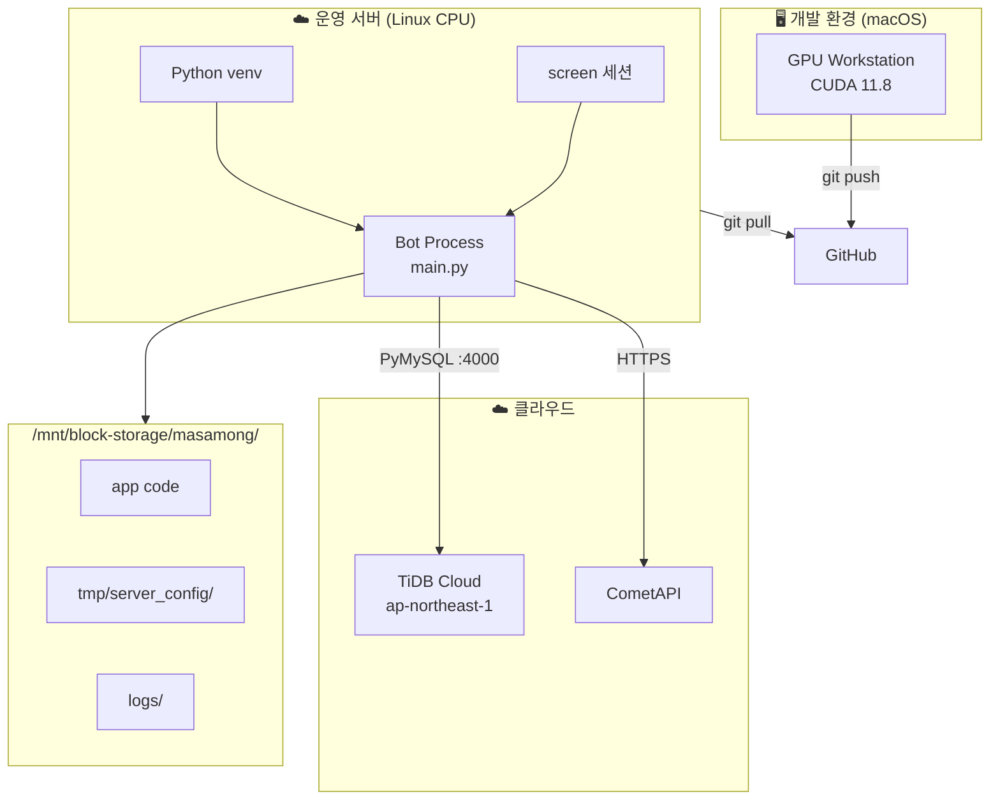

---

## 보안 고려사항

### 1. 멘션 게이트

- 모든 프롬프트에 자동 추가되는 멘션 정책
- 코드 레벨에서도 이중 확인

### 2. API 키 관리

```python
# ❌ 하드코딩 금지
GEMINI_API_KEY = "AIza..."

# ✅ 환경 변수 사용
GEMINI_API_KEY = os.environ.get("GEMINI_API_KEY")
```

### 3. Rate Limiting

```python
# API 호출 제한 (DB 기반)
async def check_rate_limit(api_type: str) -> bool:
    recent_calls = await db.count_recent_calls(
        api_type, 
        window_minutes=60
    )
    return recent_calls < config.RPM_LIMIT
```

### 4. 입력 검증

```python
# 사용자 입력 sanitization
cleaned_query = re.sub(r'[<>\"\'`]', '', user_query)
```

---

## 모니터링 및 관찰성

### 로깅 계층

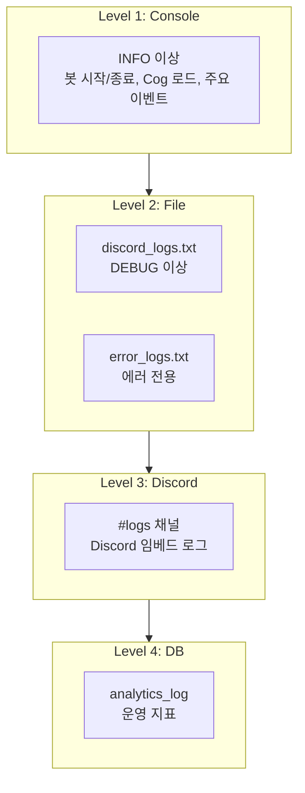

### 메트릭 수집

```python
# analytics_log 테이블
{
  "event_type": "AI_INTERACTION",
  "details": {
    "model_used": "deepseek-v4-flash",
    "rag_hits": 3,
    "latency_ms": 1250,
    "tools_used": ["get_weather"],
    "self_score": 0.92
  }
}
```

---

## 배포 고려사항

### 저사양 서버

**권장 사양**:
- CPU: 2 Core
- RAM: 2GB
- Disk: 5GB

**최적화 설정**:
```env
AI_MEMORY_ENABLED=false
RERANK_ENABLED=false
SEARCH_CHUNKING_ENABLED=false
CONVERSATION_WINDOW_SIZE=3
```

### 고성능 서버

**권장 사양**:
- CPU: 4+ Core
- RAM: 8GB+
- Disk: 20GB+
- GPU: Optional (CUDA 11.8+)

**최적화 설정**:
```env
AI_MEMORY_ENABLED=true
RERANK_ENABLED=true
SEARCH_CHUNKING_ENABLED=true
LOCAL_EMBEDDING_DEVICE=cuda  # GPU 사용
BM25_AUTO_REBUILD_ENABLED=true
```

---

## 레퍼런스

| 문서 | 내용 |
|------|------|
| [UML_SPEC.md](UML_SPEC.ko.md) | 🆕 UML 다이어그램 상세 분석 |
| [README.md](../README.md) | 프로젝트 메인 문서 |
| [QUICKSTART.md](QUICKSTART.md) | 빠른 시작 가이드 |
| [Discord.py](https://discordpy.readthedocs.io/) | Discord.py 공식 문서 |
| [Google Gemini API](https://ai.google.dev/) | Gemini API |
| [SentenceTransformers](https://www.sbert.net/) | 임베딩 모델 |
| [SQLite FTS5](https://www.sqlite.org/fts5.html) | 전문 검색 |

---

*마지막 업데이트: 2026-04-30*
