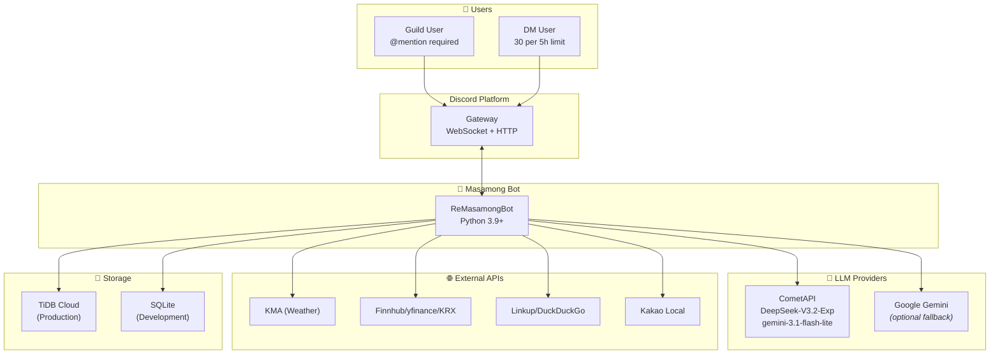
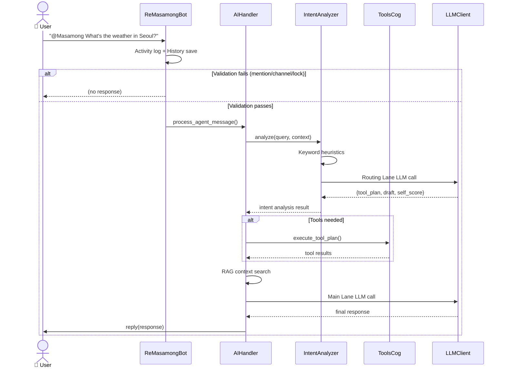
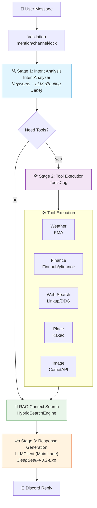
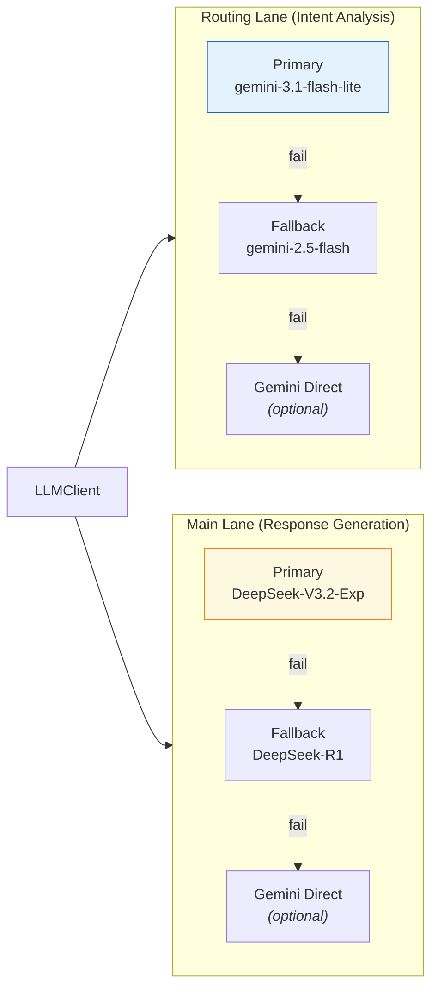
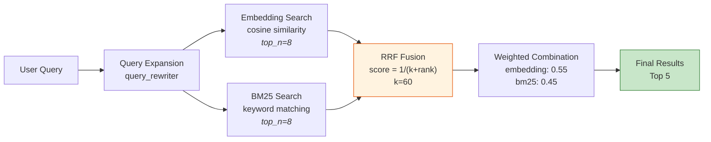

# Masamong Discord Bot

[한국어](../README.md) | English | [日本語](README.ja.md)

Masamong is a Discord bot that provides **mention-based AI chat** and **utility tools (weather, stocks, exchange rates, places, image generation)**.
This document describes **the actual behavior and architecture in the current code**.

---

## System Context Diagram



---

## Message Processing Flow



---

## 3-Stage AI Pipeline



---

## Dual Lane LLM Routing



---

## Hybrid RAG Search



---

**Quick Start**

1. Install Python 3.9+
2. Install dependencies
```
python -m pip install -r requirements.txt
```
3. Configure environment variables
- Use `.env` or `config.json`
- Load order: **env vars → `config.json` → defaults**
4. Run
```
python main.py
```

**Behavior Overview**
- Guild channels: AI responds only when the bot is mentioned.
- DM: chat without mention, with **30 messages per 5 hours + 100 global DMs per day** limits.
- Response generation: **CometAPI (default)**, optional direct Gemini fallback.
- AI pipeline is ready when at least one LLM provider is available.

**Pipeline Details**

**1) Message Routing**
1. `main.py` receives all messages.
2. Command messages are processed and stop there.
3. Non-command messages are passed to `AIHandler.process_agent_message`.
4. Guild messages require mention; DM does not.

**2) Tool Detection and Execution**
- Tools are selected by **keyword matching** + LLM analysis.
- Tools are executed in `ToolsCog`.
- Tool results are placed at the top of the prompt.
- Weather requests are handled by a single tool call.

**3) LLM Selection and Fallback**
- CometAPI is tried first when enabled.
- Gemini fallback is used only when `ALLOW_DIRECT_GEMINI_FALLBACK=true`.
- Gemini is optional if CometAPI is configured.

**4) RAG (Memory) Pipeline**
1. Messages are stored in `conversation_history`.
2. Window summaries are created after a message window fills.
3. Summaries are embedded and stored in `discord_memory_entries`.
4. Query time uses embedding/BM25 hybrid search.
5. `emb_config.json` controls embedding/BM25/query expansion/reranker.

**5) Auto Web Search**
- Triggered only when "latest/news/how/why" keywords appear and RAG is weak.
- Linkup is preferred; DuckDuckGo is used as fallback.
- Monthly budget with EUR limit enforcement.

**6) Background Tasks**
- Rain/snow alerts based on short-term precipitation probability.
- Morning/evening greetings with weather summary.
- Earthquake alerts for domestic M≥4.0 events.

**Dependencies by Feature**
- AI chat: `COMETAPI_KEY` recommended, Gemini optional fallback
- Image generation: `COMETAPI_KEY` required + `COMETAPI_IMAGE_ENABLED=true`
- Weather: `KMA_API_KEY`
- Exchange rates: `EXIM_API_KEY_KR`
- Place/search: `KAKAO_API_KEY`
- Web search: `LINKUP_API_KEY` (primary), DuckDuckGo (fallback)
- Stocks (default): `USE_YFINANCE=true` + CometAPI ticker extraction
- Stocks (alternative): `USE_YFINANCE=false` with KRX/Finnhub keys
- Fortune/Zodiac: CometAPI only (no Gemini fallback)
- RAG embeddings: `numpy`, `sentence-transformers`

**Architecture Components**

| Area | Modules | Responsibility |
| --- | --- | --- |
| Entrypoint | `main.py` | Bot init, Cog loading, message routing |
| AI pipeline | `cogs/ai_handler.py` | Tool routing, RAG, LLM calls |
| LLM Client | `utils/llm_client.py` | Lane routing, Rate Limit, prompt filtering |
| Intent Analysis | `utils/intent_analyzer.py` | Keyword + LLM intent detection |
| RAG Management | `utils/rag_manager.py` | Memory store, window generation |
| Hybrid Search | `utils/hybrid_search.py` | Embedding + BM25 + RRF |
| Tools | `cogs/tools_cog.py` | Weather/stocks/exchange/places/web/image |
| Weather/alerts | `cogs/weather_cog.py` | Weather + rain/greeting/earthquake alerts |
| Fortune/Zodiac | `cogs/fortune_cog.py` | Fortune and zodiac features |
| Commands | `cogs/commands.py`, `cogs/fun_cog.py` | Utility commands and summary |
| Ranking | `cogs/activity_cog.py` | Activity tracking and ranking |
| Poll | `cogs/poll_cog.py` | Poll creation |
| Settings | `cogs/settings_cog.py` | Slash command config storage |
| Maintenance | `cogs/maintenance_cog.py` | Archiving, BM25 rebuild |
| DB Adapter | `database/compat_db.py` | TiDB/SQLite unified adapter |

**Data Storage**
- Main DB: TiDB (production) / SQLite (development)
- Memory Store: `discord_memory_entries` (TiDB/SQLite)
- Kakao Store: `kakao_chunks` (TiDB/local)
- Key tables: `conversation_history`, `conversation_windows`, `user_activity`, `user_profiles`, `api_call_log`

**Config Priority**
- Load order: env vars → `config.json` → defaults
- AI allowlist: `prompts.json` (`channels.allowed`) or `DEFAULT_AI_CHANNELS`
- `/config channel` writes DB but is **not used for AI allowlist** in the current pipeline.

**Command Summary**
- `!도움` / `!도움말` / `!h`: help
- `!날씨`: weather
- `!요약`: chat summary (guild only)
- `!랭킹`: activity ranking (guild only)
- `!투표`: poll (guild only)
- `!이미지`: image generation (guild only)
- `!운세`, `!별자리`: fortune/zodiac
- `!업데이트`: update info
- `!delete_log`: delete log (admin only)
- `!debug`: debug (owner only)

**Operational Notes**
- CometAPI is the primary LLM provider; Gemini keys are optional.
- Stock lookup in yfinance mode depends on CometAPI ticker extraction.
- Image generation is rate-limited per user and globally.
- DM usage is strictly rate-limited.

## Further Reading

| Document | Content |
|----------|---------|
| [ARCHITECTURE.md](ARCHITECTURE.md) | Detailed system architecture |
| [UML_SPEC.md](UML_SPEC.md) | UML diagrams & technical analysis |
| [QUICKSTART.md](QUICKSTART.md) | Quick start guide |
