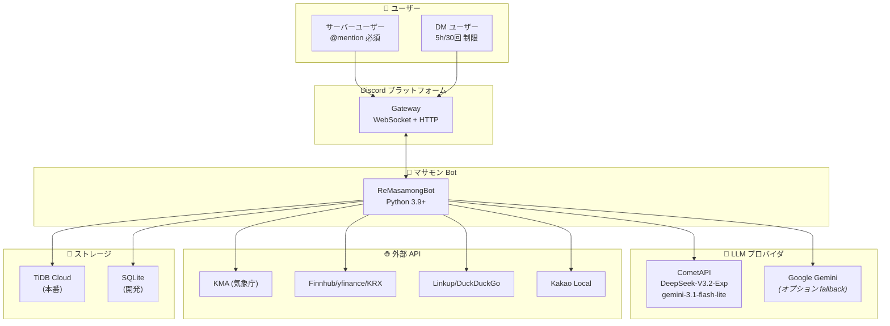
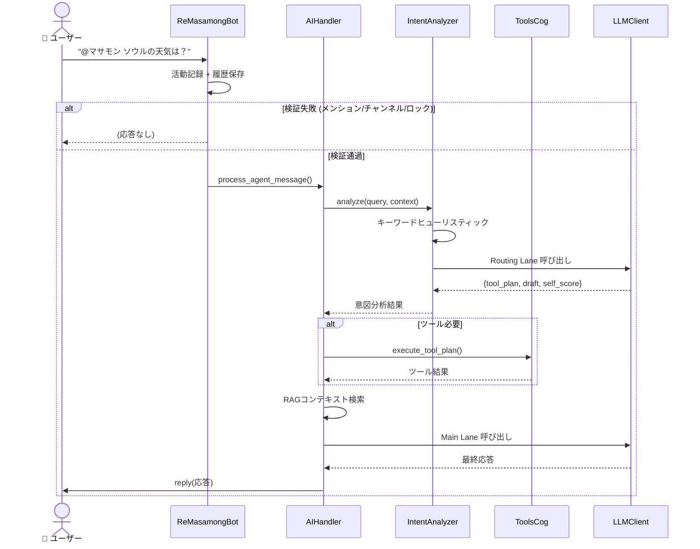
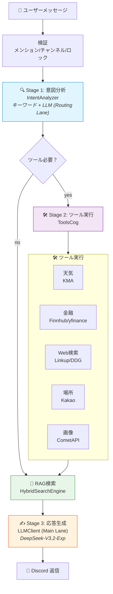
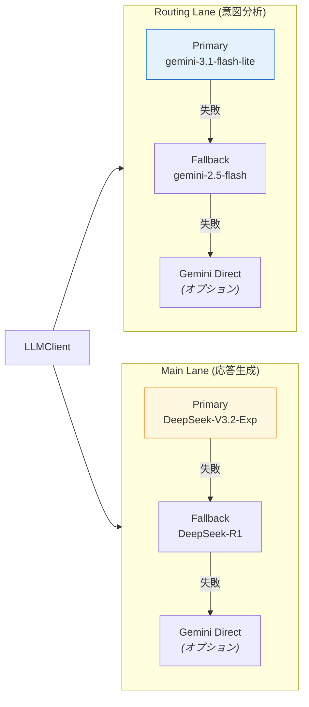
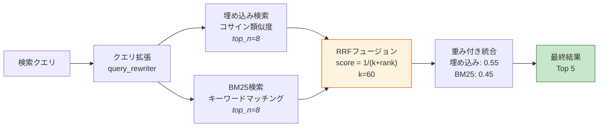

# マサモン Discord ボット

[한국어](../README.md) | [English](README.en.md) | 日本語

マサモンは Discord サーバーで **メンションベースのAI会話** と **ユーティリティツール（天気/株価/為替/場所検索/画像生成）** を提供するボットです。
この文書は **現在のコードに基づく実際の動作と構造** を技術文書として整理しています。

---

## システムコンテキスト図



---

## メッセージ処理フロー



---

## 3ステージAIパイプライン



---

## デュアルレーンLLMルーティング



---

## ハイブリッドRAG検索



---

**Quick Start**
1. Python 3.9+ を用意
2. 依存関係をインストール
```
python -m pip install -r requirements.txt
```
3. 環境変数を設定
- `.env` または `config.json` を使用
- 読み込み順序: **環境変数 → `config.json` → 既定値**
4. 実行
```
python main.py
```

**動作概要**
- サーバー: `@マサモン` メンションがある場合のみAIが応答。
- DM: メンション不要。ただし **5時間あたり30回 + 全体で1日100回** の制限あり。
- 応答生成: **CometAPI（既定）**、必要時のみ Gemini フォールバック。
- LLMプロバイダが1つ以上有効ならAIパイプラインは準備状態になります。

**パイプライン詳細**

**1) メッセージルーティング**
1. `main.py` が全メッセージを受信。
2. `!` コマンドは命令処理へ。
3. 非コマンドは `AIHandler.process_agent_message` に渡される。
4. Guildはメンション必須、DMは省略。

**2) ツール検出と実行**
- **キーワードマッチング + LLM分析**でツールを選択。
- 実行は `ToolsCog` が担当。
- ツール結果はプロンプト先頭に挿入。
- 天気リクエストは単一ツールで即時処理。

**3) LLM選択とフォールバック**
- CometAPIが有効なら先に利用。
- `ALLOW_DIRECT_GEMINI_FALLBACK=true` のときのみGeminiへフォールバック。
- CometAPIが有効ならGeminiキーは必須ではない。

**4) RAG（記憶）パイプライン**
1. メッセージは `conversation_history` に保存。
2. まとまったウィンドウ単位で要約生成。
3. 要約を埋め込み化し `discord_memory_entries` に保存。
4. 検索時は埋め込み/BM25ハイブリッド。
5. `emb_config.json` で制御。

**5) Web検索の自動判断**
- 「最新/ニュース/方法/なぜ」等のキーワード + RAGが弱い時に実行。
- Linkupを優先し、失敗時はDuckDuckGoへフォールバック。
- 月間予算制限でコスト管理。

**6) バックグラウンド処理**
- 雨/雪アラート
- 朝/夜の挨拶（天気要約付き）
- 国内影響圏 M4.0以上の地震アラート

**機能別依存関係**
- AI会話: `COMETAPI_KEY` 推奨、Geminiは任意フォールバック
- 画像生成: `COMETAPI_KEY` 必須 + `COMETAPI_IMAGE_ENABLED=true`
- 天気: `KMA_API_KEY`
- 為替: `EXIM_API_KEY_KR`
- 場所/検索: `KAKAO_API_KEY`
- Web検索: `LINKUP_API_KEY` (主)、DuckDuckGo (代替)
- 株価（既定）: `USE_YFINANCE=true` + CometAPIティッカー抽出
- 株価（代替）: `USE_YFINANCE=false` で KRX/Finnhub
- 運勢/星座: CometAPIのみ（Geminiフォールバックなし）
- RAG埋め込み: `numpy`, `sentence-transformers`

**アーキテクチャ構成**
| 領域 | モジュール | 役割 |
| --- | --- | --- |
| エントリポイント | `main.py` | 初期化、Cog読み込み、ルーティング |
| AIパイプライン | `cogs/ai_handler.py` | ツールルーティング、RAG、LLM呼び出し |
| LLMクライアント | `utils/llm_client.py` | レーンルーティング、Rate Limit |
| 意図分析 | `utils/intent_analyzer.py` | キーワード + LLM分析 |
| RAG管理 | `utils/rag_manager.py` | メモリ保存、ウィンドウ生成 |
| ハイブリッド検索 | `utils/hybrid_search.py` | 埋め込み + BM25 + RRF |
| ツール | `cogs/tools_cog.py` | 天気/株価/為替/場所/検索/画像 |
| 天気/通知 | `cogs/weather_cog.py` | 天気、雨/挨拶/地震通知 |
| 運勢/星座 | `cogs/fortune_cog.py` | 運勢と星座 |
| コマンド | `cogs/commands.py`, `cogs/fun_cog.py` | 汎用コマンド、要約 |
| ランキング | `cogs/activity_cog.py` | 活動記録/ランキング |
| 投票 | `cogs/poll_cog.py` | 投票作成 |
| 設定 | `cogs/settings_cog.py` | スラッシュ設定保存 |
| 保守 | `cogs/maintenance_cog.py` | アーカイブ/BM25再構築 |
| DBアダプター | `database/compat_db.py` | TiDB/SQLite統合 |

**データ保存**
- メインDB: TiDB (本番) / SQLite (開発)
- メモリストア: `discord_memory_entries` (TiDB/SQLite)
- Kakaoストア: `kakao_chunks` (TiDB/ローカル)
- 主要テーブル: `conversation_history`, `conversation_windows`, `user_activity`, `user_profiles`, `api_call_log`

**設定優先順位**
- 環境変数 → `config.json` → 既定値
- AI許可チャンネル: `prompts.json` または `DEFAULT_AI_CHANNELS`
- `/config channel` はDB保存のみで、AI許可ロジックには直接反映されません。

**コマンド概要**
- `!도움` / `!도움말` / `!h`: ヘルプ
- `!날씨`: 天気
- `!요약`: 要約（サーバーのみ）
- `!랭킹`: ランキング（サーバーのみ）
- `!투표`: 投票（サーバーのみ）
- `!이미지`: 画像生成（サーバーのみ）
- `!운세`, `!별자리`: 運勢/星座
- `!업데이트`: 更新情報
- `!delete_log`: ログ削除（管理者のみ）
- `!debug`: デバッグ（オーナーのみ）

**運用上の注意**
- CometAPIが主要LLMプロバイダ。Geminiキーはオプション。
- yfinanceモードの株価はCometAPIのティッカー抽出に依存します。
- 画像生成はユーザー/全体の制限があります。
- DMは厳格な使用制限が適用されます。

## 参考文献

| 文書 | 内容 |
|------|------|
| [ARCHITECTURE.md](ARCHITECTURE.md) | 詳細システムアーキテクチャ |
| [UML_SPEC.md](UML_SPEC.md) | UML図と技術分析 |
| [QUICKSTART.md](QUICKSTART.md) | クイックスタートガイド |
