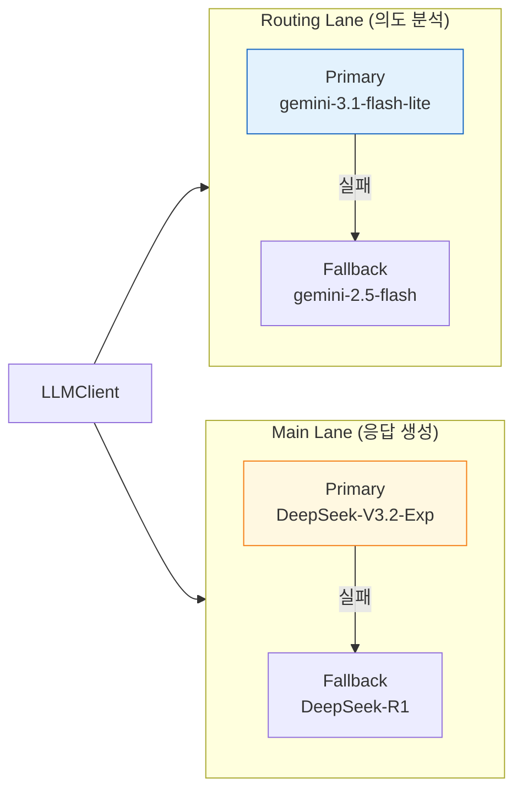

# 🤖 마사몽 — Discord AI 챗봇

<p align="center">
  <strong>한국어 중심 Discord AI 챗봇</strong><br/>
  듀얼 레인 LLM · 구조화 메모리(RAG) · 날씨 · 금융 · 웹 검색 · 운세 · 이미지 생성
</p>

<p align="center">
  <a href="../../README.md">English</a> &nbsp;|&nbsp;
  <a href="README.ja.md">日本語</a>
</p>

---

## 개요

마사몽은 Discord 서버에서 동작하는 **한국어 중심 AI 챗봇**입니다.  
멘션 기반 대화, 구조화 메모리/RAG, Kakao 대화 벡터 검색, 날씨/금융/웹 검색 도구, 운세, 이미지 생성, 커뮤니티 기능을 하나의 런타임으로 통합 운영합니다.

- **언어**: Python 3.9+
- **프레임워크**: `discord.py` >=2.7.1
- **LLM**: CometAPI (OpenAI-compatible) + Gemini (선택적 fallback)
- **DB**: TiDB (운영) / SQLite (개발)
- **라이선스**: MIT

---

## 빠른 시작

### 사전 요구사항
- Python 3.9+
- Discord Bot Token ([Developer Portal](https://discord.com/developers/applications))
- CometAPI Key (또는 Gemini API Key)

### 설치

```bash
git clone https://github.com/kim0040/masamong.git
cd masamong

python3 -m venv venv
source venv/bin/activate

pip install -r requirements.txt
pip install -r requirements-cpu.txt
```

### 설정

```bash
cp .env.example .env
# .env 파일을 편집하여 실제 API 키 입력
```

**최소 `.env`:**
```env
DISCORD_BOT_TOKEN=your_token_here
COMETAPI_KEY=your_cometapi_key
COMETAPI_BASE_URL=https://api.cometapi.com/v1
USE_COMETAPI=true
```

### 실행

```bash
PYTHONPATH=. python main.py
```

---

## 주요 기능

| 기능 | 설명 |
|------|------|
| **AI 대화** | `@마사몽` 멘션으로 LLM 응답 (채널별 페르소나 적용) |
| **DM 대화** | 멘션 없이 1:1 대화 (5시간당 30회 제한) |
| **메모리 / RAG** | 하이브리드 검색 (임베딩 + BM25 + RRF)으로 대화 기억 회상 |
| **날씨** | 기상청 KMA 실시간/주간/중기 예보 + 지진 알림 + `!날씨` |
| **금융** | 주식(국내/해외), 환율 — Finnhub, yfinance, KRX, EximBank |
| **웹 검색** | 실시간 웹/뉴스 검색 — Linkup API (주력) / DuckDuckGo (대체) |
| **이미지 생성** | `!이미지 <프롬프트>` — CometAPI Gemini Image |
| **운세** | 일간/월간/연간 운세 + 별자리 + 구독 |
| **랭킹** | 서버 활동 랭킹 + 통계 차트 (`!랭킹`) |
| **요약** | 채널 대화 요약 (`!요약`) |
| **투표** | `!투표 "주제" "항목1" "항목2"` |

### 명령어

| 명령어 | 설명 |
|--------|------|
| `@마사몽 <메시지>` | AI 대화 (서버, 멘션 필수) |
| `!날씨 [지역] [일자]` | 날씨 예보 |
| `!운세` / `!별자리` | 운세 및 별자리 |
| `!랭킹` | 서버 활동 랭킹 |
| `!요약` | 채널 대화 요약 |
| `!투표 "주제" "항목1" "항목2"` | 투표 생성 |
| `!이미지 <프롬프트>` | AI 이미지 생성 |
| `!도움` | 도움말 |
| `/config` | 슬래시 커맨드 — AI 설정 |
| `/persona` | 슬래시 커맨드 — 페르소나 설정 |

---

## 아키텍처

마사몽은 **3단계 듀얼 레인 에이전트 파이프라인**을 사용합니다:

```
메시지 → 의도 분석 (Routing Lane) → 도구 실행 → RAG 검색 → 응답 생성 (Main Lane)
```

[📗 상세 아키텍처 (한국어)](ARCHITECTURE.md) &nbsp;|&nbsp; [📘 상세 아키텍처 (English)](ARCHITECTURE.en.md)

[📐 UML 명세 및 다이어그램](UML_SPEC.md) — C4, 컴포넌트, 클래스, 시퀀스, 액티비티, 상태, 배포, ER 다이어그램 (총 17종)

---

## 프로젝트 구조

```
masamong/
├── main.py              # 봇 진입점, Cog 로드, DB 마이그레이션
├── config.py            # 설정 (.env → config.json → 기본값)
├── prompts.json          # 채널 페르소나 & 시스템 프롬프트
├── emb_config.json       # 임베딩 / RAG 설정
│
├── cogs/                 # Discord Cog 모듈
│   ├── ai_handler.py     # AI 파이프라인 (핵심)
│   ├── tools_cog.py      # 외부 도구 통합
│   ├── weather_cog.py    # 날씨 명령어 + 강수/인사 알림
│   ├── fortune_cog.py    # 운세 / 별자리 / 구독
│   ├── activity_cog.py   # 활동 추적 + 랭킹
│   └── ...
│
├── utils/                # 유틸리티 모듈
│   ├── llm_client.py     # LLM 레인 라우팅 (Primary/Fallback)
│   ├── intent_analyzer.py # 의도 분석 + 도구 탐지
│   ├── rag_manager.py    # RAG / 임베딩 / 메모리 관리
│   ├── hybrid_search.py  # 임베딩 + BM25 + RRF 검색
│   └── api_handlers/     # Finnhub, yfinance, KRX, Kakao, EximBank
│
├── database/             # TiDB/SQLite 스키마 + 어댑터
├── scripts/              # 운영 스크립트 (smoke test, 마이그레이션 등)
└── docs/                 # 문서
```

---

## 듀얼 레인 LLM 시스템



각 레인은 **Primary + Fallback** 타깃을 가지며 실패 시 자동 전환됩니다.  
자세한 내용은 [ARCHITECTURE.md](ARCHITECTURE.md)를 참조하세요.

---

## 설정 우선순위

```
1. 환경변수 (.env)          ← 최우선
2. config.json              ← 보조
3. 코드 기본값 (config.py)   ← 최하위
```

**주요 환경변수:**
| 변수 | 용도 |
|------|------|
| `DISCORD_BOT_TOKEN` | Discord 봇 토큰 (필수) |
| `COMETAPI_KEY` | CometAPI 키 (기본 LLM) |
| `GEMINI_API_KEY` | Gemini 키 (선택적 fallback) |
| `KMA_API_KEY` | 기상청 API 키 |
| `LINKUP_API_KEY` | 웹 검색 API 키 |
| `MASAMONG_DB_BACKEND` | `tidb` 또는 `sqlite` |

전체 환경변수는 `.env.example`을 참조하세요.

---

## 기술 스택

| 계층 | 기술 |
|------|------|
| 봇 프레임워크 | discord.py >=2.7.1 |
| LLM 제공자 | CometAPI (OpenAI-compatible), Google Gemini |
| LLM 아키텍처 | Dual Lane (Routing + Main) with Primary/Fallback |
| 데이터베이스 | TiDB (운영), SQLite (개발) |
| 벡터 검색 | SentenceTransformers + TiDB VECTOR(384) / 코사인 유사도 |
| 웹 검색 | Linkup API, DuckDuckGo |
| 금융 | Finnhub, yfinance, KRX API, EximBank |
| 날씨 | 기상청(KMA) API |
| 차트 | matplotlib, seaborn |
| 테스트 | pytest |

### 임베딩 모델

| 모델 | 용도 |
|------|------|
| `dragonkue/multilingual-e5-small-ko-v2` | 한국어 최적화 임베딩 |
| `upskyy/e5-small-korean` | 쿼리 재작성 |
| `BAAI/bge-reranker-v2-m3` | Cross-encoder 재순위화 |

---

## 라이선스

MIT License

Copyright (c) 2025-2026 kim0040

이 소프트웨어의 복제본과 관련 문서 파일을 소유한任何人에게 제한 없이 소프트웨어를 다룰 수 있는 권한을 무료로 부여합니다. 여기에는 소프트웨어의 사용, 복사, 수정, 병합, 출판, 배포, 서브라이선스, 판매 권한이 제한 없이 포함됩니다.

본 소프트웨어는 "있는 그대로" 제공되며, 어떠한 종류의 보증도 제공되지 않습니다.

---

## 문서

| 문서 | 언어 | 내용 |
|------|------|------|
| [ARCHITECTURE.md](ARCHITECTURE.md) | 한국어 | 시스템 아키텍처 상세 (15개 다이어그램) |
| [ARCHITECTURE.en.md](ARCHITECTURE.en.md) | English | System architecture detail (15 diagrams) |
| [UML_SPEC.md](UML_SPEC.md) | 한국어 | UML 분석 — C4, 클래스, 시퀀스, ER (17개 다이어그램) |
| [../README.md](../../README.md) | English | 영문 README |
| [README.ja.md](README.ja.md) | 日本語 | 일본어 README |

---

<p align="center">
  Made with 🐍 by <a href="https://github.com/kim0040">kim0040</a>
</p>
