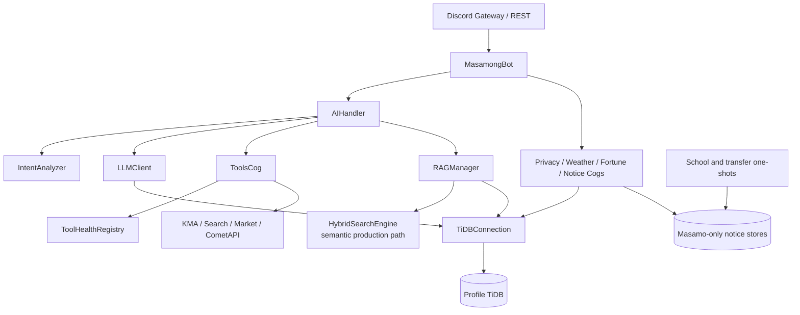
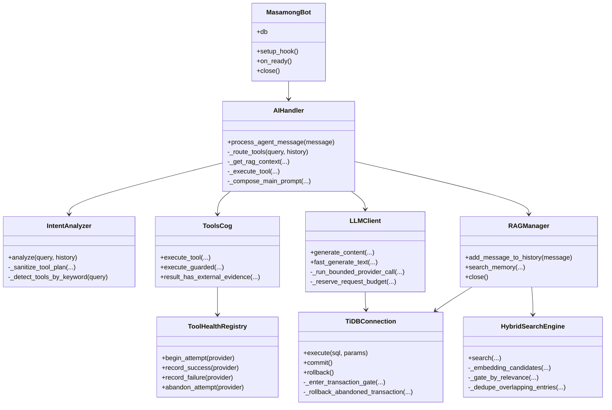
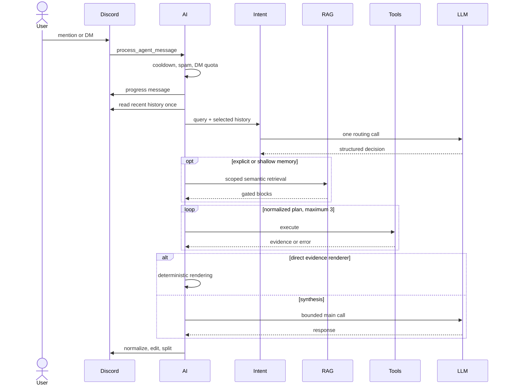
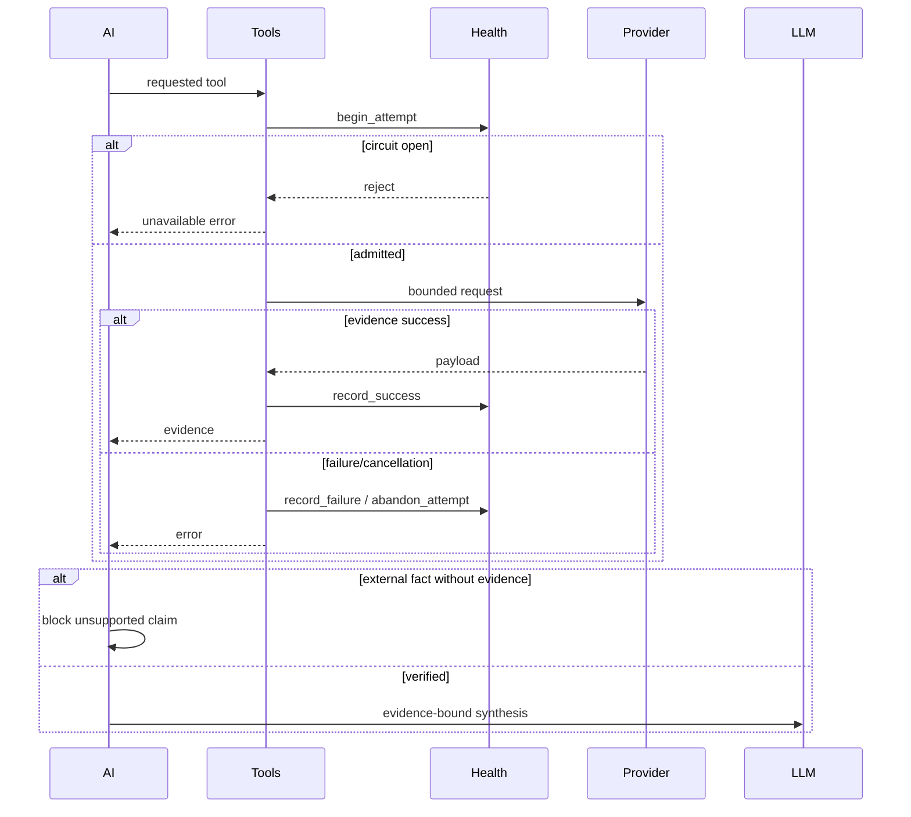
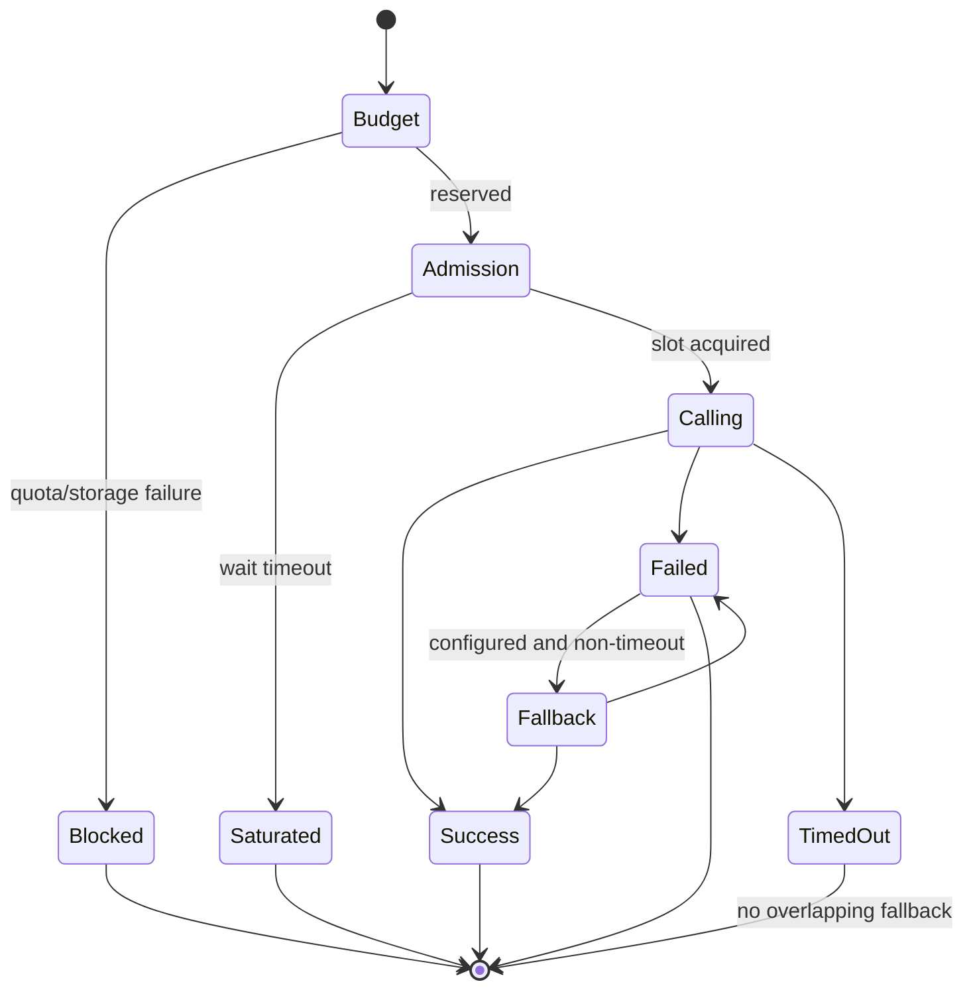
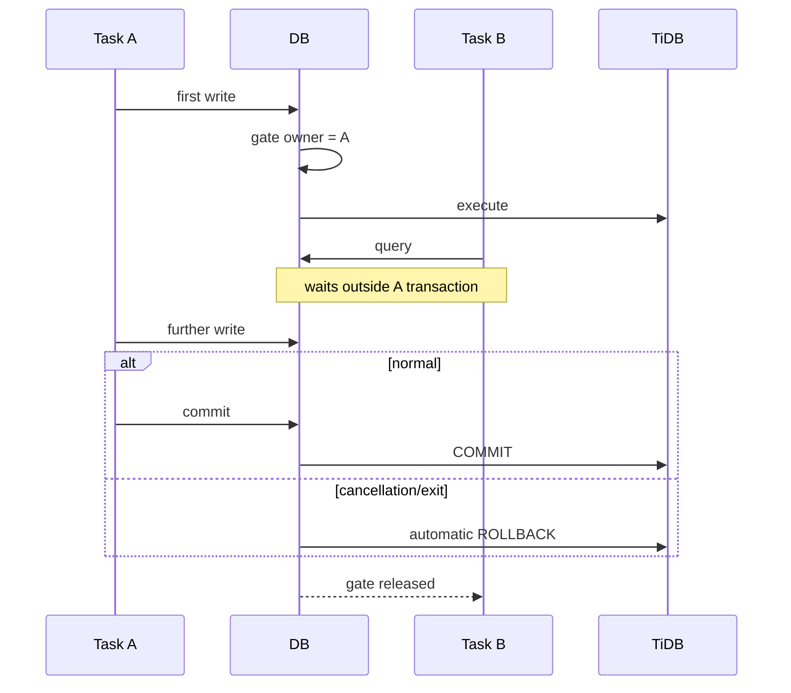
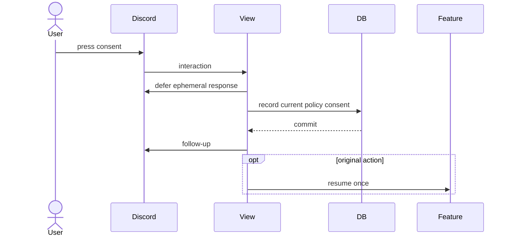
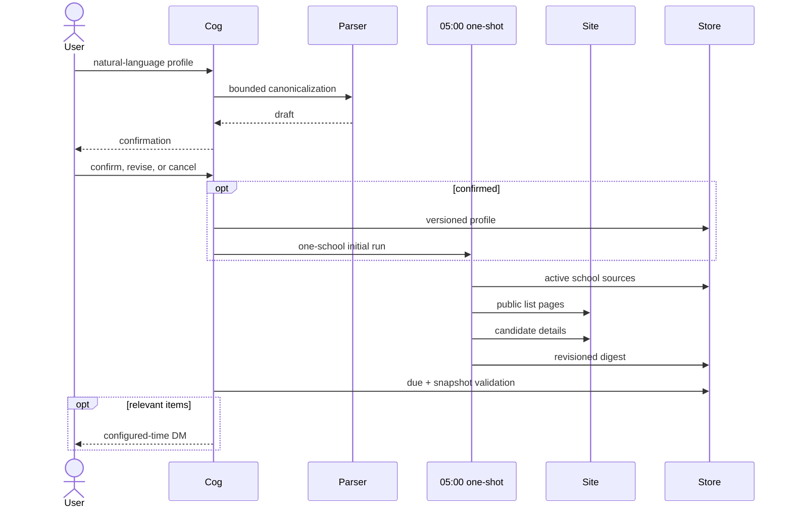
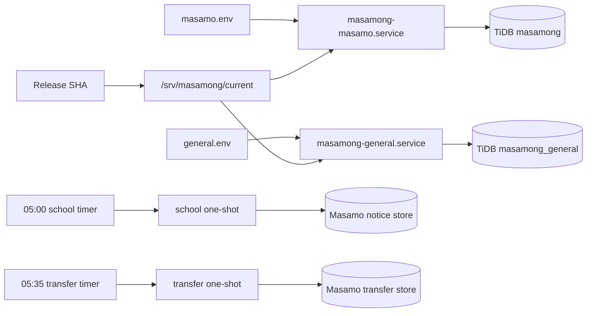

# Masamong UML Specification

These diagrams represent the current implementation. BM25 is intentionally
absent from the production runtime; retrieval is semantic. For feature use,
see the [Korean user guide](README.ko.md); for the component-level explanation,
see [Architecture](ARCHITECTURE.en.md).

## Components



## Core classes



## Conversation



## Retrieval

```mermaid
sequenceDiagram
    participant AI
    participant Search
    participant DiscordStore
    participant KakaoStore
    participant Reranker

    AI->>Search: query + guild/channel/user scope
    Search->>Search: variants; shallow uses one
    par Discord
        Search->>DiscordStore: vector or bounded compatibility scan
        DiscordStore-->>Search: candidates
    and mapped Kakao
        Search->>KakaoStore: scoped query
        KakaoStore-->>Search: candidates
    end
    Search->>Search: identity alignment
    Search->>Search: absolute semantic gate
    Search->>Search: relative floor and overlap dedupe
    opt enabled
        Search->>Reranker: reorder gated candidates
    end
    Search-->>AI: maximum 3 blocks
```

## Evidence tool



## LLM state



## TiDB transaction ownership



## Consent interaction



## School notice



## Earthquake edit

```mermaid
sequenceDiagram
    participant Loop as 60-second KMA loop
    participant DB
    participant Discord

    Loop->>DB: load watermark
    Loop->>Loop: fetch new notices
    Loop->>DB: save watermark before send
    alt new incident
        Loop->>Discord: formal alert
        Loop->>DB: save message ID
    else same incident window
        Loop->>DB: load message ID
        Loop->>Discord: PATCH original
    end
    Note over Loop,Discord: permission/timeouts never create duplicates
```

## Deployment


