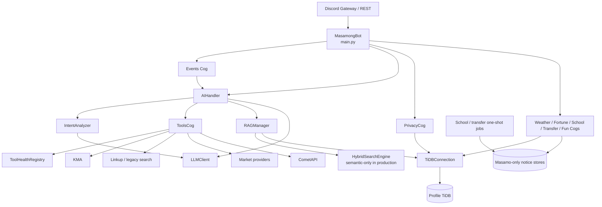
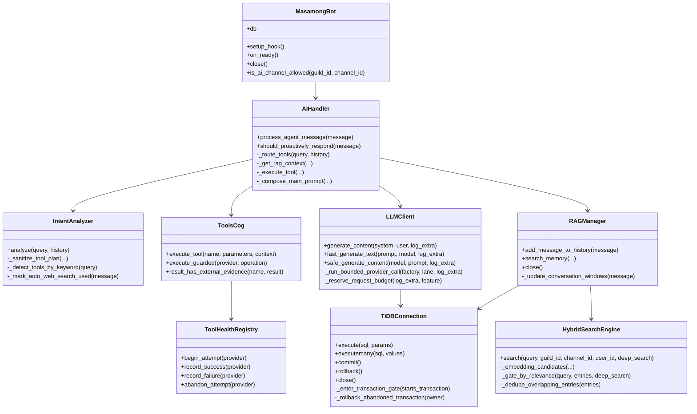
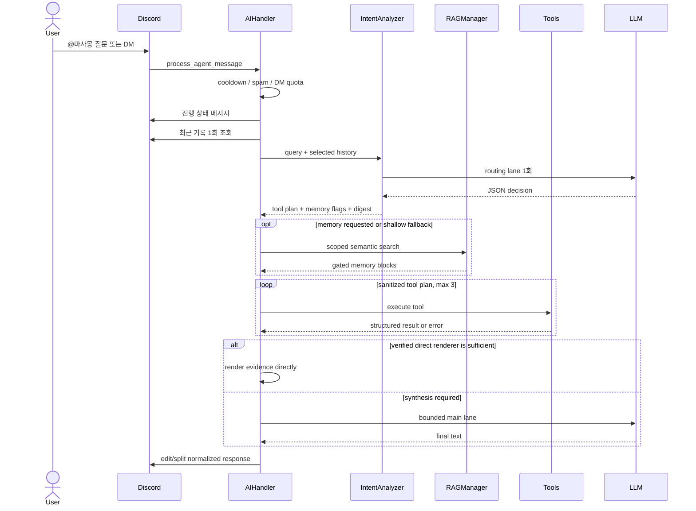
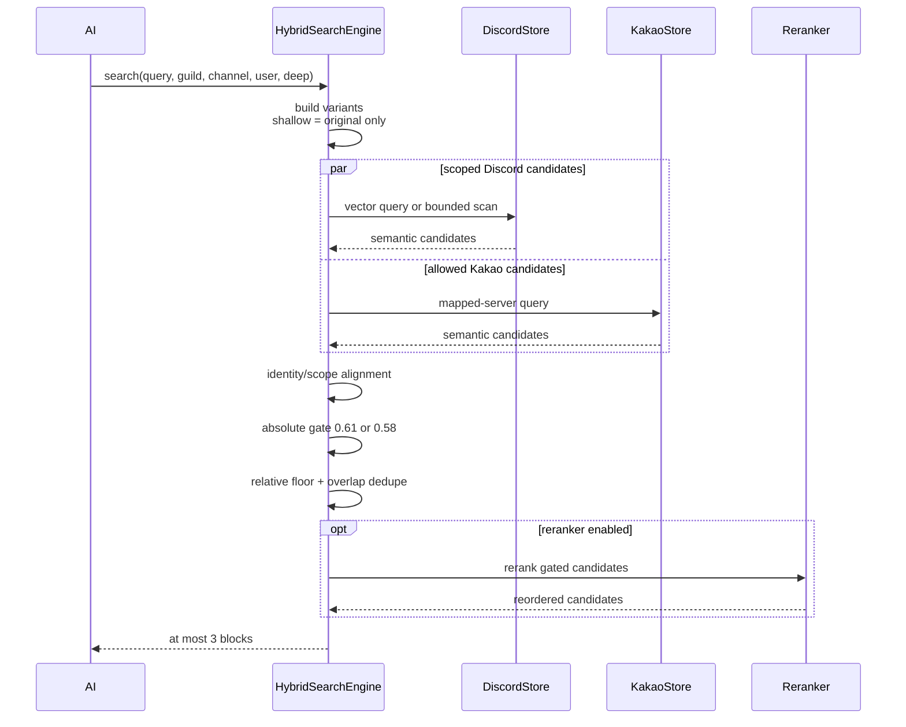
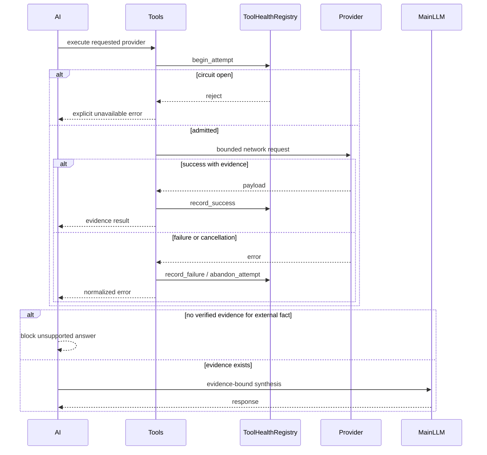
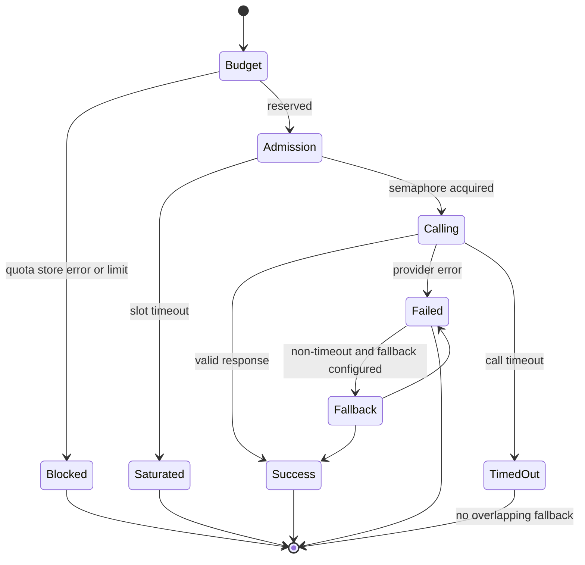
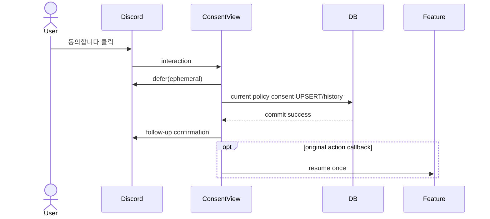
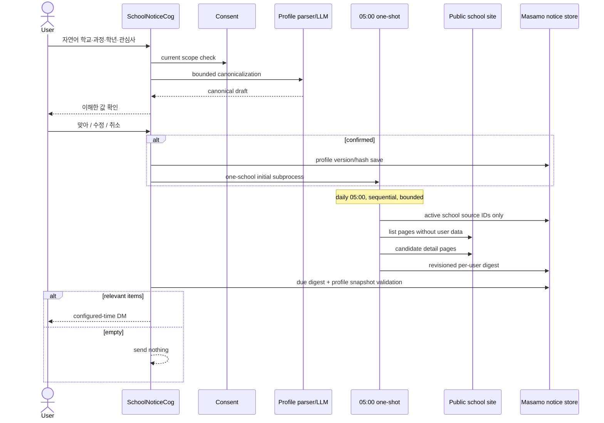
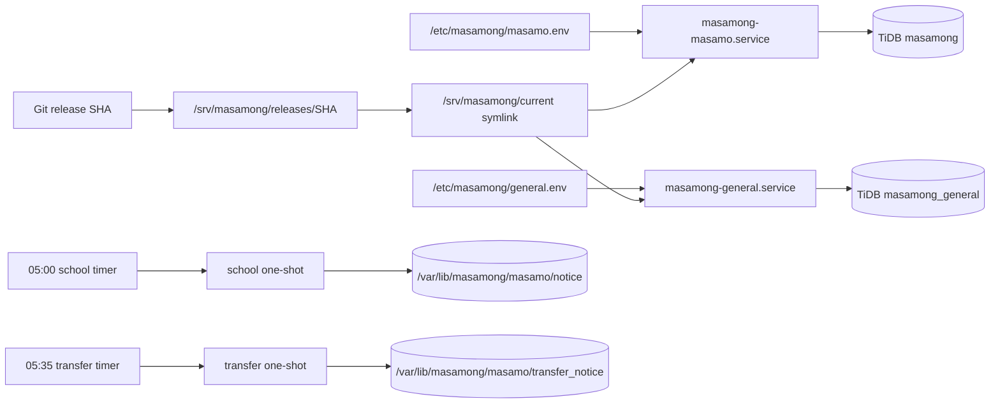

# 마사몽 UML 명세

이 문서는 현재 구현의 구조와 핵심 시퀀스를 Mermaid로 표현합니다. 운영 원격 경로에는
BM25 구성요소가 없으며 의미 임베딩 검색만 표시합니다. 기능을 사용하려면
[사용자 가이드](README.ko.md)를, 구성 요소의 설명을 읽으려면
[아키텍처](ARCHITECTURE.ko.md)를 참고할 수 있습니다.

## 전체 컴포넌트



## 핵심 클래스



## 일반 대화 시퀀스



## RAG 시퀀스



## 외부 사실 확인 시퀀스



## LLM 호출 상태



## TiDB 트랜잭션 소유권

```mermaid
sequenceDiagram
    participant A as Discord Task A
    participant DB as TiDBConnection
    participant B as Discord Task B
    participant TiDB

    A->>DB: first write
    DB->>DB: acquire transaction gate<br/>owner = Task A
    DB->>TiDB: execute
    B->>DB: SELECT or write
    Note over B,DB: waits; cannot enter A transaction
    A->>DB: second write
    DB->>TiDB: execute
    alt normal
        A->>DB: commit
        DB->>TiDB: COMMIT
    else A cancelled/exits
        DB->>TiDB: automatic ROLLBACK
    end
    DB-->>B: release gate
```

## 개인정보 동의 버튼



## 학교 공지 등록·수집·전달



## 지진 편집

```mermaid
sequenceDiagram
    participant Loop as 60s KMA loop
    participant DB
    participant Discord

    Loop->>DB: load occurrence watermark
    Loop->>Loop: fetch and sort new KMA notices
    Loop->>DB: persist new watermark before send
    alt new incident
        Loop->>Discord: send formal incident message
        Loop->>DB: persist channel message ID
    else same time/distance incident
        Loop->>DB: load original message ID
        Loop->>Discord: PATCH original message
    end
    Note over Loop,Discord: timeout/permission errors do not send duplicates
```

## 배포 구조


