# 마사몽 UML 상세 분석 문서

> **버전**: 2.0.0 | **언어**: Python 3.9+ | **작성일**: 2026-04-30

본 문서는 마사몽 Discord 봇의 소프트웨어 아키텍처를 UML 표기법과 Mermaid 다이어그램으로 상세하게 분석한 기술 문서입니다.

---

## 목차

1. [시스템 컨텍스트 다이어그램 (C4 Level 1)](#1-시스템-컨텍스트-다이어그램-c4-level-1)
2. [컨테이너 다이어그램 (C4 Level 2)](#2-컨테이너-다이어그램-c4-level-2)
3. [컴포넌트 다이어그램](#3-컴포넌트-다이어그램)
4. [클래스 다이어그램](#4-클래스-다이어그램)
5. [시퀀스 다이어그램](#5-시퀀스-다이어그램)
6. [액티비티 다이어그램](#6-액티비티-다이어그램)
7. [상태 다이어그램](#7-상태-다이어그램)
8. [배포 다이어그램](#8-배포-다이어그램)
9. [ER 다이어그램](#9-er-entity-relationship-다이어그램)

---

## 1. 시스템 컨텍스트 다이어그램 (C4 Level 1)

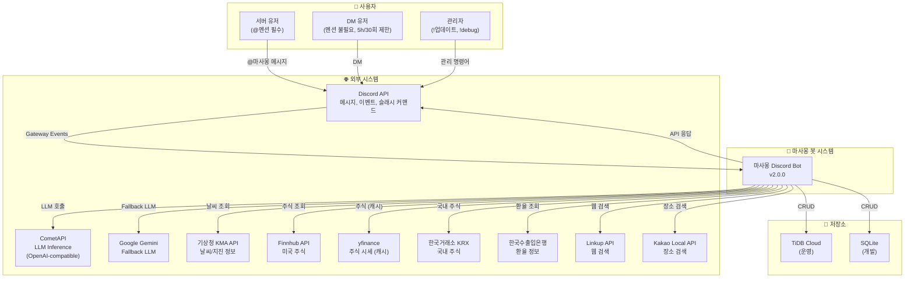

---

## 2. 컨테이너 다이어그램 (C4 Level 2)

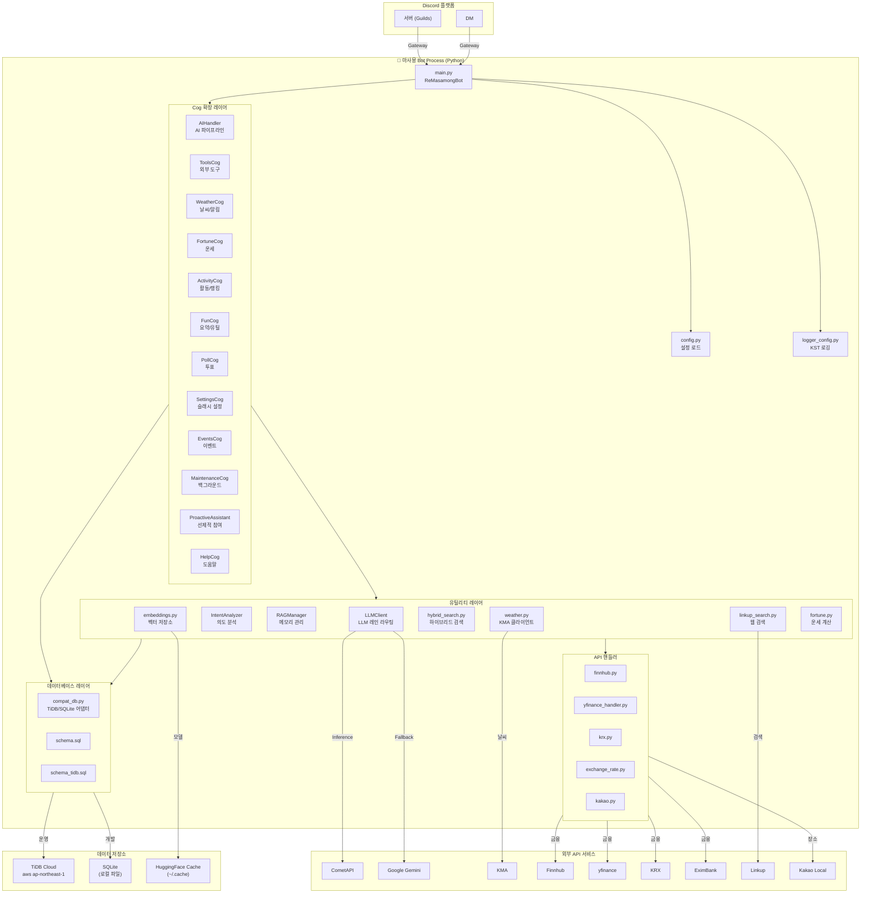

---

## 3. 컴포넌트 다이어그램

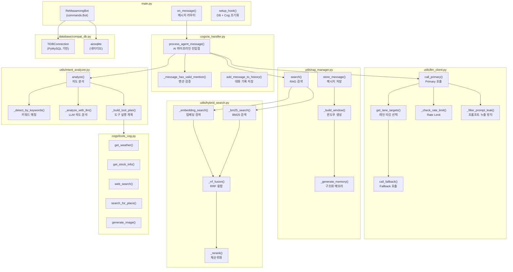

---

## 4. 클래스 다이어그램

### 4.1 핵심 클래스 구조

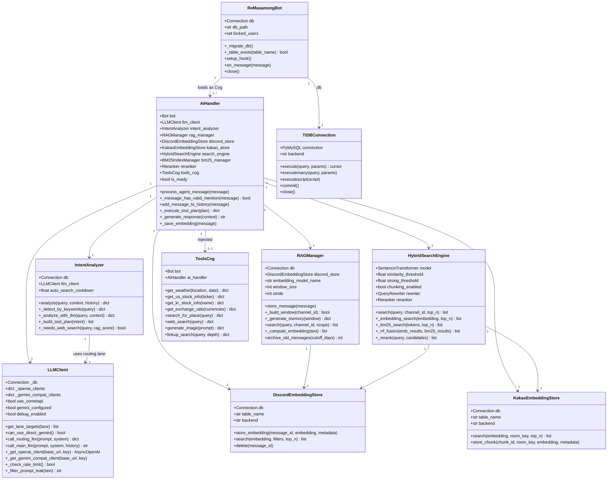

### 4.2 Cog 의존성 관계

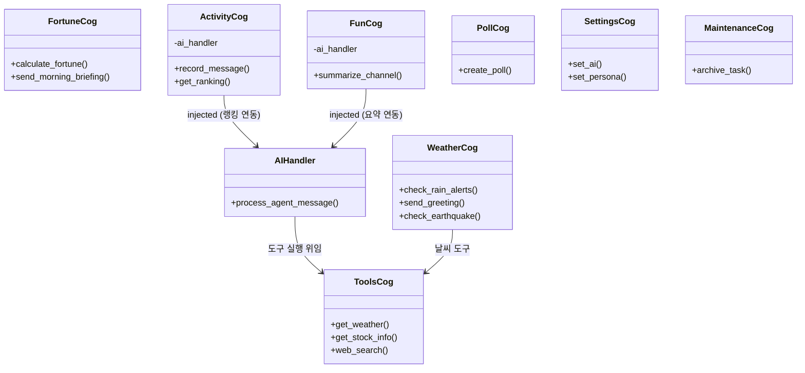

---

## 5. 시퀀스 다이어그램

### 5.1 전체 메시지 처리 흐름

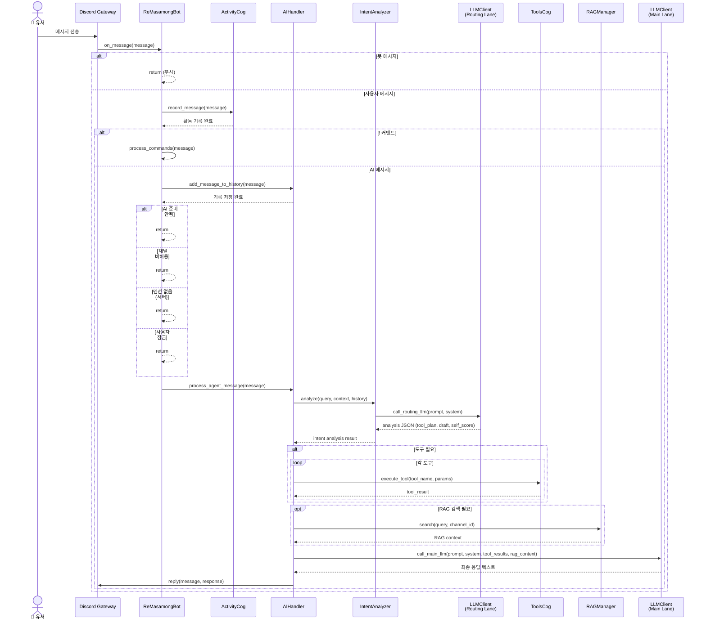

### 5.2 듀얼 레인 LLM 라우팅 흐름

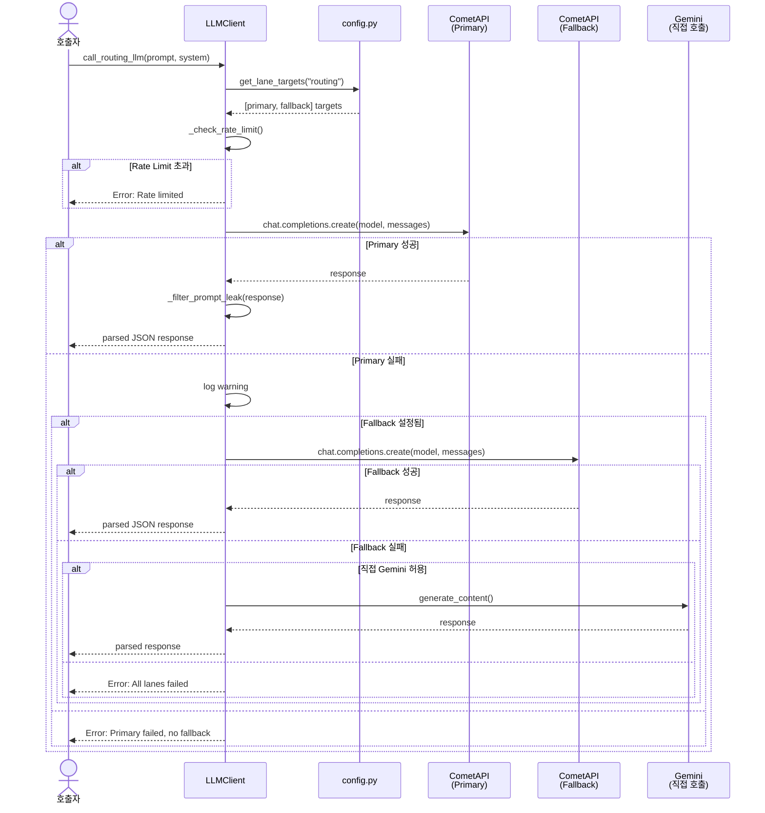

### 5.3 RAG 검색 파이프라인

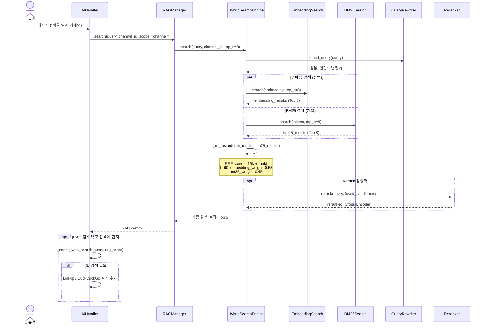

### 5.4 외부 도구 실행 흐름

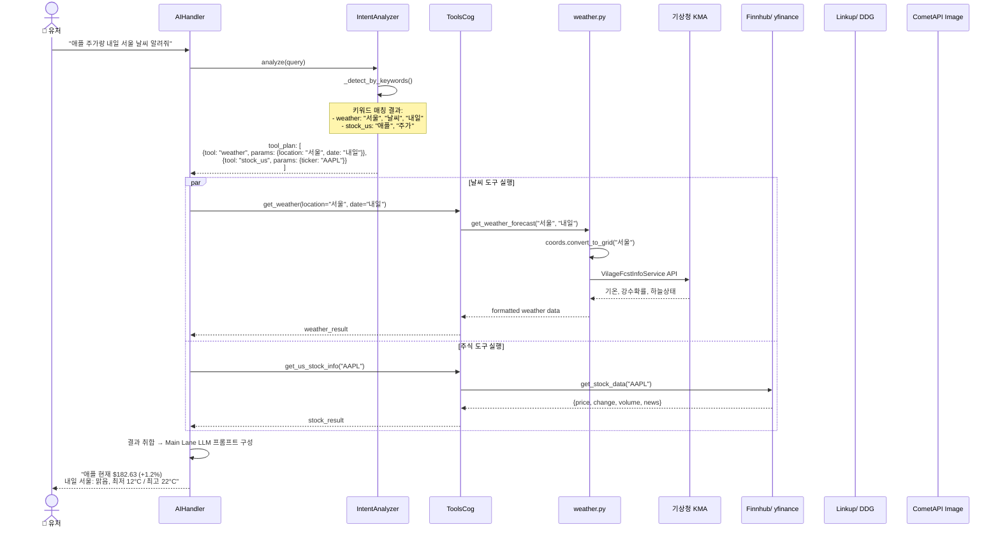

### 5.5 배경 알림 루프 (WeatherCog)

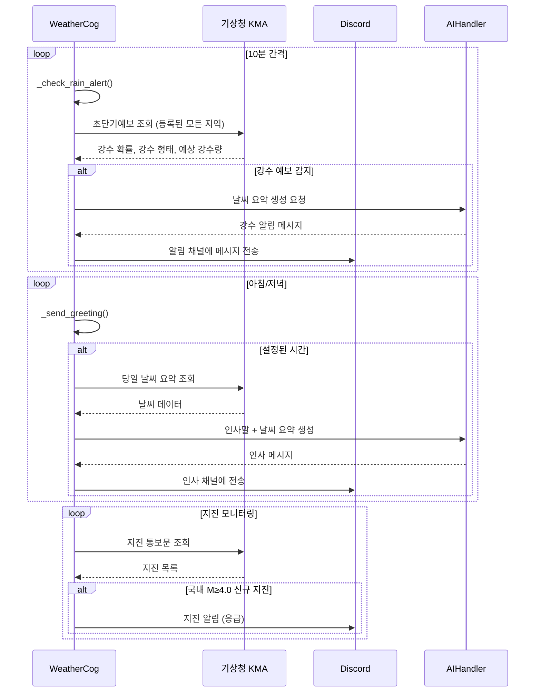

---

## 6. 액티비티 다이어그램

### 6.1 메시지 처리 활동 흐름

```mermaid
flowchart TD
    Start([메시지 수신]) --> CheckBot{작성자가 봇?}
    CheckBot -->|Yes| End([종료])
    CheckBot -->|No| RecordActivity[활동 기록<br/>ActivityCog.record_message]

    RecordActivity --> CheckCmd{! 프리픽스?}
    CheckCmd -->|Yes| ProcessCmd[process_commands<br/>명령어 처리]
    ProcessCmd --> End

    CheckCmd -->|No| AddHistory[대화 기록 저장<br/>add_message_to_history]

    AddHistory --> CheckAIReady{AI 준비 완료?}
    CheckAIReady -->|No| End
    CheckAIReady -->|Yes| CheckChannel{채널 허용?<br/>DM은 자동 통과}
    CheckChannel -->|No| End
    CheckChannel -->|Yes| CheckMention{멘션 검증<br/>서버: @멘션 필수<br/>DM: 불필요}
    CheckMention -->|실패| End

    CheckMention -->|통과| CheckLock{사용자 잠금?<br/>(대화형 커맨드 중)}
    CheckLock -->|Yes| End
    CheckLock -->|No| ValidateInput[입력 검증 및 정제<br/>text_cleaner]

    ValidateInput --> IntentAnalysis[1단계: 의도 분석<br/>IntentAnalyzer.analyze]

    IntentAnalysis --> HasTools{도구 필요?}

    HasTools -->|Yes| ExecuteTools[2단계: 도구 실행<br/>ToolsCog 호출]
    ExecuteTools --> CollectResults[도구 결과 수집]

    HasTools -->|No| RAGSearch[RAG 컨텍스트 검색<br/>RAGManager.search]
    CollectResults --> RAGSearch

    RAGSearch --> CheckRAGScore{RAG 점수 낮음<br/>+ 검색 필요어?}

    CheckRAGScore -->|Yes| WebSearch[자동 웹 검색<br/>Linkup / DuckDuckGo]
    CheckRAGScore -->|No| BuildPrompt[프롬프트 구성<br/>페르소나 + 도구결과 + RAG]

    WebSearch --> BuildPrompt

    BuildPrompt --> GenResponse[3단계: 응답 생성<br/>Main Lane LLM 호출]

    GenResponse --> CheckSuccess{생성 성공?}
    CheckSuccess -->|No| GenFallback[Fallback LLM 시도]
    GenFallback --> CheckSuccess

    CheckSuccess -->|Yes| FormatResponse[응답 포맷팅<br/>data_formatters]
    FormatResponse --> SendMessage[Discord 메시지 전송]

    SendMessage --> SaveEmbedding[임베딩 비동기 저장<br/>asyncio.create_task]
    SaveEmbedding --> End
```

### 6.2 의도 분석 상세 활동

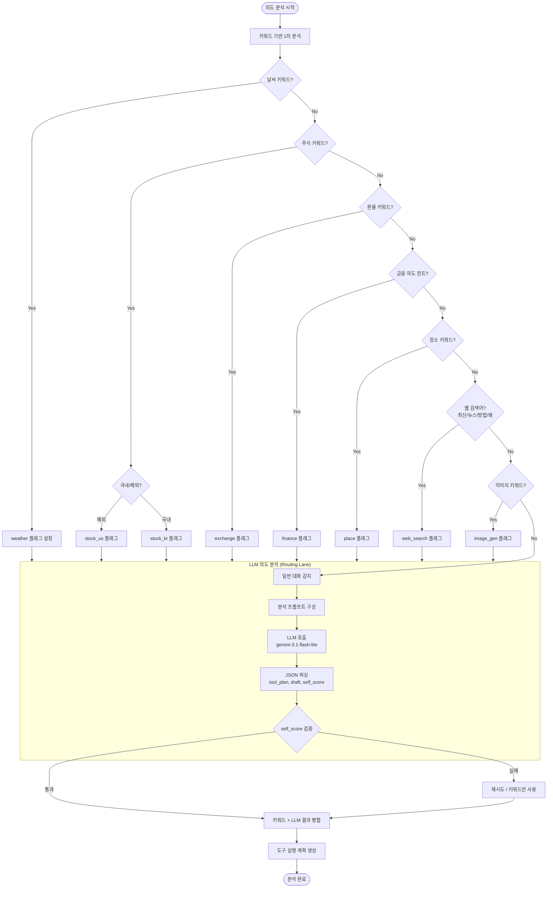

---

## 7. 상태 다이어그램

### 7.1 봇 라이프사이클

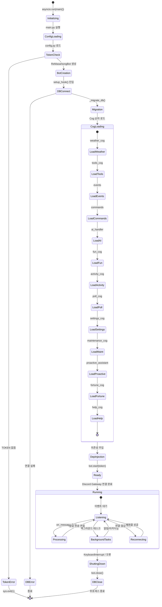

### 7.2 AI 처리 상태

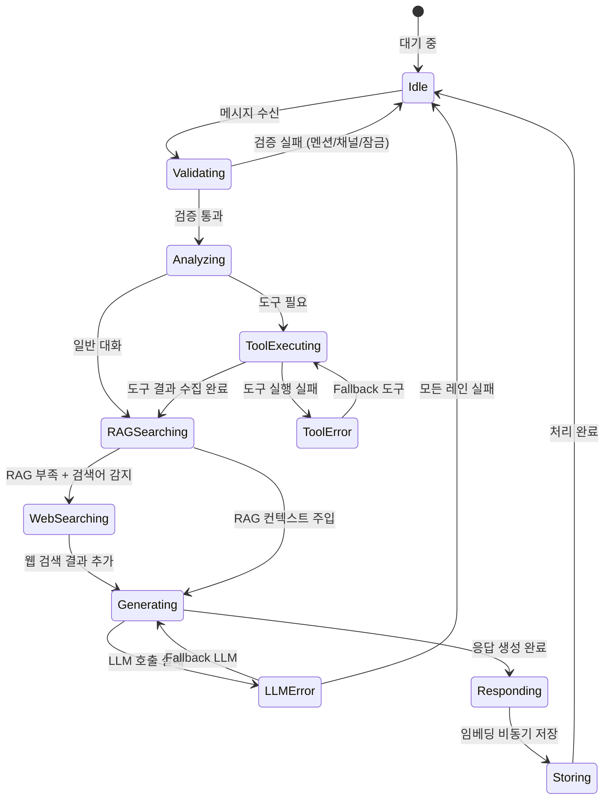

---

## 8. 배포 다이어그램

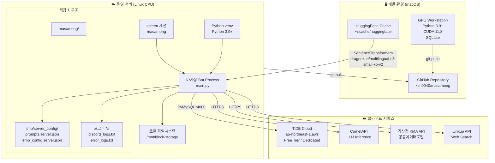

---

## 9. ER (Entity-Relationship) 다이어그램

```mermaid
erDiagram
    guild_settings {
        bigint guild_id PK "서버 ID"
        boolean ai_enabled "AI 활성화 여부"
        text ai_allowed_channels "허용 채널 JSON"
        float proactive_response_probability "선제 응답 확률"
        int proactive_response_cooldown "선제 응답 쿨다운(초)"
        text persona_text "커스텀 페르소나"
        text created_at "생성 시간"
        text updated_at "수정 시간"
    }

    user_profiles {
        bigint user_id PK "사용자 ID"
        text birth_date "생년월일 (YYYY-MM-DD)"
        text birth_time "출생 시간 (HH:MM)"
        text gender "성별 (M/F)"
        boolean is_lunar "음력 여부"
        boolean subscription_active "운세 구독 여부"
        text subscription_time "구독 발송 시간"
        text pending_payload "미리 생성된 브리핑"
        text last_fortune_sent "마지막 운세 발송일"
        text last_fortune_content "마지막 운세 내용"
        text birth_place "출생 지역"
        text created_at "생성 시간"
    }

    user_activity {
        bigint user_id PK "사용자 ID"
        bigint guild_id PK "서버 ID"
        int message_count "메시지 수"
        text last_active_at "마지막 활동 시간"
    }

    user_activity_log {
        bigint message_id PK "메시지 ID"
        bigint guild_id "서버 ID"
        bigint channel_id "채널 ID"
        bigint user_id "사용자 ID"
        text created_at "생성 시간"
    }

    conversation_history {
        bigint message_id PK "메시지 ID"
        bigint guild_id "서버 ID"
        bigint channel_id "채널 ID"
        bigint user_id "사용자 ID"
        text user_name "사용자 이름"
        text content "메시지 내용"
        boolean is_bot "봇 여부"
        text created_at "생성 시간"
        blob embedding "임베딩 벡터"
    }

    conversation_windows {
        bigint window_id PK "윈도우 ID (AUTO)"
        bigint guild_id "서버 ID"
        bigint channel_id "채널 ID"
        bigint start_message_id "시작 메시지 ID"
        bigint end_message_id "종료 메시지 ID"
        int message_count "메시지 수"
        text messages_json "메시지 JSON"
        text anchor_timestamp "기준 타임스탬프"
        text created_at "생성 시간"
    }

    conversation_history_archive {
        bigint message_id PK "메시지 ID"
        bigint guild_id "서버 ID"
        bigint channel_id "채널 ID"
        bigint user_id "사용자 ID"
        text user_name "사용자 이름"
        text content "메시지 내용"
        boolean is_bot "봇 여부"
        text created_at "생성 시간"
        blob embedding "임베딩 벡터"
    }

    discord_memory_entries {
        bigint id PK "엔트리 ID (AUTO)"
        text memory_id UK "메모리 UUID"
        text anchor_message_id "기준 메시지 ID"
        text server_id "서버 ID"
        text channel_id "채널 ID"
        text owner_user_id "소유 유저 ID"
        text owner_user_name "소유 유저 이름"
        text memory_scope "스코프 (channel/user)"
        text memory_type "메모리 타입"
        text summary_text "요약 텍스트"
        text memory_text "메모리 본문"
        text raw_context "원본 컨텍스트"
        text source_message_ids "소스 메시지 ID 목록"
        text speaker_names "발화자 목록"
        text keyword_json "키워드 JSON"
        text timestamp "타임스탬프"
        blob embedding "임베딩 벡터"
    }

    kakao_chunks {
        bigint id PK "청크 ID (AUTO)"
        text room_key "방 키"
        text source_room_label "방 라벨"
        bigint chunk_id "청크 번호"
        bigint session_id "세션 ID"
        text start_date "시작 날짜"
        int message_count "메시지 수"
        text summary "요약"
        text text_long "전체 텍스트"
        vector embedding "Vector(384)"
    }

    locations {
        text name PK "지역명"
        int nx "격자 X 좌표"
        int ny "격자 Y 좌표"
    }

    api_call_log {
        bigint id PK "로그 ID (AUTO)"
        text api_type "API 타입"
        text called_at "호출 시간"
    }

    system_counters {
        text counter_name PK "카운터명"
        bigint counter_value "카운터 값"
        text last_reset_at "마지막 리셋 시간"
    }

    analytics_log {
        bigint log_id PK "로그 ID (AUTO)"
        text log_timestamp "로그 시간"
        text event_type "이벤트 타입"
        text guild_id "서버 ID"
        text user_id "사용자 ID"
        text details "상세 정보 JSON"
    }

    linkup_usage_log {
        bigint id PK "로그 ID (AUTO)"
        text used_at "사용 시간"
        text endpoint "엔드포인트 (search/fetch)"
        text depth "검색 깊이"
        boolean render_js "JS 렌더링 여부"
        float cost_eur "비용 (EUR)"
    }

    dm_usage_logs {
        bigint user_id PK "사용자 ID"
        int usage_count "사용 횟수"
        text window_start_at "윈도우 시작 시간"
        text reset_at "리셋 예정 시간"
    }

    user_preferences {
        bigint user_id PK "사용자 ID"
        text preference_type PK "설정 타입"
        text preference_value "설정 값"
        text updated_at "수정 시간"
    }

    discord_chat_embeddings {
        bigint id PK "엔트리 ID (AUTO)"
        text message_id UK "메시지 ID"
        text server_id "서버 ID"
        text channel_id "채널 ID"
        text user_id "사용자 ID"
        text user_name "사용자 이름"
        text message "메시지 내용"
        text timestamp "타임스탬프"
        blob embedding "임베딩 벡터"
    }

    %% Relations
    guild_settings ||--o{ user_activity : "has members in"
    user_profiles ||--o| user_preferences : "has"
    conversation_history ||--o{ conversation_windows : "forms"
    conversation_history ||--o{ conversation_history_archive : "archived to"
    conversation_history ||--o{ user_activity_log : "tracks"
    conversation_windows ||--o{ discord_memory_entries : "summarized into"
    conversation_history ||--o{ discord_chat_embeddings : "embedded as"
```

---

## 부록: 주요 데이터 흐름 요약

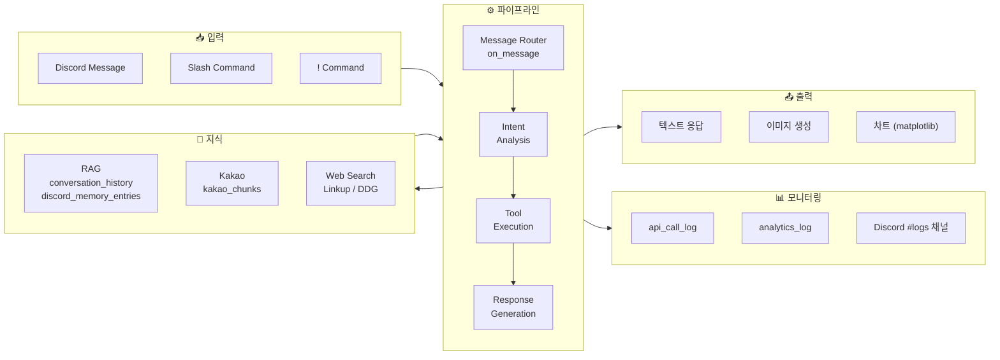

---

> **문서 업데이트**: 마지막 갱신 2026-04-30  
> **참조**: 이 문서는 [ARCHITECTURE.md](ARCHITECTURE.md), [README.md](../README.md)와 함께 읽는 것을 권장합니다.
